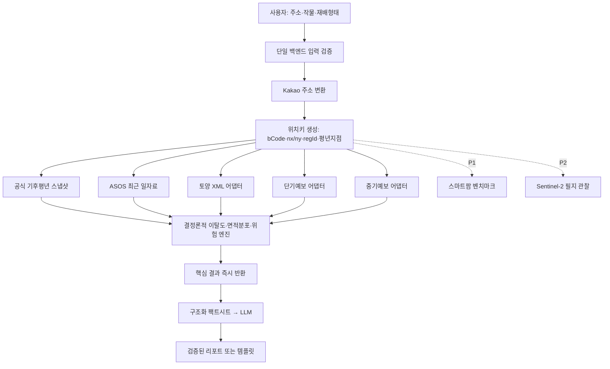

# 흙날씨.진단 — 100점 목표 최종 기획서

> 문서 상태: 개발 기준선(Implementation Baseline)
> 버전: 2.0.0
> 작성 기준일: 2026-07-22
> 대상: 48~72시간 해커톤 프로토타입
> 과제 원문: [문제 정의서1 - 기업 문제](https://lean-mahogany-686.notion.site/1-39b09c484bff80b6a7e3c41842def27a)
> 의사결정 기록: [`07_에이전트_협의록.md`](./07_에이전트_협의록.md)

이 문서는 공식 심사표가 공개되지 않은 상태에서 만든 **내부 100점 품질 기준**이다. 기획 완결성을 100점 기준에 맞추되, 실제 대회 점수는 구현 완성도·현장 시연·심사 기준에 따라 달라질 수 있다. 구현하지 않았거나 실제 응답으로 검증하지 않은 항목을 완료됐다고 주장하지 않는다.

---

## 0. 한 페이지 요약

### 한 문장 정의

> **농지 후보 주소·작물·재배형태·작기를 입력하면 노지는 공식 지역 토양통계와 기후평년값으로 재배조건을 1차 검토하고, 시설은 토양 참고와 외기 운영위험을 분리하며, 최근 관측·단기·중기 자료를 초보자가 바로 실행할 다음 행동으로 바꾸는 농업 의사결정 보조 서비스.**

### 해결하려는 문제

초보 귀농인은 작물 재배 매뉴얼, 토양 통계, 기상예보를 각각 찾아도 다음 세 질문에 답하기 어렵다.

1. 이 지역을 해당 작물 후보지로 계속 검토할 가치가 있는가?
2. 앞으로 며칠 동안 어떤 위험을 먼저 확인해야 하는가?
3. 결과를 본 뒤 무엇을 현장에서 확인해야 하는가?

### 주 사용자

농지 후보지와 관심 작물은 있지만 pH·EC·평년값·예보를 해석하기 어려운 **귀농 준비자와 초보 재배자**.

### 사용자에게 주는 결과

```text
노지: 기후 최적범위 이탈도 + 토양 적합면적 분포 + 자료 충족도
시설: 토양 참고(토경만) + 외기 운영위험 + 센서 확인 안내
최근 7일 대표관측 추이  + 평년 대비 편차
단기 1~3일 상세 위험    + 중기 4~10일 광역 추세
유리한 조건             + 확인이 필요한 조건
지금 할 일 1~3개         + 데이터 한계와 출처
```

### 차별점

API 개수가 아니라 서로 다른 의미의 데이터를 섞지 않는 구조가 차별점이다.

```text
노지 기후 조건   = 공식 기후평년값의 최적범위 이탈도
노지 토양 조건   = 지역 토양통계의 적합·불확실·외부 면적비
시설 현장조건   = 토양 참고(토경만) + 외기 운영위험
최근 추이       = ASOS 대표관측 + 동일 지점 평년 비교
향후 위험     = 기상청 단기·중기예보
노지 관찰     = Sentinel-2 위성 관측(P2)
시설 벤치마크   = 스마트팜 과거 유사 작기 자료(P1)
자연어 설명   = 결정론적 계산 결과를 LLM이 쉬운 말로 변환
```

기후 이탈도와 토양 면적분포는 하나의 0~100 점수로 합치지 않는다. 최근 관측·기상예보·위성·타 농가 스마트팜 데이터도 장기 조건 지표를 임의로 올리거나 내리지 않는다.

### 성공 정의

- 사용자가 2분 안에 `후보지 계속 검토 여부`, `가장 큰 위험`, `다음 행동`을 이해한다.
- 지역 평균과 필지 실측을 혼동하지 않는다.
- 5개 작물 모두 재배형태와 근거상태에 맞는 계산 규약과 동일한 출처 메타데이터를 가진다.
- 외부 API 하나가 실패해도 나머지 결과가 유지된다.
- LLM이 실패해도 숫자 결과와 규칙 기반 리포트가 남는다.

---

## 1. 과제 요구사항 추적표

| 과제 요구사항 | 본 기획의 대응 | 검증 증거 |
|---|---|---|
| 재배 희망 지역·작물 입력 | 주소 검색, 5종·재배형태·필요 작기 선택 | 입력 E2E |
| 토양 공공데이터 연동 | 농경지화학성 통계정보 V2 XML 어댑터 | 성공·빈값 fixture와 계약 테스트 |
| 기상 공공데이터 연동 | 단기 상세예보와 중기 광역추세를 별도 수집 | 중복 날짜·공간수준 테스트 |
| 5종 고정 | 사과·배·오이·감자·상추 설정을 버전 관리 | 작물별 스키마·정상 E2E 5건 |
| 환경 적합도 알고리즘 | 공식 최적범위의 물리적 편차·무차원 이탈도 + 토양 적합면적 분포; 허용범위까지 확인된 경우에만 선택적 사다리꼴 점수 | 범위 안·상하 이탈·면적합 단위 테스트 |
| 작물별 가중치·민감도 | 공식 근거에 따라 `핵심/중요/보조` 등급을 3/2/1로 정규화 | 모든 규칙에 출처·버전 존재 |
| 최근 추이·예측 위험 | 최근 7개 완료일 ASOS 대표관측 + 1991~2020 월별 평년 비교 + 단·중기 예보 위험 | 관측지점·거리·관측일·발표시각·유효기간 테스트 |
| 결측·이상치 방어 | 모듈별 70% 게이트, 단위 검증, `NO_DATA`·`SCHEMA_CHANGED` 분리 | 실패 주입 테스트 |
| LLM 리포트 | 구조화 팩트시트만 설명, JSON 검증, 템플릿 폴백 | 근거성 테스트 10건 |
| 쉬운 UI/UX | 결론→이유→위험→행동→근거 순서와 쉬운 용어 | 초보 사용자 5명 테스트 |

---

## 2. 제품 경계와 명시적 가정

### 2.1 가정

- 해커톤 개발시간은 48~72시간으로 가정한다.
- 비상업적 대회 시연이 1차 목적이다.
- 농경지화학성 V2와 작물코드 API의 정확한 오퍼레이션·필드·단위는 구현 전 실제 승인 응답으로 동결한다.
- ASOS 일자료의 활용승인·오퍼레이션·관측지점 매핑은 구현 전 실제 응답으로 동결한다.
- 공식 기후평년값은 기상청의 1991~2020 자료를 버전 관리된 정적 스냅샷으로 사용한다.
- 사과·배의 연중 월별 프로필과 감자·오이·상추의 작기는 공식 재배자료로 검수되기 전 계산에 사용하지 않는다.
- 필지 토양검정 결과는 현재 보유하지 않은 것으로 가정한다.

가정이 바뀌면 관련 모듈만 교체하며, 조건지표·위험·LLM의 책임 분리는 유지한다.

### 2.2 서비스가 하는 일

- 노지의 기후 최적범위 이탈과 지역 토양 적합면적 분포를 이용한 후보지 1차 검토
- 시설의 토양 참고·외기 운영위험 분리 안내
- 공개데이터와 작물 기준의 편차 설명
- 단기·중기 기상 위험과 행동 안내
- 데이터 범위·기준시점·결측의 투명한 표시
- 초보자용 자연어 요약

### 2.3 하지 않는 일

- 필지 정밀 토양진단 또는 시비처방
- 재배 성공확률·수확량·수익 예측
- 병충해 확정 진단
- 농지 매입 또는 작물 선택의 최종 의사결정
- 다른 스마트팜의 CO₂·온도를 사용자 농장의 현재값으로 사용
- 비닐하우스 내부 작물의 위성 생육진단

필수 고지문:

> 본 결과는 공개 지역통계와 기상자료를 나란히 보여주는 1차 판단 보조 정보입니다. 필지 토양검정·현장 조사·전문가 상담을 대체하지 않으며, 최적범위 이탈도와 적합면적 분포는 수확량이나 성공확률을 의미하지 않습니다.

---

## 3. 사용자 입력과 이용 흐름

### 3.1 최소 입력

1. 주소 또는 지역
2. 작물: 사과 / 배 / 오이 / 감자 / 상추
3. 재배형태
   - 사과·배·감자: `노지` 자동 선택
   - 오이·상추: `노지 / 시설토경 / 시설수경` 선택
4. 재배 예정 작기
   - 사과·배 노지: 추가 입력 없이 검수된 `겨울철+생육기 월별 연중 프로필` 사용
   - 감자 노지: 검수된 `봄재배 / 고랭지 여름재배 / 가을재배` 중 하나 또는 시작·종료월 직접입력 필수
   - 오이·상추 노지: 시작월·종료월 필수; 공식 일정으로 검수된 프리셋이 있을 때만 프리셋 제공
   - 오이·상추 시설: 선택사항이며 외기 운영위험 설명에만 사용
   - 현재 월이나 인기 작기를 조용히 기본값으로 적용하지 않음; 추천값도 사용자가 한 번 확인
5. 생육단계: 선택사항
   - 미입력 기본값: `미지정`
   - 미지정일 때 개화기 냉해처럼 단계별 피해를 단정하지 않고 일반 주의만 제공
6. 필지 다각형: P2 위성 기능을 사용하려는 노지 사용자에게만 요구

필수 작기가 없는 노지 감자·오이·상추는 토양 참고와 일반 예보만 제공하고, 기후 종합 이탈도는 `판단보류`로 표시한다.

### 3.2 핵심 흐름

```text
주소 검색
→ 분석 기준 행정구역 확인
→ 작물·재배형태·필요 작기 선택
→ 기후·최근 관측·토양·예보 병렬 조회
→ 노지는 기후 이탈도·토양 면적분포, 시설은 분리형 참고 결과 표시
→ 단기 상세위험·중기 광역추세 표시
→ 지금 할 일과 데이터 한계 표시
→ LLM 리포트 지연 로딩, 실패 시 템플릿 표시
```

### 3.3 결과 화면 정보 순서

```text
결론
→ 가장 큰 이유
→ 임박한 위험
→ 다음 행동
→ 변수별 근거
→ 데이터 공간범위·기준시점·출처·한계
```

---

## 4. 범위 우선순위

### P0 — 반드시 완성

- Kakao 주소 검색과 분석 행정구역 확인
- 5종 작물 및 재배형태 분기
- 5종의 검수된 연중 프로필·작기 선택과 미입력 판단보류
- 기상청 공식 1991~2020 기후평년값 스냅샷
- 기상청 ASOS 일자료 기반 최근 7개 완료일의 대표관측 추이
- 농경지화학성 통계정보 V2 실제 XML 파싱
- 단기 상세예보와 중기 광역추세
- 작물별 범위·가중치·민감도 설정
- 노지 기후 이탈도·토양 면적분포와 시설 분리형 결과, 자료 충족도, 근거상태
- 결측·이상치·부분실패 처리
- 행동 중심 리포트와 LLM 폴백
- 출처·공간범위·기준시점 표시
- 5종 fixture·E2E와 노지/시설 골든 패스

### P1 — P0 안정 후

- 스마트팜 과거 유사 작기 벤치마크
- 작물별 토양적성 통계정보 V2
- 결과 저장·공유

### P2 — 스트레치

- Sentinel-2 RGB·NDVI 필지 관찰
- 지도 필지 다각형 그리기
- PNU 기반 토양특성 상세정보 V3
- NDVI 장기 시계열·전년 동기 비교
- 사용자 현장센서·필지 토양검정 연동
- 농지 비교·알림·계정 기능

P1·P2가 없어도 과제의 핵심요건을 충족한다. 핵심이 불안정한 상태에서 API 수를 늘리지 않는다.

---

## 5. 데이터 소스와 정확한 역할

### 5.1 P0 데이터

| 소스 | 공식 형식·공간/시간 수준 | 사용 역할 | 사용하지 않는 역할 |
|---|---|---|---|
| [Kakao Local](https://developers.kakao.com/docs/ko/local/dev-guide) | JSON 기본, 주소→위경도·10자리 법정동코드 | 위치 확인, KMA 격자·지역코드 연결 | 농지 경계 확정 |
| [기상청 기후평년값](https://data.kma.go.kr/normals/info1.do) | 1991~2020, 공식 관측지점별 일·월·계절·연 자료 | 작물 재배월의 장기 기후 기준 | 현재 날씨 또는 필지 미기후 |
| [기상청 ASOS 일자료](https://www.data.go.kr/data/15059093/openapi.do) | JSON/XML, 대표 관측지점의 일별 기온·강수 등 | 최근 7개 완료일 추이와 동일 지점·월 평년 대비 | 필지 미기후 또는 실시간 센서값 |
| [농경지화학성 통계정보 V2](https://www.data.go.kr/data/15144685/openapi.do) | **XML 전용**, 법정동 기반 지표별 지역 면적 통계 | 지역 농경지의 pH·유기물 등 분포 설명 | 내 밭 실측값, 임의 평균값 |
| [기상청 단기예보](https://www.data.go.kr/data/15084084/openapi.do) | JSON/XML, 약 5km 격자, 상세 시간예보 | 가까운 기간의 상세 위험 | 장기 입지 적합도 |
| [기상청 중기예보](https://www.data.go.kr/data/15059468/openapi.do) | JSON/XML, 광역예보구역, 4~10일 오전/오후·일 단위 | 이후 기간의 광역 추세 | 단기와 동일한 공간·시간 정밀도 |
| [작물코드 목록](https://www.data.go.kr/data/15160295/openapi.do) | XML, 작물 코드·공식명 | 5종 이름 표준화와 향후 API 연결 | 적정 온도·pH·가중치 획득 |
| [농사로](https://www.nongsaro.go.kr) 등 농촌진흥청 공식 자료 | 작물별 재배기술 문서 | 최적·허용범위와 민감도 근거 | 실시간 데이터 |
| [Anthropic Messages API](https://platform.claude.com/docs/en/api/messages) | JSON, 서버 인증 | 검증된 팩트의 쉬운 설명 | 이탈도·면적비·위험 계산 또는 변경 |

중요한 수정사항:

- 토양 V2 응답을 `dataType=JSON`으로 요청하거나 `items.item[0]`을 평균값으로 간주하지 않는다.
- EC는 공식 설명에 포함되더라도 실제 승인 오퍼레이션·응답·단위가 검증되기 전에는 계산 변수로 사용하지 않는다.
- 단기 `SKY`를 일조시간으로 변환하지 않는다. 공식 평년값과 작물 기준에서 일조가 함께 검증될 때만 사용한다.
- Kakao `b_code`를 토양 API에 그대로 넘길 수 있다고 단정하지 않는다. 요구 코드 수준과 자릿수를 계약 테스트로 확인한다.

### 5.2 P1·P2 데이터

| 소스 | 단계 | 역할 | 활성화 조건 |
|---|---:|---|---|
| [스마트팜코리아 품목별 데이터셋](https://smartfarmkorea.net/openApi/openApiList.do?menuId=M1104030104) | P1 | 과거 유사 시설 작기의 환경·운영 분포 | 동일 작물·시설·토경/수경·유사 작기, 최소 표본 충족 |
| [작물별 토양적성 통계정보 V2](https://www.data.go.kr/data/15144182/openapi.do) | P1 | 지역 내 작물별 적성등급 면적비 보강 | 5종 코드·실제 응답 확인 |
| [Sentinel-2 L2A](https://documentation.dataspace.copernicus.eu/Data/SentinelMissions/Sentinel2.html) | P2 | 노지의 RGB·NDVI 관찰 | 사용자가 필지 다각형 제공, 유효 픽셀 기준 충족 |
| [토양특성 상세정보 V3](https://www.data.go.kr/data/15144225/openapi.do) | P2 | PNU 기반 배수·유효토심·토성 등 | PNU 정규화·예외처리 검증 |

스마트팜 자료는 현재 사용자 농장의 관측이 아니다. 현재 공개 명세의 과거 농가·작기 자료로 취급하고 다음 문구를 고정한다.

> 동일 작물과 재배조건이 유사한 과거 스마트팜 작기의 참고 분포입니다. 현재 시설 또는 인근 농가의 실시간 측정값이 아니며 핵심 조건지표에는 반영하지 않습니다.

### 5.3 모든 데이터에 붙이는 메타데이터

```json
{
  "sourceId": "dataset-or-operation-id",
  "sourceName": "공식 데이터명",
  "sourceUrl": "REQUIRED_OFFICIAL_SOURCE_URL",
  "retrievedAt": "ISO-8601",
  "observedAt": null,
  "issuedAt": null,
  "validFrom": null,
  "validTo": null,
  "spatialLevel": "GRID_5KM | REGIONAL | LEGAL_AREA | FIELD",
  "spatialLabel": "사용자에게 보여줄 범위",
  "value": null,
  "unit": "공식 단위",
  "qualityFlags": [],
  "deliveryState": "LIVE | CACHE | REFERENCE | SAMPLE | UNAVAILABLE"
}
```

`조회시각`, `관측시각`, `발표시각`, `통계기간`은 같은 개념으로 합치지 않는다.

---

## 6. 5개 작물 적용 규칙

| 작물 | P0 재배형태 | 시간 기준 | P0 대시보드에서 볼 것 | 예보 위험 | 위성(P2) | 스마트팜(P1) |
|---|---|---|---|---|---|---|
| 사과 | 노지 | 검수된 겨울철+생육기 연중 월별 프로필 | 월별 기후, 지역 토양 pH·검증 지표 | 저온·고온·강풍·강수의 단계별/일반 주의 | 큰 과수원에서 조건부 관찰 | 미사용 |
| 배 | 노지 | 검수된 겨울철+생육기 연중 월별 프로필 | 월별 기후, 지역 토양 pH·검증 지표 | 서리 가능성·강풍·강수 주의 | 큰 과수원에서 조건부 관찰 | 미사용 |
| 오이 | 노지/시설토경/시설수경 | 노지는 시작·종료월 필수, 시설은 선택 | 노지는 선택 작기 기후 이탈도·토양분포, 시설토경은 토양 참고만, 시설수경은 토양 제외 | 노지는 작물 위험, 시설은 난방·환기·적설 운영 위험 | 노지만 조건부 | 오이 품목·표본 검증 후 시설 벤치마크 |
| 감자 | 노지 | 검수된 작기 프리셋 또는 시작·종료월 필수 | 선택 작기 기후, 토양 pH·검증 지표 | 늦서리·고온·과습 가능성 | 상대적으로 적합, 생육단계 해석 필수 | 미사용 |
| 상추 | 노지/시설토경/시설수경 | 노지는 시작·종료월 필수, 시설은 선택 | 노지는 선택 작기 기후 이탈도·토양분포, 시설토경은 토양 참고만, 시설수경은 토양 제외 | 고온·저온·과습·시설 환기 주의 | 넓은 노지만 제한적 | 실제 품목 존재 확인 전 미사용 |

작물별 규칙은 하나의 파일에서 버전 관리한다.

### 6.1 공식 자료로 확인한 P0 기준

아래 숫자는 농촌진흥청 농사로의 현재 공식 페이지에서 확인한 기준이다. `적온·좋음` 범위와 `장해·생육정지` 임계값은 의미가 다르므로 서로 바꿔 쓰지 않는다.

| 작물·공식 출처 | 검수된 작기·평가기간 | 확인된 적온·토양 기준 | 경고·표시 전용 기준 | 계산 준비상태 |
|---|---|---|---|---|
| [사과 농작업일정](https://www.nongsaro.go.kr/portal/ps/psb/psbl/workScheduleDtl.ps?cntntsNo=30663&menuId=PS00087&sKidofcomdtySeCode=FT) | 1~12월 생육달력; 월별 단계 마스크 2인 대조 필요 | 연평균 최적 8~11℃, 자료상 범위 6~14℃; 생육 18~24℃; pH 5.8~6.3; 유기물 3% 이상 | 30℃ 이상 과실비대·꽃눈형성 불량; 성숙 20~25℃; 착색 일평균 12~13℃·야간 약 8℃; 일조 2,300시간·강수 1,300mm 이하는 대응 평년자료가 있을 때만 사용 | 연평균 온도만 최적·자료범위 모두 확인; 다른 변수 외측 허용범위는 0단계 동결 필요 |
| [배 농작업일정](https://www.nongsaro.go.kr/portal/ps/psb/psbl/workScheduleDtl.ps?cntntsNo=30661&menuId=PS00087&sKidofcomdtySeCode=210002&totalSearchYn=Y) | 1~12월 생육달력; 품종 숙기 분리 | 생육적온 20℃ 내외; pH 5.5~6.5 | 지온 최고 26~27℃; 언피해 휴면기 -25~-30℃·개화기 -1.7~-2.8℃ | `20℃ 내외`의 범위 폭이 없어 기온 절대편차만 제공, 기후 종합 이탈도 보류 |
| [감자 농작업일정](https://www.nongsaro.go.kr/portal/ps/psb/psbl/workScheduleDtl.ps?cntntsNo=30699&menuId=PS00087&sKidofcomdtySeCode=210005&totalSearchYn=Y) | 봄: 파종 2월 상~3월 하·수확 5월 하~6월 하; 고랭지 여름: 4월 중~5월 중·8월 중~9월 하; 가을: 8월 중~하·11월 상~하; 겨울: 11월 하~1월 중·4월 중~5월 중 | 생육 14~23℃; 괴경비대 14~18℃; 주간 23~24℃·야간 10~14℃; 전 생육기 강수 400~800mm; pH 5.0~6.0 | 27~30℃에서 괴경비대 정지 | 적온은 확인; 저온·pH 외측 허용범위는 0단계 동결 필요 |
| [오이 농작업일정](https://www.nongsaro.go.kr/portal/ps/psb/psbl/workScheduleDtl.ps?cntntsNo=30636&menuId=PS00087&sKidofcomdtySeCode=210001&totalSearchYn=Y) | 순수 노지 프리셋 미확정; 사용자 시작·종료월 사용 | 생육 20~25℃; 근권 20~23℃; pH 5.5~6.8 | [시설 현장기술 사례](https://www.nongsaro.go.kr/portal/ps/psz/psza/contentSub.ps?cntntsNo=228637&menuId=PS00077)의 5℃ 이하·35℃ 이상 생육정지는 위험경고에만 사용; pH 4.3 이하는 고사 위험 | 온도는 최적·위험 양끝 확인; 시설 사례를 노지 허용범위로 쓰지 않고 0단계 검수 |
| [상추 농작업일정](https://www.nongsaro.go.kr/portal/ps/psb/psbl/workScheduleDtl.ps?cntntsNo=30624&menuId=PS00087) | 여름·고랭지·가을 공식 작형; 표의 파종·정식·수확 시기를 프리셋화 | 발아 15~20℃; 육묘 18~20℃; 생육 15~20℃; 최적지온 20℃; pH 6.6~7.2 | [시설 현장기술 사례](https://nongsaro.go.kr/portal/ps/psz/psza/contentSub.ps?cntntsNo=262044&menuId=PS00077)의 꽃눈분화 후 25℃ 이상 추대 위험; pH 5 이하 생육 저하 | 고온 경고는 확인; 저온·상측 pH 외측 허용범위는 0단계 동결 필요 |

현재 근거만으로 5종 모든 변수의 사다리꼴 외측 허용범위가 완성된 것은 아니다. 확인되지 않은 경계를 대칭 확장하거나 최적범위 폭으로 자동 생성하지 않는다. §7에 따라 최적범위만 있는 변수는 이탈도를 계산하고, 범위 폭이 없거나 핵심변수가 미완성이면 항목별 편차·경고만 표시한다.

사과의 pH는 현재 농사로 페이지의 5.8~6.3을 기준으로 한다. [구판 농촌진흥청 사과 매뉴얼](https://www.nongsaro.go.kr/cms_contents/937/100207_MF_ATTACH_01.pdf) 17쪽의 6.0~6.5와 차이가 있으므로 출처일과 규칙버전을 고정하고 팀 2인이 대조한다.

### 6.2 규칙 데이터 계약

```jsonc
{
  "crop": "potato",
  "cultivationMode": "OPEN_FIELD",
  "seasonProfile": {
    "id": "POTATO_SPRING",
    "startMonth": 2,
    "endMonth": 6,
    "userConfirmed": true
  },
  "stage": "UNSPECIFIED",
  "metric": "growingSeasonTemperature",
  "unit": "C",
  "use": "DEVIATION",
  "evidenceStatus": "CONFIRMED_RANGE",
  "optimalRange": [14, 23],
  "toleranceRange": null,
  "sensitivityTier": "CRITICAL | IMPORTANT | SUPPORTING",
  "critical": true,
  "sourceTitle": "농사로 밭농사-감자 농작업일정",
  "sourceUrl": "https://www.nongsaro.go.kr/portal/ps/psb/psbl/workScheduleDtl.ps?cntntsNo=30699&menuId=PS00087&sKidofcomdtySeCode=210005&totalSearchYn=Y",
  "sourcePageOrTable": "재배환경·주요 재배 형태",
  "sourceVersion": "retrieved-2026-07-22",
  "reviewedAt": "2026-07-22",
  "ruleVersion": "1.0.0"
}
```

감자 봄재배의 공식 파종·수확 창을 월 평년값에 매핑하면서 생기는 월 단위 근사는 UI와 규칙 메타데이터에 표시한다.

구현에 들어가는 모든 숫자는 이 메타데이터를 가져야 한다. 출처가 없는 숫자는 UI 예시에는 사용할 수 있어도 실제 계산에는 사용할 수 없다.

---

## 7. 노지 재배조건 대시보드와 시설 참고 설계

### 7.1 결과 명칭

사용:

- `공식 최적범위 종합 이탈도` — 기후 스칼라 자료, 낮을수록 최적범위에 가까움
- `실제 편차` — 예: 최적 상한보다 3.2℃ 높음
- `토양 확정 적합면적비 / 불확실면적비 / 범위 밖 면적비`
- `시설 토양 참고`(시설토경만)
- `시설 외기 운영위험`
- `모듈별 자료 충족도`
- `근거상태와 공간범위`

사용 금지:

- `재배 성공확률`
- `수확량 예측점수`
- `내 밭 정밀진단`
- `AI 최적 작물 확정`
- 공식 허용범위가 완성되지 않은 0~100 종합적합도

### 7.2 평가기간 고정

- 사과·배는 검수된 연중 프로필의 월별 규칙을 사용한다. 연평균 하나로 겨울 저온과 개화·생육기 조건을 상쇄하지 않는다.
- 감자·오이·상추 노지는 사용자가 확인한 작기의 시작월~종료월만 평가한다.
- 월별 기준과 생육 중요도는 작물 규칙 파일에 출처와 함께 둔다. 각 월·변수의 이탈도를 3/2/1 민감도 규칙으로 정규화한다.
- 월별 공식 기준이 없는 기간을 이웃 달 기준으로 채우지 않는다. 핵심 월 자료가 없으면 기후 모듈을 `판단보류`한다.
- 시작월이 종료월보다 큰 월경계 작기는 연도 순환을 명시적으로 처리한다.

### 7.3 변수별 실제 편차와 무차원 이탈도

스칼라 값 `x`와 공식 최적범위 `[L,U]`에 대해 다음을 계산한다.

```text
L ≤ x ≤ U : d(x) = 0
x < L     : d(x) = (L-x) / (U-L)
x > U     : d(x) = (x-U) / (U-L)
```

- `d=0`: 공식 최적범위 안
- `d=0.5`: 최적범위 폭의 절반만큼 벗어남
- `d=1`: 최적범위 폭 한 배만큼 벗어남
- 상한을 자르거나 `100×e^-d`처럼 0~100으로 변환하지 않는다.
- 실제 단위 편차와 `d`를 함께 표시한다.
- 단일 목표값만 있는 배의 `20℃ 내외`처럼 범위 폭이 없으면 `|x-20|℃`만 표시하고 종합 이탈도에서 제외한다.
- 한쪽 임계값과 장해 임계값은 위험 플래그로만 사용한다.

공식 허용범위 `[a,d]`와 최적범위 `[b,c]`가 모두 확인되고 `a < b ≤ c < d`일 때만 다음 사다리꼴 0~100 보조점수를 계산할 수 있다.

```text
x < a 또는 x > d : 0
a ≤ x < b        : 100 × (x-a)/(b-a)
b ≤ x ≤ c        : 100
c < x ≤ d        : 100 × (d-x)/(d-c)
```

5종의 조건이 동일하게 완성되기 전에는 이를 대표 종합점수로 노출하지 않는다.

### 7.4 가중치와 종합 이탈도

출처 문서에서 변수의 민감도를 정량값으로 주지 않을 때 임의 소수 가중치를 꾸며내지 않는다. 작물별 공식 재배자료의 표현을 다음 등급으로 코딩한다.

| 민감도 등급 | 원시 가중치 | 의미 |
|---|---:|---|
| 핵심(CRITICAL) | 3 | 누락되면 종합 이탈도를 보류하는 핵심 변수 |
| 중요(IMPORTANT) | 2 | 생육에 큰 영향을 주지만 단독으로 전체 판단을 막지는 않는 변수 |
| 보조(SUPPORTING) | 1 | 설명력은 있으나 상대 영향이 낮은 변수 |

```text
기후 종합 이탈도 D = Σ(확인된 원시 가중치 × d) / Σ(확인된 원시 가중치)
```

등급 선택 근거는 작물 설정에 반드시 기록한다. `D`는 정확도·실패확률·수확량이 아니며 낮을수록 공식 최적범위에 가깝다는 뜻만 가진다.

현재 근거상 사과·감자·오이·상추는 조건 충족 시 `D`를 제공할 수 있다. 배는 기온이 단일 목표값이라 pH 토양분포·기온 절대편차·냉해 경고만 제공하고 기후 종합 이탈도는 `판단보류`한다.

### 7.5 기후·토양·시설 결과를 분리하는 이유

| 모듈 | P0 대표 출력 | 합치지 않는 이유 |
|---|---|---|
| 기후평년 | 최적범위 종합 이탈도 `D`와 실제 편차 | 관측지점의 월별 스칼라 자료 |
| 지역 토양통계 | 적합·불확실·범위 밖 면적비 | 필지 대표값이 아닌 구간별 지역 면적분포 |
| 최근 관측·예보 | 추이와 위험 플래그 | 장기 입지조건이 아닌 시간가변 정보 |
| 시설 | 토양 참고(토경만)와 외기 운영위험 | 외기가 제어된 내부 생육환경을 직접 나타내지 않음 |

따라서 기후와 토양을 50:50으로 합산하지 않는다. 서로 다른 의미의 숫자를 하나로 합치면 정확해 보이지만 검증되지 않은 종합값이 된다.

- 시설토경: 지역 토양통계를 `시설 토양 참고`로만 제공하고, 사용자 시설의 실측 pH·EC로 표현하지 않는다.
- 시설수경: 토양 모듈을 `해당 없음`으로 처리한다.
- 두 시설형태 모두: 예보를 `난방·환기·차광·강풍·적설 운영위험`으로 변환하고 `시설 센서 확인 필요`를 제공한다.
- 외기 값을 작물 내부 생육 적온과 직접 비교하지 않는다.

### 7.6 토양 면적통계 처리

농경지화학성 V2가 구간별 면적 분포를 반환한다면 첫 행 또는 구간 중간값으로 평균을 만들지 않는다.

```text
확정 적합면적비 = 최적범위에 완전히 포함된 검증 구간 면적 / 전체 유효면적
불확실면적비   = 최적범위 경계와 겹치는 구간 면적 / 전체 유효면적
범위 밖 면적비 = 1 - 확정 적합면적비 - 불확실면적비
```

- 구간 경계·면적 단위·전체면적 합이 실제 명세와 fixture로 검증돼야 한다.
- 경계가 겹치는 구간은 적합으로 임의 배분하지 않고 `불확실`로 표시한다.
- 불확실 비중이 30%를 넘으면 요약 판정을 만들지 않고 세 면적비만 표시한다. 30%는 MVP 표시 가드레일이다.
- 스키마 의미를 확인할 수 없으면 해당 지표를 `판단보류`한다.
- API가 공식적으로 대표값을 제공하는 경우에만 §7.3 스칼라 이탈도를 계산한다.
- 토양 면적비와 기후 `D`를 합산하지 않는다.

### 7.7 결측 게이트

```text
기후 자료 충족도 = 이탈도 계산 가능한 원래 가중치 합 / 계획된 전체 가중치 합
토양 자료 충족도 = 검증된 지표 원래 가중치 합 / 계획된 전체 가중치 합
```

| 조건 | 표시 정책 |
|---|---|
| 기후 충족도 70% 이상이고 핵심변수 존재 | 기후 종합 이탈도 `D` + 변수별 편차 표시 |
| 기후 충족도 40~69% 또는 핵심변수 누락 | `D`를 숨기고 변수별 편차만 표시 |
| 토양 지표의 구간·면적합·단위 검증 완료 | 지표별 세 면적비 표시 |
| 기후와 토양 모두 제공 | 대시보드 상태 `COMPLETE` |
| 둘 중 하나만 제공 | 상태 `PARTIAL`과 누락 영향 표시 |
| 둘 다 미제공 | `데이터 부족`과 다음 행동 표시 |

결측 재정규화는 기후 충족도 게이트를 통과한 경우에만 허용한다. 예보 위험은 별도 결과이므로 다른 모듈이 미제공이어도 계속 표시한다.

시설토경은 토양 충족도가 70% 이상일 때만 요약을 보여주고, 그 미만이면 검증된 지표별 분포만 제공한다. 시설수경에는 토양 충족도를 계산하지 않는다.

### 7.8 근거상태와 공간범위

`신뢰도 83%`처럼 정확도 확률로 오해할 숫자나 종합 등급을 만들지 않는다. 각 결과에 다음 두 축을 그대로 표시한다.

| 축 | 값 |
|---|---|
| 규칙 근거상태 | `CONFIRMED_RANGE / SINGLE_TARGET / RISK_ONLY / UNCONFIRMED` |
| 데이터 공간범위 | `NORMAL_STATION / REGIONAL_SOIL_STAT / FORECAST_GRID / FORECAST_REGION / FIELD` |

현재 P0의 토양 근거는 `REGIONAL_SOIL_STAT`, 기후평년은 `NORMAL_STATION`이다. 필지 실측이나 정확도 확률로 승격해 표현하지 않는다.

### 7.9 첫 화면의 결정 안내

단일 적합·부적합 판정 대신 다음 우선순위 규칙으로 첫 문장을 만든다.

| 상태 | 결정 조건 | 첫 문장 |
|---|---|---|
| `DATA_NEEDED` | 필수 작기·핵심 기후자료·필수 범위 폭이 없거나 기후·토양이 모두 미제공 | `자료를 더 확보한 뒤 판단하세요` |
| `CHECK_FIRST` | 핵심 기후변수 `d>0`, 공식 위험 플래그 활성, 또는 검증된 토양분포가 불확실 0%이면서 적합 0% | `이 항목을 먼저 확인한 뒤 후보지 검토를 이어가세요` |
| `FIELD_TEST_NEXT` | 확인 가능한 핵심 기후변수 `d=0`, 활성 위험 없음, 위 강한 토양 신호 없음 | `공개자료에서 큰 이탈은 확인되지 않았습니다. 필지 토양검정 후 검토를 이어가세요` |

이 규칙은 `적합/부적합`, 매입 권고, 성공 보장이 아니다. 여러 조건이 겹치면 `DATA_NEEDED → CHECK_FIRST → FIELD_TEST_NEXT` 순으로 보수적으로 선택하고, 조건을 발생시킨 근거를 함께 보여준다.

---

## 8. 최근 관측·단기·중기 위험 설계

### 8.1 최근 7일 대표관측 추이

ASOS 일자료에서 오늘의 미완료 자료를 제외한 최근 7개 완료일을 조회한다. 주소에 가장 가까운 운영 관측지점을 사용하되, 다음 정보를 함께 표시한다.

- 관측지점명과 주소 기준점까지의 거리
- 관측 시작일·종료일과 유효 일수
- 일 최저·최고·평균기온과 일강수량 추이
- 같은 관측지점·같은 달의 1991~2020 평년값 대비 편차

관측지점 매핑이나 동일 지점 평년값을 확인할 수 없으면 임의의 인접 지점을 결합하지 않는다. 7일 중 유효 일수가 5일 미만이면 추세 해석을 숨기고 원자료와 결측 사실만 표시한다. `5/7일`은 MVP 자료충족 가드레일이며 사용자 테스트 후 조정한다. 최근 관측은 현재 필지의 미기후가 아니며 기후평년 이탈도에는 반영하지 않는다.

### 8.2 두 예보를 분리하는 이유

- 단기예보: 약 5km 격자의 상세예보
- 중기예보: 더 넓은 광역예보구역의 최고·최저기온·강수 가능성 등

동일한 정밀도의 “10일 예보”처럼 보이게 하지 않는다.

```text
1~3일: 지역 상세위험
4~10일: 광역 위험추세
```

실제 API가 제공하는 날짜 범위가 달라지면 응답의 유효시각을 기준으로 구간을 정한다.

### 8.3 공통 일 단위 DTO

```json
{
  "date": "YYYY-MM-DD",
  "sourceType": "SHORT_GRID | MID_REGIONAL",
  "spatialLevel": "GRID_5KM | REGIONAL",
  "issueTime": "ISO-8601",
  "minTemperature": null,
  "maxTemperature": null,
  "precipitationProbability": null,
  "precipitationAmount": null,
  "windSpeed": null,
  "risks": []
}
```

- 중복 날짜는 단기예보를 우선한다.
- 강수확률과 강수량을 같은 값으로 취급하지 않는다.
- 중기예보에 없는 시간별 강수량·풍속을 생성하지 않는다.
- 각 위험에 발표시각·공간수준·기준 출처를 붙인다.

### 8.4 위험 규칙

```jsonc
{
  "crop": "apple",
  "cultivationMode": "OPEN_FIELD",
  "stage": "UNSPECIFIED",
  "metric": "maxTemperature",
  "operator": "GTE",
  "threshold": 30,
  "durationRule": "ANY_VALID_FORECAST_STEP",
  "severity": "CAUTION",
  "actionId": "CHECK_HEAT_MITIGATION",
  "evidenceStatus": "RISK_ONLY",
  "sourceUrl": "https://www.nongsaro.go.kr/portal/ps/psb/psbl/workScheduleDtl.ps?cntntsNo=30663&menuId=PS00087&sKidofcomdtySeCode=FT"
}
```

- 생육단계가 없으면 단계별 피해를 확정하지 않는다.
- 시설재배에서는 외부기온을 내부 작물온도로 표현하지 않고 난방·환기·적설·강풍의 운영 위험으로 바꾼다.
- 농약명·비료량·병명을 LLM이 임의로 생성하지 않는다.

---

## 9. 스마트팜 벤치마크(P1)

### 9.1 역할

스마트팜코리아의 농가·작기별 환경·제어·생육 자료를 **과거 유사 시설 운영 참고분포**로만 사용한다.

### 9.2 매칭 조건

- 동일 작물
- 동일 시설유형
- 동일 시설토경/시설수경 방식
- 유사 계절 또는 생육단계
- 공식 단위 확인
- 최소 5개 농가-작기 표본

표본이 부족하거나 상추 데이터가 실제 응답에 없으면 카드를 숨기고 억지 대체값을 만들지 않는다.

### 9.3 출력

```text
대상: 유사 오이 시설토경 작기
자료기간: 실제 명세·응답 기준
표본수: n개 농가-작기
온도·습도·CO₂: 중앙값과 25/75백분위
고지: 현재 사용자 시설 측정값이 아니며 핵심 조건지표 미반영
```

`인근`, `현재 현장`, `실시간 검증`이라는 표현을 사용하지 않는다.

---

## 10. Sentinel-2 노지 관찰(P2)

[Sentinel-2](https://documentation.dataspace.copernicus.eu/Data/SentinelMissions/Sentinel2.html)는 주요 밴드에서 10m 공간해상도와 명목상 약 5일 재방문 특성을 가진다. 실제 사용 가능 간격은 구름 때문에 더 길어질 수 있다.

### 10.1 최소 기능

- 사용자가 그린 노지 필지 다각형
- 최근 사용 가능한 L2A RGB
- NDVI `(B08-B04)/(B08+B04)`
- SCL 기반 구름·구름그림자·눈·무자료 제외
- 필지 내부 NDVI 중앙값, 25·75백분위
- 촬영일, 유효 픽셀 수, 유효 픽셀 비율
- 비교 가능한 최근 두 관측의 변화량

### 10.2 품질 가드레일

- 시설재배에서는 비활성화
- 필지 경계 10m 안쪽을 우선 집계
- 내부 유효 픽셀 25개 미만이면 정량 등급 미제공
- 유효 픽셀 비율 70% 미만이면 변화 비교 제외
- 비교 가능한 관측이 2개 미만이면 추세 미제공
- 촬영일을 항상 표시
- NDVI를 건강도·병충해·수확량으로 직접 번역하지 않음

25픽셀·70% 기준은 MVP 제품 가드레일이며 현장 검증 후 조정한다.

### 10.3 API

- [OAuth2 인증](https://documentation.dataspace.copernicus.eu/APIs/SentinelHub/Overview/Authentication.html)
- [Process API](https://documentation.dataspace.copernicus.eu/APIs/SentinelHub/Process.html): RGB·NDVI 이미지
- [Statistical API](https://documentation.dataspace.copernicus.eu/APIs/SentinelHub/Statistical.html): 필지 통계·시계열

---

## 11. LLM 리포트 설계

### 11.1 책임 분리

결정론적 코드가 계산하는 것:

- 기후 변수별 실제 편차·이탈도와 조건부 종합 이탈도
- 토양 적합·불확실·범위 밖 면적비와 모듈별 자료 충족도
- `DATA_NEEDED/CHECK_FIRST/FIELD_TEST_NEXT` 결정 안내와 발생 근거
- 단기·중기 위험
- 출처·공간범위·기준시점
- 다음 행동 후보

LLM이 하는 것:

- 검증된 사실을 초보자 언어로 요약
- 강점·위험·다음 행동의 우선순위 설명
- 전문 용어의 쉬운 풀이

### 11.2 LLM 입력 최소화

- 정확한 주소·좌표·API 키·농가 ID를 보내지 않는다.
- 시군구 수준 지역명과 정규화된 팩트시트만 전달한다.
- 사용자의 자유문장을 명령으로 프롬프트에 이어붙이지 않는다.

### 11.3 출력 스키마

```json
{
  "summary": "한 문단 요약",
  "strengths": ["검증된 강점"],
  "risks": ["검증된 위험"],
  "nextActions": ["현장 확인 행동"],
  "limitations": ["지역 통계 기반 등의 한계"]
}
```

서버는 출력 JSON과 팩트시트를 대조한다. 팩트시트에 없는 숫자, 병명, 원인 확정, 수확량·수익 보장이 있으면 LLM 결과를 폐기하고 템플릿을 사용한다.

### 11.4 템플릿 폴백

```text
{decisionGuidance}
선택 지역의 {crop} 기후 최적범위 종합 이탈도는 {deviationStatus}입니다.
토양 지역통계의 확정 적합면적비는 {soilFitStatus}이며 경계 불확실 비율은 {soilUncertainStatus}입니다.
우선 확인할 항목은 {topRisk}입니다.
향후 예보에서는 {forecastRisk} 가능성이 있어 {action}을 권장합니다.
이 결과는 {spatialScope} 통계에 기반하므로 필지 토양검정이 필요합니다.
```

기후 종합 이탈도가 판단보류인 작물에는 첫 문장을 `확인된 변수별 편차`로 대체한다. 시설재배에는 위 노지 문장을 사용하지 않고 다음 분리형 템플릿을 쓴다.

```text
선택 지역의 외기 예보에서 {facilityRisk} 운영위험을 확인했습니다.
시설토경의 지역 토양 참고에서는 {soilReference}; 시설수경은 토양 항목이 해당되지 않습니다.
실제 작물 환경 판단에는 시설 내부 온도·습도·배지 또는 양액 센서를 확인하세요.
```

LLM 키가 없거나 429·5xx·시간초과가 발생해도 전체 서비스는 동작한다.

---

## 12. 시스템 아키텍처

해커톤 MVP에는 마이크로서비스·메시지 큐·별도 데이터베이스가 필요하지 않다. 단일 백엔드, 로컬 규칙 파일, 인메모리 캐시, 검증된 fixture로 구성한다.



### 12.1 API 엔드포인트

```text
GET  /api/locations?q=...
POST /api/analyses
POST /api/analyses/:id/report
GET  /api/health/preflight     # 비밀값을 반환하지 않는 데모 전 점검
```

분석 요청 예시:

```json
{
  "location": {
    "displayName": "선택 지역명",
    "latitude": 0,
    "longitude": 0,
    "legalDongCode": "10자리 코드"
  },
  "crop": "APPLE | PEAR | CUCUMBER | POTATO | LETTUCE",
  "cultivationMode": "OPEN_FIELD | FACILITY_SOIL | FACILITY_HYDRO",
  "season": {
    "profileId": "VERIFIED_PROFILE_ID | CUSTOM | NOT_APPLICABLE",
    "startMonth": null,
    "endMonth": null,
    "userConfirmed": true
  },
  "growthStage": "UNSPECIFIED"
}
```

### 12.2 핵심 응답 원칙

1. Kakao 위치 확인은 먼저 수행한다.
2. 위치키 생성 후 평년값·ASOS 최근 관측·토양·단기·중기를 병렬 호출한다.
3. `Promise.allSettled` 형태로 부분 성공을 허용한다.
4. 결정론적 결과를 목표 5초 안에 반환한다.
5. LLM은 별도 요청으로 지연 로딩하며 목표 8초를 넘으면 템플릿으로 전환한다.
6. 스마트팜·위성은 핵심 응답과 분리한다.

---

## 13. API 계약·캐시·실패 정책

| 소스 | 초기 캐시 정책 | 시간초과 시작값 | 실패 시 동작 |
|---|---|---:|---|
| Kakao | 요청 중 메모리, 필요 시 주소 해시 24시간 | 3초 | 0건·다건을 사용자에게 재확인 |
| 기후평년 | 배포 스냅샷 | 해당 없음 | 미지원 지점이면 기후 모듈 미제공 |
| ASOS 일자료 | 완료일 기준 최대 24시간 | 3초 | 최근 추이만 미제공, 적합도·예보 유지 |
| 토양 V2 | 지역코드·연도 기준 7일 | 3초 | 토양 모듈 미제공, 예보는 유지 |
| 단기예보 | 다음 발표주기까지 | 3초 | 허용된 최신 캐시 또는 `상세예보 없음` |
| 중기예보 | 발표주기 기준 최대 6시간 | 3초 | 단기 결과 유지, `광역추세 없음` |
| 작물코드 | 7일 또는 배포 스냅샷 | 3초 | 검증된 로컬 5종 매핑 사용 |
| 스마트팜 | 실제 적재주기 확인 후 1~24시간 | 4초 | 카드 숨김, 핵심 조건지표 불변 |
| Sentinel-2 | AOI·기간 해시 24시간 | 12초, 지연 로딩 | 관측 보류, 핵심 결과 유지 |
| Anthropic | 팩트해시·프롬프트 버전 기준 선택 캐시 | 8초 | 템플릿 리포트 |

초기 시간초과와 TTL은 실제 응답시간·발표주기를 측정해 조정한다.

공통 오류 정책:

- `400/401/403`: 재시도하지 않고 입력·설정 오류로 분류
- `429`: `Retry-After`를 존중하고 전체 제한시간 안에서 최대 한 번 재시도
- 네트워크·`5xx`: 짧은 지터 후 최대 한 번 재시도
- 빈 응답: 장애와 구분해 `NO_DATA`
- 예상 태그·단위 변경: `SCHEMA_CHANGED`, 해당 지표 생성 중지
- 전체 요청이 보조 API 하나 때문에 500이 되지 않음
- 인증키를 캐시 키나 로그에 포함하지 않음

### 데모 fixture 폴백

```text
LIVE 성공
→ 최신 CACHE
→ 허용 기간 내 오래된 CACHE + 시점 경고
→ DEMO 환경에서만 검증 fixture + 샘플 데이터 배지
→ UNAVAILABLE
```

- fixture에서 API 키·전체 주소·정확 좌표·농가 ID를 제거한다.
- `DEMO_ALLOW_FIXTURE=true`인 데모 환경에서만 사용한다.
- 운영환경에서는 fixture 자동 폴백을 금지한다.
- 샘플 데이터의 원 수집일과 `SAMPLE` 배지를 항상 표시한다.

---

## 14. 보안·개인정보·라이선스

### 14.1 비밀키

- 모든 키는 백엔드 배포 Secret 또는 로컬 `.env`에만 둔다.
- Git, 기획서, 팀 Notion, 메신저, 프론트 번들에 실제 키를 기록하지 않는다.
- `.env.example`에는 변수명만 둔다.
- 공공데이터 키가 URL에 포함될 수 있으므로 전체 요청 URL을 로그로 남기지 않는다.
- 로그와 오류에서 키 패턴을 마스킹한다.

### 14.2 입력·신뢰경계

- 작물과 재배형태는 enum 검증
- 작기 프로필은 검수 allowlist, 직접입력 월은 1~12 정수로 검증하고 필수 조합에서 `userConfirmed=true`를 요구
- 서버가 누락 작기를 현재 월로 자동 채우지 않음
- 좌표는 대한민국 범위 및 유한수 검증
- 주소 길이 제한
- GeoJSON은 Polygon/MultiPolygon 허용 여부를 명시하고 정점 수·면적 제한
- XML DTD·외부 엔티티 비활성화로 XXE 방지
- 외부 API URL은 서버에 고정해 SSRF 차단
- CORS 허용 출처 제한과 기본 속도 제한

### 14.3 개인정보 최소화

- 정확한 주소와 좌표는 기본적으로 영구 저장하지 않는다.
- 로그에는 요청 ID, 작물, 시군구 수준 코드, 오류종류만 기록한다.
- LLM에는 정확 주소·좌표·농가 식별자를 전달하지 않는다.

### 14.4 이용조건

- 기상청 자료는 출처표시 조건을 UI와 발표자료에 반영한다.
- 농사로의 본 문서 작물 근거 페이지는 공공누리 제2유형(출처표시+상업적 이용금지)으로 표시된다. 해커톤 이후 상업 서비스에서는 해당 기준값의 사용범위를 제공기관에 확인하거나 상업 이용 가능한 대체 근거를 확보한다.
- 농경지화학성·작물코드·토양도 API 페이지에는 공공누리 제4유형 조건이 표시되므로 비상업 해커톤 이후 상용화·파생지표 배포 전에 제공기관 이용조건을 재검토한다.
- Copernicus·Kakao·Anthropic도 각 서비스 이용약관과 표시 의무를 배포 전 확인한다.

---

## 15. UI/UX 명세

### 15.1 결과 카드

1. `자료 확보 / 먼저 확인 / 필지검정 진행` 결정 안내
2. `기후 최적범위 종합 이탈도` 또는 판단보류 이유
3. `토양 확정 적합 / 불확실 / 범위 밖 면적비`
4. `최근 7일 대표관측 추이`와 평년 대비 편차
5. `모듈별 자료 충족도`와 근거상태·공간범위
6. `1~3일 지역 상세위험`
7. `4~10일 광역 위험추세`
8. `지금 할 일 1~3개`
9. `변수별 실제값·최적범위·실제 편차·이탈도`
10. `출처·공간범위·기준시점·한계`
11. P1/P2 보조 카드

1·2·3·5·9번은 노지 결과의 기본 카드다. 배처럼 종합 이탈도를 제공할 수 없는 작물은 변수별 편차와 판단보류 이유를 2번 카드로 보여준다. 시설토경에서는 토양 카드를 `시설 토양 참고`로 바꾸고, 시설수경에서는 숨긴다. 두 시설형태는 `외기 운영위험`과 `시설 센서 확인`을 첫 카드로 보여준다.

### 15.2 쉬운 용어

| 전문 용어 | 기본 표현 | 상세 설명 |
|---|---|---|
| pH | 토양 산성도 | 작물이 양분을 이용하기 쉬운 정도에 영향을 줌 |
| EC | 토양 염류 정도 | 값이 높으면 뿌리가 물을 흡수하기 어려울 수 있음 |
| 유효인산 | 뿌리가 이용할 수 있는 인산 | 뿌리 발달과 초기 생육에 관련 |
| NDVI | 녹색 식생 반사 변화 | 촬영일과 구름 영향을 받는 관찰 지표 |
| 최적범위 이탈도 | 공식 범위에서 벗어난 상대 거리 | 0이면 범위 안, 낮을수록 가까움; 성공확률이 아님 |
| 확정 적합면적비 | 공식 범위 안에 완전히 들어오는 토양 구간의 면적 비율 | 필지 자체가 그 비율만큼 적합하다는 뜻은 아님 |
| 자료 충족도 | 필요한 자료가 얼마나 확보됐는지 | 정확도 확률이 아님 |

### 15.3 필수 화면 상태

| 상태 | 동작 |
|---|---|
| 초기 | 지원 작물·재배형태와 서비스 한계를 짧게 안내 |
| 작기 선택 | 검수된 프리셋만 표시, 추천은 강조만 하고 사용자 확인 전 자동 적용 금지 |
| 주소 검색 중 | 진행 상태와 취소 가능 |
| 주소 0건·다건 | 자동 첫 결과 선택 금지, 사용자 확인 |
| 분석 중 | 기후·최근 관측·토양·단기·중기·리포트의 개별 진행 상태 |
| 정상 | 결론부터 표시 |
| 부분 결측 | 이용 가능한 카드 유지, 누락과 영향 표시 |
| 자료 부족 | 제공할 수 없는 모듈 지표를 숨기고 필요한 다음 행동 표시 |
| 미지원 지역 | 가까운 지역 값을 몰래 대입하지 않음 |
| 오래된 캐시 | 데이터 시점과 `CACHE` 표시 |
| 데모 fixture | `SAMPLE` 배지와 원 수집일 표시 |
| LLM 실패 | 템플릿 즉시 표시 |
| 위성 구름·작은 필지 | 정량판단 보류와 이유 표시 |

### 15.4 접근성

- 키보드만으로 주소·작물·재배형태·결과 상세를 조작
- 모든 입력에 명시적 라벨
- 색상 외 아이콘·텍스트로 위험 수준 표현
- 가시적 포커스, 충분한 대비
- 모바일 한 열 구성과 가로 스크롤 방지
- `prefers-reduced-motion` 존중

---

## 16. 개발 순서와 완료조건

### 0단계 — API 계약 동결

구현보다 먼저 수행한다.

- 승인 데이터셋 ID·오퍼레이션·Base URL·키 종류 확정
- 각 API 성공·빈값·인증오류 응답을 비밀값 제거 후 fixture로 저장
- ASOS 일자료 활용승인, 최근 7개 완료일 조회, 운영지점·평년지점 매핑 확정
- 토양 V2 XML 태그·단위·면적 의미·법정동코드 자릿수 확인
- EC 제공 여부 확인
- 중기 육상예보·기온예보 `regId` 매핑 확정
- 5개 작물의 월별/작기 프로필·범위·민감도에 대한 공식 출처·페이지·버전 확정
- 라이선스·출처표시 문구 확정

**게이트:** 임의 필드명·임의 단위·출처 없는 기준값이 하나라도 계산 경로에 있으면 1단계로 넘어가지 않는다. 값마다 `CONFIRMED_RANGE/SINGLE_TARGET/RISK_ONLY/UNCONFIRMED`를 분류한다.

### 1단계 — 노지 한 종의 세로 슬라이스

감자 또는 사과 한 종으로 주소→평년→최근 관측→토양→단·중기→결과 화면을 완성한다.

**완료조건:** 정상·빈값·토양 XML 다건 파싱, 이탈도 범위 안·상하 편차, 토양 면적합 테스트가 통과한다.

### 2단계 — 5종과 재배형태

- 사과·배·오이·감자·상추 규칙 추가
- 오이·상추 노지/시설토경/시설수경 분기
- 감자 작기 프리셋과 오이·상추 노지 시작·종료월 확인 흐름
- 모듈별 자료 충족도와 근거상태·공간범위
- 단기·중기 중복 제거

**완료조건:** 5종 정상 fixture와 각 작물 E2E가 통과한다.

### 3단계 — LLM·폴백·UX

- 팩트시트와 JSON 출력 검증
- 템플릿 폴백
- 부분실패·미지원·오래된 캐시 상태
- 모바일·키보드 접근성

**완료조건:** LLM 실패 시에도 이탈도·면적분포·위험과 행동안내가 유지된다.

### 4단계 — 통합 QA와 발표

- 실패 주입, 성능, 출처, 라이선스 문구 확인
- 실시간·캐시·샘플 배지 확인
- 3분 발표 리허설

### 5단계 — 시간이 남을 때만 P1/P2

스마트팜 → 토양적성 통계 → 위성 순서로 추가한다. 추가 기능 때문에 P0 테스트를 약화하지 않는다.

### 16.1 48시간 기준 시간표와 역할

| 시간 | 산출물 | 종료 게이트 | 주 책임 역할 |
|---:|---|---|---|
| 0~4h | API 계약표·비식별 fixture·작물 근거표 | 임의 필드·단위·기준값 0건 | 데이터/농업 규칙 |
| 4~16h | 노지 1종 세로 슬라이스 | 정상·빈값·경계 테스트 통과 | 백엔드/데이터 |
| 16~28h | 5종·작기·재배형태·부분실패 | 5종 E2E와 시설 분리 결과 통과 | 백엔드+QA |
| 20~34h | 입력·결과·출처·오류 UI | 모바일·키보드·상태 QA | 프론트/UX |
| 28~38h | 팩트시트·LLM·템플릿 | 근거 밖 숫자 0건 | 백엔드/리포트 |
| 38~44h | 통합·성능·보안·데모 fixture | P0 체크리스트 전부 녹색 | 전원 |
| 44~48h | 사용자 테스트·3분 발표·예비 시나리오 | 3회 연속 완주 | 발표/제품 |

인원이 적으면 한 사람이 여러 역할을 맡되, `데이터 계약 승인자`와 `발표 결과 검수자`를 가능하면 분리한다. 72시간이 주어져도 첫 48시간에 P0를 닫고 나머지는 버그 수정과 P1에만 사용한다.

### 16.2 상위 위험과 대응

| 위험 | 조기 신호 | 예방·대응 | 중단 기준 |
|---|---|---|---|
| 토양 XML 의미 오해 | 면적합·단위가 설명과 불일치 | 실제 응답·명세 계약 테스트 | 의미 미확정이면 토양 숫자 미제공 |
| 5종 기준 근거 미완성 | 숫자에 URL·페이지 없음 | 근거표를 0단계 게이트로 운영 | 해당 변수 계산 제외·판단보류 |
| ASOS 추가권한 지연 | 401/403 또는 신청 미승인 | 즉시 신청, 비식별 fixture 준비 | 라이브로 위장하지 않고 `SAMPLE/UNAVAILABLE` |
| 작기 임의 적용 | 입력 없이 기준월 결정 | 사용자 확인 전 분석 버튼 비활성화 | 작기 없으면 기후 종합 이탈도 보류 |
| 단·중기 날짜 충돌 | 같은 날짜가 두 번 표시 | 공통 DTO와 단기 우선 규칙 | 중기 카드만 숨기고 단기 유지 |
| 외부 API 장애 | 3초 초과·429·5xx | 병렬·캐시·1회 재시도·부분성공 | 보조 카드 숨김, 핵심 결과 유지 |
| LLM 환각·지연 | 팩트 밖 숫자·8초 초과 | JSON 대조·템플릿 폴백 | LLM 결과 폐기 |
| 범위 과다 | P0 실패인데 P1/P2 작업 시작 | 매 4시간 P0 게이트 확인 | P1/P2 즉시 중단 |

---

## 17. 테스트와 수용 기준

### 17.1 계산·작물 규칙

- [ ] 5종의 모든 사용값에 단위·용도·근거상태·출처·위치·버전이 존재한다.
- [ ] 0~100 보조점수를 쓰는 변수에만 공식 최적범위와 공식 허용범위가 모두 존재한다.
- [ ] 사과·배 연중 월별 프로필과 감자·오이·상추 노지 작기 규칙에 출처가 있다.
- [ ] 노지 감자·오이·상추의 필수 작기 미입력 시 기후 종합 이탈도가 `판단보류`된다.
- [ ] 추천 작기가 사용자 확인 전에 자동 적용되지 않는다.
- [ ] 계산에 포함된 3/2/1 원시 가중치의 정규화 합은 1.0이다.
- [ ] 최적범위 안 `d=0`, 하한 아래·상한 위 이탈도와 실제 단위편차 테스트가 통과한다.
- [ ] 단일 목표·한쪽 임계·장해 임계가 종합 이탈도에 잘못 포함되지 않는다.
- [ ] 동일 입력·동일 규칙버전은 항상 동일 결과다.
- [ ] 결정 안내 3상태의 우선순위와 발생 근거가 테스트되고 `적합/부적합`으로 바뀌지 않는다.
- [ ] 시설수경에 지역 토양 지표가 적용되지 않는다.
- [ ] 시설토경·시설수경에 외기 기반 작물 기후 이탈도가 생성되지 않는다.
- [ ] 시설토경은 검증된 지역 토양 참고만, 시설수경은 토양 `해당 없음`만 표시한다.
- [ ] 출처 없는 일조·EC·CO₂가 계산에 들어가지 않는다.

### 17.2 데이터 계약

- [ ] 토양 V2 실제 XML 성공·다건·빈값·스키마변경 fixture를 파싱한다.
- [ ] 빈 문자열·`-`·누락 태그를 숫자 0으로 바꾸지 않는다.
- [ ] 최소 6개 시연지역에서 Kakao 법정동코드와 토양 요청코드 변환을 확인한다.
- [ ] 모든 카드에 출처·공간범위·기준시점·전달상태가 있다.
- [ ] 토양 면적분포를 단일 평균으로 허위 변환하지 않는다.
- [ ] 최근 관측은 가장 가까운 운영 ASOS 지점명·거리·유효일수를 표시한다.
- [ ] 동일 관측지점의 월 평년값을 매칭할 수 없으면 평년 편차를 만들지 않는다.

### 17.3 결측·근거

- [ ] 기후 충족도 70% 미만이거나 핵심변수가 없으면 기후 종합 이탈도 `D`가 숨겨진다.
- [ ] 기후·토양 둘 다 없으면 `데이터 부족`, 하나만 있으면 `PARTIAL`이 표시된다.
- [ ] 토양 면적분포와 기후 이탈도가 50:50 또는 다른 단일값으로 합쳐지지 않는다.
- [ ] 지역 토양통계는 항상 `REGIONAL_SOIL_STAT`로 표시된다.
- [ ] 결측 전후 사용 변수와 가중치가 기록된다.

### 17.4 예보

- [ ] 단기·중기 중복 날짜는 한 번만 표시되고 단기가 우선한다.
- [ ] 최근 7개 완료일 중 유효일이 5일 미만이면 추세 해석을 숨긴다.
- [ ] 중기 데이터에 없는 시간별 강수량·풍속을 생성하지 않는다.
- [ ] 강수확률을 강수량으로 표현하지 않는다.
- [ ] 생육단계 미입력 시 단계별 피해를 확정하지 않는다.
- [ ] 시설 외부기온을 내부 작물온도로 표현하지 않는다.

### 17.5 LLM

- [ ] LLM 호출 여부가 이탈도·면적비·위험에 영향을 주지 않는다.
- [ ] 최소 10개 결과에서 팩트시트에 없는 숫자 주장 0건이다.
- [ ] 병명·농약명·수확량·수익 보장 표현이 없다.
- [ ] 시간초과·429·5xx에서 템플릿을 제공한다.
- [ ] 정확 주소·좌표·키가 프롬프트에 없다.

### 17.6 보안·장애·성능

- [ ] 브라우저 번들·응답·로그에 실제 키가 없다.
- [ ] XML 외부 엔티티가 비활성화돼 있다.
- [ ] 보조 API 하나 실패로 전체 요청이 500이 되지 않는다.
- [ ] `LIVE/CACHE/REFERENCE/SAMPLE/UNAVAILABLE`이 화면에서 구분된다.
- [ ] 위성 제외 핵심 결과 목표 5초, LLM 포함 목표 8초를 측정한다.
- [ ] 동일 요청 캐시 응답 목표 1초를 측정한다.

### 17.7 E2E

- [ ] 사과 노지 정상
- [ ] 배 노지에서 기후 종합 이탈도 판단보류 + 기온 절대편차·토양분포·냉해경고 정상
- [ ] 오이 노지 + 검수 작기 정상
- [ ] 오이 시설토경 정상
- [ ] 감자 노지 + 봄재배 또는 검수 작기 정상
- [ ] 감자 노지 작기 미입력 판단보류
- [ ] 상추 노지 + 검수 작기 정상
- [ ] 상추 시설수경에서 토양 미적용 정상
- [ ] 토양 없음
- [ ] 중기예보 실패
- [ ] Kakao 주소 0건·다건
- [ ] LLM 실패
- [ ] 토양 XML 스키마 변경
- [ ] P1 스마트팜 품목 미매칭
- [ ] P2 위성 전 기간 구름·작은 필지

---

## 18. KPI와 사용자 검증

사전 목표와 실제 측정 결과를 구분한다. 측정하지 않은 수치를 성과로 발표하지 않는다.

| 검증 항목 | 해커톤 목표 | 방법 |
|---|---:|---|
| 핵심 판단 이해 | 초보 사용자 5명 중 4명 이상이 `계속 검토/위험/다음 행동`을 설명 | 5분 사용성 테스트 |
| 데이터 한계 이해 | 5명 중 4명 이상이 지역 평균과 필지 실측을 구분 | 결과 후 질문 |
| 지표 의미 이해 | 5명 중 4명 이상이 이탈도와 실패확률, 면적분포와 필지값을 구분 | 결과 후 질문 |
| 판단 시간 | 입력부터 핵심 결론 확인까지 2분 이내 | 화면 녹화·타이머 |
| 5종 완결성 | 5종 정상 E2E 100% 통과 | 자동·수동 테스트 |
| 계산 결정성 | 동일 입력 결과 일치율 100% | 단위 테스트 |
| 출처 표시 | 수치 카드 100% | UI 체크리스트 |
| LLM 근거성 | 10개 샘플의 근거 밖 숫자 0건 | 팩트시트 대조 |
| 장애 복원 | 토양·예보·LLM 실패 각각 폴백 성공 | 실패 주입 |

장기 KPI 후보:

- 분석 완료율
- 토양검정·현장 체크리스트 클릭률
- 결과 이해도
- 결측·미지원 비율
- 리포트 오류 신고율
- 실제 토양검정 입력 전후 판단 변화율

수확량·수익 증가는 장기 현장검증 전 KPI 성과로 주장하지 않는다.

---

## 19. 3분 발표 시나리오

실제 주소와 숫자는 발표 전 API 검증을 마친 값으로 고정한다. 임의 수치를 발표문에 넣지 않는다.

### 0:00~0:20 — 문제

> 초보 귀농인은 토양 통계와 기상예보를 각각 찾을 수 있어도, 이 지역을 계속 검토할지와 당장 무엇을 준비할지 판단하기 어렵습니다.

### 0:20~0:35 — 해결

> 흙날씨.진단은 주소와 작물을 입력하면 지역 재배조건, 향후 위험, 다음 행동을 2분 안에 보여줍니다.

### 0:35~1:00 — 입력

- 검증된 시연 주소 선택
- 행정구역 확인
- 주 시연은 `감자 / 노지 / 검수된 작기`를 한 번 확인
- 시설 분리형 결과는 예비 화면에서 `오이 / 시설토경`으로 준비

### 1:00~1:40 — 적합성과 근거

- 기후 최적범위 종합 이탈도와 변수별 실제 편차
- 토양 적합·불확실·범위 밖 면적비
- 결과 제목에 `{지역}·노지·{선택 작기}` 반복
- 모듈별 자료 충족도와 근거상태·공간범위
- `지역 토양 통계`, 기준연도·출처 표시

신뢰 문장:

> 이 결과는 주소 주변의 지역 토양통계와 공식 기후자료를 이용한 1차 검토이며 필지 실측은 아닙니다.

지표 문장:

> 이탈도 0은 공식 최적범위 안이라는 뜻이며, 0.64는 범위 폭의 0.64배만큼 벗어났다는 뜻이지 성공확률이 아닙니다.

### 1:40~2:10 — 위험과 행동

- 최근 7일 대표관측과 평년 대비 편차
- 1~3일 상세위험
- 4~10일 광역추세
- 초보자가 실행할 행동 1~3개

### 2:10~2:35 — 기술 차별성

- 적합도·예보·시설 참고·위성 관찰을 섞지 않는 구조
- 자료 충족도와 출처 패널
- LLM은 계산하지 않고 설명만 함

### 2:35~2:50 — 신뢰성과 폴백

- 토양검정 CTA
- 외부 API와 LLM 실패 시 부분 결과·템플릿 유지
- 샘플 데이터는 샘플로 표시

### 2:50~3:00 — 마무리

> 저희의 차별점은 API 개수가 아니라, 서로 다른 데이터의 한계를 보존하면서 초보자의 다음 행동으로 바꾼다는 것입니다.

---

## 20. 예상 심사 질문

### “이탈도 0.64는 실패확률 64%인가요?”

아니다. 공식 최적범위 폭의 0.64배만큼 벗어났다는 무차원 거리다. 실제 단위 편차를 함께 표시하며 수확량·성공확률·정확도를 뜻하지 않는다.

### “왜 보기 쉬운 0~100 종합점수를 주지 않나요?”

현재 공식 근거에는 일부 작물의 최적범위만 있고 0점이 되는 허용경계는 없다. 이를 임의 생성하면 정확해 보이는 허위 점수가 된다. 과제가 허용한 대시보드 방식으로 기후 이탈도·토양 면적분포·예보 위험을 분리하고, 공식 허용범위가 완성된 변수에만 보조점수를 계산한다.

### “지역 평균으로 내 밭을 어떻게 진단하나요?”

필지 진단이라고 주장하지 않는다. 후보 지역 1차 선별에 쓰고, 최종 판단 전 농업기술센터 토양검정을 안내한다.

### “가중치는 누가 정했나요?”

공식 재배자료의 민감도 표현을 핵심·중요·보조 3단계로 코딩해 3/2/1로 정규화한다. 모든 범위와 등급에 출처·페이지·버전을 공개한다. 기후 이탈도와 토양 면적분포는 의미가 달라 합산하지 않는다.

### “왜 재배 시기를 입력해야 하나요?”

감자·오이·상추는 작기에 따라 비교해야 할 월별 기후가 달라지기 때문이다. 검수된 프리셋이나 시작·종료월을 사용자가 확인하며, 필수 작기가 없으면 토양·일반 예보만 보여주고 기후 종합 이탈도는 보류한다.

### “단기와 중기예보가 같은 정확도인가요?”

아니다. 단기는 약 5km 격자의 상세위험, 중기는 광역예보구역의 추세로 분리하고 중기에 없는 값을 생성하지 않는다.

### “스마트팜 데이터가 내 농장에 적용되나요?”

핵심 조건지표에는 적용하지 않는다. 같은 작물·시설·재배방식의 과거 유사 작기를 표본수와 분포로 보여주는 P1 참고카드다.

### “왜 시설재배에는 종합 참고지수가 없나요?”

외기 온도는 난방·환기·차광으로 조절되는 시설 내부 생육환경을 직접 나타내지 않기 때문이다. 시설토경은 지역 토양 참고와 외기 운영위험을 분리하고, 시설수경은 토양을 제외하며 실제 시설 센서 확인을 안내한다.

### “위성으로 병충해를 알 수 있나요?”

아니다. 노지 필지의 식생 반사 변화만 관찰한다. 촬영일·구름·픽셀 한계를 표시하고 원인은 현장 확인 대상으로 남긴다.

### “왜 AI가 필요한가요?”

AI는 계산하지 않는다. 결정론적 결과를 초보자가 이해할 우선순위와 행동으로 변환한다. AI가 실패해도 동일 팩트의 템플릿 리포트가 남는다.

### “API가 끊기면 데모도 끝나나요?”

실시간→캐시→명시된 샘플 순으로 폴백하고 각 상태를 배지로 보여준다. 샘플을 실시간처럼 숨기지 않는다.

### “상용화할 수 있나요?”

기술 확장은 가능하지만 일부 농촌진흥청 데이터의 공공누리 제4유형 조건이 있으므로 상용화 전에 이용조건과 파생결과 배포 범위를 제공기관과 재확인한다.

---

## 21. API 키와 신청 목록

| 환경변수 | 서비스 | 현재 문서상 상태 | 단계 | 비고 |
|---|---|---|---:|---|
| `DATA_GO_KR_SERVICE_KEY` | 단기·중기·토양 V2·작물코드 | 확보 | P0 | 승인 서비스별 실제 호출 권한 확인 |
| `DATA_GO_KR_SERVICE_KEY` 권한 추가 | ASOS 일자료 | 추가 활용신청·키 재사용 여부 확인 필요 | P0 | 공공데이터포털의 실제 승인·인증 정책으로 동결 |
| `KAKAO_REST_API_KEY` | Kakao Local | 확보 | P0 | 백엔드 전용 |
| `ANTHROPIC_API_KEY` | Anthropic Messages | 재확인 필요 | P0 폴백 가능 | 없어도 템플릿으로 동작 |
| `SMARTFARM_SERVICE_KEY` | 스마트팜코리아 | 확보 | P1 | 승인받은 정확한 데이터셋·오퍼레이션 확인 |
| `COPERNICUS_CLIENT_ID` | Copernicus Data Space | 미확보 | P2 | OAuth2 Client Credentials |
| `COPERNICUS_CLIENT_SECRET` | Copernicus Data Space | 미확보 | P2 | 프론트 노출 금지 |

추가 활용신청 후보:

1. 기상청 ASOS 일자료 조회서비스 — P0
2. 작물별 토양적성 통계정보 V2 — P1
3. 토양특성 상세정보 V3 — P2

별도 `SOIL_RDA_API_KEY`를 존재한다고 가정하지 않는다. 공공데이터포털 승인 서비스는 계정 키 정책을 포털에서 확인하고, 실제 키는 이 문서에 기록하지 않는다.

`.env.example`:

```env
DATA_GO_KR_SERVICE_KEY=
KAKAO_REST_API_KEY=
ANTHROPIC_API_KEY=
SMARTFARM_SERVICE_KEY=
COPERNICUS_CLIENT_ID=
COPERNICUS_CLIENT_SECRET=
DEMO_ALLOW_FIXTURE=false
```

---

## 22. 100점 내부 심사 루브릭

| 평가축 | 배점 | 기획서 증거 | 구현 완료조건 |
|---|---:|---|---|
| 문제·사용자·의사결정 | 10 | §0·§2 | 사용자 5명 검증 |
| 가치 제안·문제해결 | 10 | §0·§3·§19 | 2분 내 핵심 판단 |
| 데이터·과학적 타당성 | 18 | §5~§10 | 실제 계약·출처·이탈도·면적합 테스트 |
| UX·접근성 | 12 | §15 | 상태·모바일·키보드 QA |
| 기술·신뢰성·보안 | 12 | §12~§14 | 장애·키 노출·성능 테스트 |
| 차별성 | 10 | 데이터 역할 분리 구조 | 데모에서 흐름 증명 |
| MVP·데모 완성도 | 10 | §4·§16·§19 | 5종 E2E와 골든 패스 |
| KPI·검증·확장 | 8 | §18 | 목표와 측정 결과 분리 |
| 발표·질의응답 | 6 | §19·§20 | 3분 리허설 완주 |
| 책임 있는 표현 | 4 | §2·§14·§15 | 금지 문구·고지 체크 |
| 합계 | **100** | 계획상 전 항목 정의 | 실제 구현 증거가 있어야 획득 |

다음 상태에서는 만점으로 평가하지 않는다.

- API 키가 프론트나 저장소에 노출됨
- 지역 통계를 내 밭 실측 또는 실시간 토양으로 표현함
- 출처 없는 범위·가중치를 계산에 사용함
- 공식 허용범위 없이 0~100 종합점수를 생성함
- 장해 임계값을 최적·허용범위로 바꾸거나 기후 이탈도와 토양 면적분포를 합산함
- 사용자가 확인하지 않은 작기를 자동 적용함
- 단기·중기예보를 동일 정밀도로 표현함
- 5종 중 하나라도 규칙 출처·fixture·E2E가 없음
- LLM이 숫자 계산 또는 농업 진단을 단독 수행함
- 라이브 데모 실패 시 명시된 폴백이 없음

---

## 23. 개발 전 최종 체크리스트

- [ ] 과제 원문과 본 문서의 요구사항 추적표를 팀 전체가 확인했다.
- [ ] 실제 API 키는 문서·Git·프론트에 존재하지 않는다.
- [ ] 토양 V2의 실제 XML 성공 응답을 확보했다.
- [ ] EC·일조의 실제 출처와 단위를 확인했거나 계산에서 제외했다.
- [ ] 기후평년값 스냅샷의 원본 URL·지점·기간을 기록했다.
- [ ] ASOS 일자료의 활용승인·최근 7개 완료일·지점거리·평년지점 매핑을 검증했다.
- [ ] 5종 모든 기준값과 민감도에 공식 출처가 있다.
- [ ] 사과·배 연중 프로필과 감자·오이·상추 노지 작기의 기준월을 검증했다.
- [ ] 단기·중기 `regId`와 날짜 겹침 규칙을 fixture로 검증했다.
- [ ] 기후 이탈도 70% 게이트, 토양 면적분포, 시설토경·시설수경 분리 결과를 테스트했다.
- [ ] LLM 없이도 전체 핵심 흐름이 동작한다.
- [ ] 데모 샘플에는 `SAMPLE` 배지와 원 수집일이 보인다.
- [ ] 발표 주소 2개와 예비 주소 1개를 사전 검증했다.
- [ ] 사용자 5명 테스트 결과를 목표와 구분해 기록했다.
- [ ] P0가 모두 녹색이기 전에는 P1·P2를 추가하지 않는다.

---

## 24. 공식 근거자료

- [과제 원문](https://lean-mahogany-686.notion.site/1-39b09c484bff80b6a7e3c41842def27a)
- [기상청 단기예보 조회서비스](https://www.data.go.kr/data/15084084/openapi.do)
- [기상청 중기예보 조회서비스](https://www.data.go.kr/data/15059468/openapi.do)
- [기상청 기후평년값](https://data.kma.go.kr/normals/info1.do)
- [기상청 지상(종관, ASOS) 일자료 조회서비스](https://www.data.go.kr/data/15059093/openapi.do)
- [농경지화학성 통계정보 V2](https://www.data.go.kr/data/15144685/openapi.do)
- [작물코드 목록 정보](https://www.data.go.kr/data/15160295/openapi.do)
- [작물별 토양적성 통계정보 V2](https://www.data.go.kr/data/15144182/openapi.do)
- [토양특성 상세정보 V3](https://www.data.go.kr/data/15144225/openapi.do)
- [Kakao Local REST API](https://developers.kakao.com/docs/ko/local/dev-guide)
- [스마트팜코리아 품목별 데이터셋](https://smartfarmkorea.net/openApi/openApiList.do?menuId=M1104030104)
- [스마트팜코리아 공공데이터 설명](https://www.data.go.kr/data/15135912/openapi.do)
- [Copernicus Sentinel-2](https://documentation.dataspace.copernicus.eu/Data/SentinelMissions/Sentinel2.html)
- [Copernicus Sentinel Hub 인증](https://documentation.dataspace.copernicus.eu/APIs/SentinelHub/Overview/Authentication.html)
- [Copernicus Process API](https://documentation.dataspace.copernicus.eu/APIs/SentinelHub/Process.html)
- [Copernicus Statistical API](https://documentation.dataspace.copernicus.eu/APIs/SentinelHub/Statistical.html)
- [Anthropic Messages API](https://platform.claude.com/docs/en/api/messages)
- [농촌진흥청 농사로](https://www.nongsaro.go.kr)
- [농사로 사과 농작업일정](https://www.nongsaro.go.kr/portal/ps/psb/psbl/workScheduleDtl.ps?cntntsNo=30663&menuId=PS00087&sKidofcomdtySeCode=FT)
- [농사로 배 농작업일정](https://www.nongsaro.go.kr/portal/ps/psb/psbl/workScheduleDtl.ps?cntntsNo=30661&menuId=PS00087&sKidofcomdtySeCode=210002&totalSearchYn=Y)
- [농사로 감자 농작업일정](https://www.nongsaro.go.kr/portal/ps/psb/psbl/workScheduleDtl.ps?cntntsNo=30699&menuId=PS00087&sKidofcomdtySeCode=210005&totalSearchYn=Y)
- [농사로 오이 농작업일정](https://www.nongsaro.go.kr/portal/ps/psb/psbl/workScheduleDtl.ps?cntntsNo=30636&menuId=PS00087&sKidofcomdtySeCode=210001&totalSearchYn=Y)
- [농사로 상추 농작업일정](https://www.nongsaro.go.kr/portal/ps/psb/psbl/workScheduleDtl.ps?cntntsNo=30624&menuId=PS00087)
- [농사로 오이 현장기술지원](https://www.nongsaro.go.kr/portal/ps/psz/psza/contentSub.ps?cntntsNo=228637&menuId=PS00077)
- [농사로 상추 여름재배 현장기술지원](https://nongsaro.go.kr/portal/ps/psz/psza/contentSub.ps?cntntsNo=262044&menuId=PS00077)

---

## 최종 제품 문장

> **흙날씨.진단은 노지에서 지역 토양 통계와 공식 기후자료로 5개 작물 각각의 재배조건을 투명하게 검토하고, 시설에서는 토양 참고와 외기 운영위험을 분리하며, 최근 관측과 단기·중기 기상 위험을 초보자가 실행할 다음 행동으로 바꾸는 근거 중심 농업 의사결정 보조 서비스다.**
