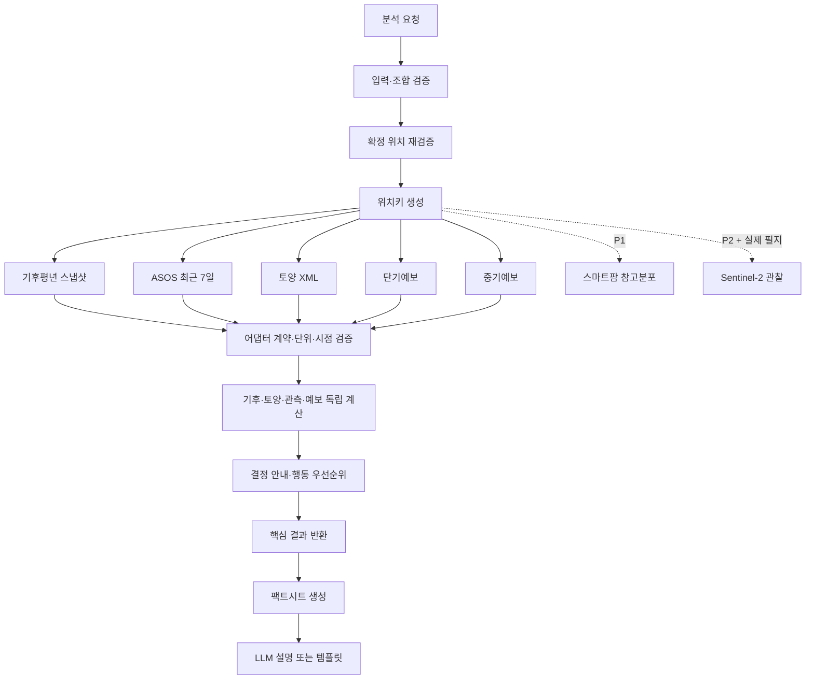

# 흙날씨.진단 — 서비스 로직 구현 명세서

> 문서 상태: 구현 기준선 v3.0 — 독립 교차검토 `APPROVED`  
> 작성일: 2026-07-23  
> 범위: 프론트엔드와 연결하지 않는 백엔드·도메인 로직 명세  
> 대상: 48~72시간 해커톤 P0와 이후 P1·P2 확장  
> 관련 문서: `07_흙날씨진단_100점_최종기획서.md`, `07_에이전트_협의록.md`, `PRODUCT_FIRST_PRD.md`  
> 검토 기록: `09_서비스로직_에이전트_협의록.md`

이 문서는 현재 프론트엔드의 화면 값과 JavaScript를 백엔드로 옮기는 문서가 아니다. 프로젝트의 최신 기획 기준을 실제 코드로 구현할 수 있도록 입력 검증, 외부 데이터 수집, 계산, 부분 실패, 판단 문장, 행동 추천, LLM 검증, 위성 확장, 테스트 계약을 고정한다.

`APPROVED`는 세 AI 서브에이전트 역할이 명세의 내부 정합성을 독립 재검토했다는 뜻이다. 실제 API 응답, 농업 규칙, 실행 코드, 현장 타당성이 검증됐다는 뜻은 아니며 §25 단계 0과 §28의 계약 동결을 통과해야 구현 승인이 가능하다.

---

## 0. 구현 결론

서비스는 다음 네 결과축을 독립적으로 계산한다.

1. **장기 기후 조건:** 공식 최적범위에서 벗어난 상대 거리
2. **지역 토양 조건:** 적합·경계 불확실·범위 밖 구간의 면적비
3. **최근·향후 위험:** 최근 7일 대표관측, 1~3일 상세위험, 4~10일 광역추세
4. **자료 상태:** 자료 충족도, 근거상태, 공간범위, 기준시점, 전달상태

네 결과축의 원자료·상태·구성요소 점수는 독립적으로 보존한다. 사용자용 `생육점수`는 기후·토양·예보에 검수된 작물 영향도, 자료 신뢰도, 실제 충족도를 적용한 `growth-score-v2`로 계산한다. 결측은 0점으로 바꾸지 않고 근거강도 0.35 미만에서는 점수를 보류한다. 최근 관측·스마트팜·위성은 이 점수에 포함하지 않는다. 사용자에게 보여줄 결론과 다음 행동은 이 결과축을 입력으로 받는 **결정론적 규칙 엔진**이 만든다. LLM은 계산이나 판정을 바꾸지 않고, 이미 확정된 사실을 쉬운 문장으로 바꾸는 역할만 맡는다.

### 0.1 반드시 폐기할 현재 데모 로직

`08_흙날씨진단_UI_샘플.html`의 아래 값과 함수는 시각 시연용이며 실제 로직으로 이식하지 않는다.

- 작물별 고정 `score`, `range`, `climate`, `soil`
- 기후 55% + 토양 45% 합산
- 자료 상태에 따라 점수 범위를 임의로 `±3`, `±8`, `±9`, `±10` 확장하는 규칙
- `ready=100`, `partial=78`, `stale=74`처럼 상태명에 고정된 자료 충족도
- 토양 구간 통계를 pH·유기물·배수의 단일 대표값처럼 표시하는 예시
- 검증되지 않은 작기·온도·강수·pH 범위와 감점값
- 필수 작기 대신 `unknown`을 선택해도 종합점수를 계속 만드는 흐름
- 데이터 없이 만들어 둔 `추정 범위`

`06_전체보유API_최종계획서.md`의 스마트팜 CO₂ 8% 보정과 결측 가중치 자동 재정규화도 최신 최종기획서에서 폐기된 안이다. 스마트팜은 P1 참고분포이며 핵심 조건지표에 반영하지 않는다.

---

## 1. 문서 우선순위와 해석 규칙

로직이 충돌할 때 다음 순서로 해석한다.

1. 과제 문제 정의와 안전·개인정보·이용조건
2. `07_흙날씨진단_100점_최종기획서.md`의 데이터·계산 계약
3. `07_에이전트_협의록.md`의 충돌 조정 결과
4. `PRODUCT_FIRST_PRD.md`의 사용자 가치·상태·수용 조건
5. `06_전체보유API_최종계획서.md`의 API 보유 현황
6. 현재 HTML은 화면 흐름 참고용

외부 API의 실제 필드명, 코드 자릿수, 단위, 발표주기, 라이선스는 문서의 추정으로 확정하지 않는다. 구현 전 성공·빈값·인증오류 실제 응답으로 `API 계약 동결`을 통과해야 한다.

---

## 2. 기능 범위

### 2.1 P0

- 주소 검색과 사용자의 행정구역 확정
- 사과·배·오이·감자·상추 지원
- 노지·시설토경·시설수경 분기
- 작기·생육단계 입력 검증
- 기후평년, ASOS 최근 관측, 지역 토양 통계, 단기·중기예보 수집
- 기후 이탈도, 토양 면적분포, 예보 위험, 자료 충족도 계산
- `DATA_NEEDED / CHECK_FIRST / FIELD_TEST_NEXT` 판단
- 사용자 상황별 1~3개 행동 생성
- 부분 실패·캐시·샘플·LLM 폴백
- 출처·거리·기준시점·한계 묶음 생성

### 2.2 P1

- 같은 작물·시설형태·재배방식·유사 작기의 스마트팜 과거 참고분포
- 결과 저장·공유
- 작물별 토양적성 통계

### 2.3 P2

- 실제 노지 필지 다각형 기반 Sentinel-2 RGB·NDVI 관찰
- PNU 기반 토양특성 상세정보
- 사용자 센서·필지 토양검정 연동

P1·P2 실패는 P0 결과를 바꾸거나 전체 분석을 실패시키지 않는다.

---

## 3. 핵심 불변조건

아래 조건은 모든 구현체가 지켜야 한다.

1. 같은 정규화 입력, 같은 원자료, 같은 규칙 버전은 같은 결과를 만든다.
2. `null`, 빈 문자열, `-`, 누락 태그를 숫자 `0`으로 바꾸지 않는다.
3. 출처·단위·용도·근거상태가 없는 숫자는 계산에 넣지 않는다.
4. 기후·토양·예보 원점수는 독립 보존하고, 대표 생육점수는 검수된 중요도·신뢰도·충족도와 고신뢰 위험 상한으로만 계산한다.
5. 최근 관측·예보·위성·스마트팜 자료는 장기 기후 조건을 올리거나 내리지 않는다.
6. 시설 외기값을 시설 내부 작물온도라고 표현하지 않는다.
7. 지역 토양통계를 필지 실측값이나 지역 평균값으로 임의 변환하지 않는다.
8. 필수 작기를 현재 월이나 추천값으로 자동 확정하지 않는다.
9. 단기와 중기예보에 없는 값을 만들어 병합하지 않는다.
10. LLM은 숫자 계산, 원인 확정, 농약·비료 처방, 병명 확정, 수확량·수익 예측을 하지 않는다.
11. 샘플과 오래된 캐시는 라이브 자료처럼 표시하지 않는다.
12. 필지 다각형이 없으면 실제 필지 위성 결과를 생성하지 않는다.

---

## 4. 도메인 모델

### 4.1 공통 enum

```ts
type UsageMode = "LAND_SEARCH" | "ACTIVE_GROWING";

type Crop =
  | "APPLE"
  | "PEAR"
  | "CUCUMBER"
  | "POTATO"
  | "LETTUCE";

type CultivationMode =
  | "OPEN_FIELD"
  | "FACILITY_SOIL"
  | "FACILITY_HYDRO";

type EvidenceStatus =
  | "CONFIRMED_RANGE"
  | "SINGLE_TARGET"
  | "RISK_ONLY"
  | "UNCONFIRMED";

type SpatialLevel =
  | "NORMAL_STATION"
  | "OBSERVATION_STATION"
  | "REGIONAL_SOIL_STAT"
  | "FORECAST_GRID"
  | "FORECAST_REGION"
  | "REFERENCE_DATASET"
  | "FIELD";

type DeliveryState =
  | "LIVE"
  | "CACHE"
  | "SAMPLE"
  | "UNAVAILABLE";

type AdapterState =
  | "SUCCESS"
  | "NO_DATA"
  | "TIMEOUT"
  | "RATE_LIMITED"
  | "AUTH_ERROR"
  | "SCHEMA_CHANGED"
  | "UNSUPPORTED"
  | "INTERNAL_ERROR";

type ModuleState =
  | "READY"
  | "PARTIAL"
  | "HOLD"
  | "NOT_APPLICABLE"
  | "UNAVAILABLE";

type DecisionGuidance =
  | "DATA_NEEDED"
  | "CHECK_FIRST"
  | "FIELD_TEST_NEXT"
  | "FACILITY_DATA_NEEDED"
  | "FACILITY_CHECK_FIRST"
  | "FACILITY_SENSOR_NEXT";
```

`UsageMode`는 출력 순서와 행동을 바꾸지만 원자료와 과학 계산을 바꾸지 않는다.

### 4.2 분석 요청

```ts
interface LocationSelection {
  candidateToken: string;
  userConfirmed: true;
}

type ResolvedLocation =
  | {
      resolutionMode: "ADDRESS_RESOLVED";
      provider: "KAKAO";
      displayName: string;
      latitude: number;
      longitude: number;
      legalDongCode: string;
      adminAreaCode: string;
    }
  | {
      resolutionMode: "ADMIN_AREA_BROAD";
      provider: "KAKAO";
      displayName: string;
      latitude: null;
      longitude: null;
      legalDongCode: string | null;
      adminAreaCode: string;
    };

type SeasonSelection =
  | {
      kind: "VERIFIED_PROFILE";
      profileId: string;
      startMonth: null;
      endMonth: null;
      userConfirmed: true;
    }
  | {
      kind: "CUSTOM";
      profileId: "CUSTOM";
      startMonth: number;
      endMonth: number;
      userConfirmed: true;
    }
  | {
      kind: "UNKNOWN";
      profileId: "UNKNOWN";
      startMonth: null;
      endMonth: null;
      userConfirmed: true;
    }
  | {
      kind: "NOT_APPLICABLE";
      profileId: "NOT_APPLICABLE";
      startMonth: null;
      endMonth: null;
      userConfirmed: true;
    };

interface AnalysisRequest {
  usageMode: UsageMode;
  location: LocationSelection;
  crop: Crop;
  cultivationMode: CultivationMode;
  season: SeasonSelection;
  growthStage: string | "UNSPECIFIED";
  parcel?: {
    geometry: GeoJSON.Polygon | GeoJSON.MultiPolygon;
    userConfirmed: true;
  };
  options?: {
    includeSmartfarmBenchmark?: boolean;
    includeSatelliteObservation?: boolean;
    saveConsent?: boolean;
  };
}
```

클라이언트는 후보 토큰과 확인값만 보낸다. 서버가 세션에 묶인 단기 `candidateToken`으로 `ResolvedLocation`을 복원하므로 좌표·법정동코드 위변조를 비교할 필요가 없다. 복원 결과가 `ADMIN_AREA_BROAD`면 점 좌표가 필요한 격자예보·관측소 거리·위성 모듈을 몰래 대표점으로 채우지 않는다.

`saveConsent`는 기본 `false`다. 서버 영구저장은 P1이므로 P0에서는 요청 수명 또는 세션 범위의 비식별 결과만 유지한다.

---

## 5. 입력 검증과 분기

### 5.1 위치

- 주소 검색어는 공백 정리 후 길이 제한을 적용한다.
- 0건과 다건 모두 후보 목록으로 정상 반환하고 사용자가 검색어를 수정하거나 하나를 확정하게 한다.
- 다건 중 첫 결과를 자동 선택하지 않는다.
- 후보 저장소에서 복원한 `ADDRESS_RESOLVED` 좌표는 유한수이며 대한민국 지원 범위 안이어야 한다.
- 분석 요청은 사용자가 확정한 세션 후보 토큰만 받는다.
- `ADMIN_AREA_BROAD`는 검증된 행정구역 코드와 사용자 확인을 요구한다.
- 넓은 행정구역에 임의 중심점을 넣어 필지·격자 정밀도를 가장하지 않는다.
- 정확 주소·좌표는 기본 영구 저장과 LLM 전달에서 제외한다.

### 5.2 작물과 재배형태

| 작물 | 허용 재배형태 |
|---|---|
| 사과 | `OPEN_FIELD` |
| 배 | `OPEN_FIELD` |
| 감자 | `OPEN_FIELD` |
| 오이 | `OPEN_FIELD`, `FACILITY_SOIL`, `FACILITY_HYDRO` |
| 상추 | `OPEN_FIELD`, `FACILITY_SOIL`, `FACILITY_HYDRO` |

허용되지 않은 조합은 자동 보정하지 않고 `INVALID_CULTIVATION_MODE`로 거부한다.

### 5.3 작기

- 사과·배 노지: 검수된 연중 월별 프로필을 사용한다.
- 감자 노지: 검수된 프리셋 또는 시작·종료월 직접입력과 사용자 확인이 필수다.
- 오이·상추 노지: 시작·종료월과 사용자 확인이 필수다.
- 오이·상추 시설: 선택사항이며 외기 운영위험의 설명 범위에만 사용한다.
- 시작월과 종료월은 1~12 정수다.
- 시작월이 종료월보다 크면 연도 순환 작기로 명시적으로 펼친다.
- 필수 작기 질문에 아무 응답도 없으면 입력 미완료로 분석을 시작하지 않는다.
- 사용자가 `UNKNOWN`을 명시적으로 선택하고 `userConfirmed=true`이면 부분분석을 허용한다. 토양과 일반 예보를 계산하되 기후 종합 이탈도는 `HOLD`로 둔다.
- 추천 작기는 `suggested=true`일 수 있지만 `userConfirmed=true` 전에는 활성 규칙이 아니다.
- `VERIFIED_PROFILE`의 ID는 작물·재배형태 allowlist와 일치해야 한다. 임의 문자열은 거부한다.
- `CUSTOM`은 두 월과 확인값이 모두 있어야 하며, `UNKNOWN`은 두 월이 모두 `null`이어야 한다.
- `NOT_APPLICABLE`은 오이·상추 시설재배처럼 작기 입력이 선택인 허용 조합에만 사용한다.
- 사과·배 연중 프로필은 서버가 작물에 맞는 검수 ID를 지정하고 `userConfirmed=true`인 요청으로 정규화한다.

### 5.4 생육단계

- 기본값은 `UNSPECIFIED`다.
- 그 외 값은 작물 규칙 레지스트리의 생육단계 allowlist에 있어야 한다.
- `LAND_SEARCH`가 생육단계를 보내면 조용히 무시하지 않고 `INVALID_GROWTH_STAGE_CONTEXT`로 거부한다.
- 단계가 없으면 개화기 냉해처럼 특정 단계의 피해를 확정하지 않는다.
- 단계 전용 규칙은 `stage === rule.stage`일 때만 활성화한다.
- 일반 임계 규칙은 단계와 무관하게 주의 수준으로 제공할 수 있다.

### 5.5 필지 다각형

P0에서는 없어도 된다. P2 위성 기능을 요청할 때만 필수이며 다음을 검증한다.

- `Polygon` 또는 `MultiPolygon`
- 닫힌 링, 유효한 좌표 순서, 자기교차 없음
- 대한민국 지원 범위
- 서버 설정 이하의 정점 수와 면적
- 지나치게 작은 필지는 요청을 거부하지 않고 정량분석 `HOLD` 가능성을 안내

### 5.6 선택 기능

- P1·P2 옵션의 기본값은 `false`다.
- 요청값이 `true`지만 서버 capability가 꺼져 있으면 P0 분석은 계속하고 해당 선택 모듈을 `UNSUPPORTED`로 반환한다.
- `saveConsent=true`인데 P1 영구저장이 꺼져 있으면 저장한 척하지 않고 `persistenceState="NOT_AVAILABLE"`을 반환한다.
- P0 행동 추천은 읽기 전용이다. 완료·나중에 알림·현장과 다름 기록은 프론트 세션 상태이며 서버 작업·알림 API는 P1에서 별도 설계한다.
- 저장 분석의 `LAND_SEARCH → ACTIVE_GROWING` 전환도 P1이다. P0에서는 새 요청으로 모드와 생육단계를 다시 제출한다.

---

## 6. 전체 처리 흐름



### 6.1 오케스트레이터 의사코드

```ts
async function createAnalysis(raw: unknown): Promise<AnalysisResult> {
  const request = validateAndNormalizeRequest(raw);
  const resolvedLocation = locationCandidates.resolveForOwner(
    request.location.candidateToken,
    currentOwnerSession()
  );
  const locationKey = await resolveLocationKeys(resolvedLocation);
  const rules = ruleRegistry.resolve(request);

  const settled = await allSettledWithinDeadline({
    climate: () => runIfKey(
      locationKey.normalStationId,
      key => climateSnapshot.read(key, rules.evaluationPeriods)
    ),
    observations: () => runIfKey(
      locationKey.observationStationId,
      key => asos.fetch(key, lastSevenCompletedDays("Asia/Seoul"))
    ),
    soil: () => runIfKey(
      locationKey.verifiedSoilAreaCode,
      key => soilV2.fetch(key)
    ),
    shortForecast: () => runIfKey(
      locationKey.shortForecastGrid,
      grid => shortForecast.fetch(grid)
    ),
    midForecast: () => runIfKey(
      locationKey.midForecastRegionId,
      regId => midForecast.fetch(regId)
    )
  }, CORE_DEADLINE_MS);

  const datasets = validateAdapterResults(settled);
  const climateResult = climateEngine.evaluate(datasets.climate, rules);
  const soilResult = soilEngine.evaluate(datasets.soil, rules, request);
  const observationResult = observationEngine.evaluate(
    datasets.observations,
    datasets.climate
  );
  const forecastResult = forecastEngine.evaluate(
    datasets.shortForecast,
    datasets.midForecast,
    rules,
    request
  );
  const modules = buildModuleSummaries({
    request,
    datasets,
    climateResult,
    soilResult,
    observationResult,
    forecastResult
  });
  const analysisStates = evaluateAnalysisStates(request, modules);

  const decision = decisionEngine.decide({
    request,
    modules,
    analysisStates
  });
  const rankedAllActions = actionEngine.mergeAndRankAll({
    request,
    decision,
    modules
  });
  const primaryAction = selectPrimaryAction(request, rankedAllActions);
  const displayActions = projectDisplayActions(
    primaryAction,
    rankedAllActions,
    3
  );

  return assembleResult({
    request,
    rules,
    datasets,
    climateResult,
    soilResult,
    observationResult,
    forecastResult,
    modules,
    analysisStates,
    decision,
    displayActions,
    primaryAction
  });
}
```

`runIfKey(null, ...)`은 외부 호출을 하지 않고 `UNSUPPORTED` 또는 `UNAVAILABLE` 봉투를 만든다. 한 어댑터의 예외를 전체 `throw`로 전파하지 않는다. 입력·위치 확인 실패만 분석 생성 전의 차단 오류이며, 데이터 소스 실패는 모듈 상태로 변환한다.

---

## 7. 위치키 생성

확정 위치에서 다음 키를 독립적으로 만든다.

```ts
interface LocationKey {
  legalDongCode10: string | null;
  verifiedSoilAreaCode: string | null;
  shortForecastGrid: { nx: number; ny: number } | null;
  midForecastRegionId: string | null;
  normalStationId: string | null;
  observationStationId: string | null;
  observationDistanceKm: number | null;
}
```

- Kakao 법정동코드를 토양 요청코드로 단순 절단하지 않는다.
- 매핑표는 출처·버전·유효기간을 가진다.
- 평년 지점과 최근 관측 지점이 다르면 평년 대비 최근 편차를 만들지 않는다.
- 관측소를 고를 때 운영 여부, 요청 기간의 자료 존재, 거리를 순서대로 검증한다.
- 일부 키를 만들지 못해도 연결 가능한 모듈은 계속 실행한다.

### 7.1 넓은 행정구역 실행 행렬

| 모듈 | `ADMIN_AREA_BROAD` 정책 |
|---|---|
| 지역 토양통계 | 검증된 행정구역 요청코드가 있을 때만 실행 |
| 중기 광역예보 | 검증된 `regId`가 있을 때만 실행 |
| 단기 격자예보 | 임의 중심점 없이 `UNAVAILABLE` |
| ASOS 최근 추이·거리 | 임의 기준점 없이 `UNAVAILABLE` |
| 기후평년 | 공식 행정구역→평년지점 매핑이 있을 때만 실행, 없으면 `HOLD` |
| Sentinel-2 | `NOT_APPLICABLE` |

넓은 지역 결과의 전체 상태는 정상적으로 `PARTIAL`일 수 있다. 결과 한계에는 점 좌표가 없어 제외된 모듈을 명시한다.

---

## 8. 데이터 어댑터 공통 계약

### 8.1 데이터 봉투

```ts
interface DataEnvelope<T> {
  sourceId: string;
  sourceName: string;
  sourceUrl: string;
  retrievedAt: string;
  observedAt: string | null;
  issuedAt: string | null;
  validFrom: string | null;
  validTo: string | null;
  spatialLevel: SpatialLevel;
  spatialLabel: string;
  distanceKm: number | null;
  unit: string | null;
  deliveryState: DeliveryState;
  adapterState: AdapterState;
  qualityFlags: string[];
  cacheMeta: {
    storedAt: string;
    freshUntil: string;
    staleUntil: string;
  } | null;
  data: T | null;
}
```

`retrievedAt`, `observedAt`, `issuedAt`, `validFrom`, `validTo`는 서로 대체하지 않는다.

`deliveryState="CACHE"`이면서 현재시각이 `freshUntil`을 넘으면 `qualityFlags`에 `STALE`을 넣는다. `staleUntil`을 넘긴 캐시는 계산에 사용하지 않고 `UNAVAILABLE`로 전환한다. 모든 비교시각은 UTC ISO-8601로 저장하고 사용자 표시 단계에서만 시간대를 변환한다.

`distanceKm`는 소스가 검증된 점 좌표를 제공하고 서버가 사용자 기준점과의 거리를 계산할 수 있을 때만 채운다. 지역 토양 면적통계에는 임의의 `대표지점 6.8km`를 붙이지 않는다. 단기예보의 약 5km는 사용자와의 거리가 아니라 격자 공간수준이다.

### 8.2 파싱 원칙

- HTTP 성공과 데이터 성공을 분리한다.
- 빈 결과는 `NO_DATA`, 예상 필드·단위 변경은 `SCHEMA_CHANGED`다.
- 숫자는 유한수 검사 후 허용 범위를 통과해야 한다.
- 공식 결측 표기와 빈 문자열은 `null`로 유지한다.
- XML 파서는 DTD와 외부 엔티티를 비활성화한다.
- 원문 일부를 감사용으로 보관할 경우 비밀키·정확 주소·좌표·농가 ID를 제거한다.
- 응답 단위를 로컬 규칙 단위로 변환할 때 변환식과 원단위를 함께 보존한다.

### 8.3 자료 충족도와 전달상태의 분리

자료 충족도는 필요한 계산 변수 중 실제로 검증된 비중이다. `LIVE/CACHE/SAMPLE`은 전달 방식이다. 샘플이 모든 필드를 가져도 라이브 자료가 되지 않으며, 라이브 응답이라도 핵심변수가 없으면 충족도는 낮다.

---

## 9. 작물 규칙 레지스트리

### 9.1 규칙 단위

```ts
interface CropRuleBase {
  ruleId: string;
  module: "CLIMATE" | "SOIL";
  crop: Crop;
  cultivationMode: CultivationMode;
  seasonProfileId: string;
  evaluationPeriod:
    | { grain: "MONTH"; month: number }
    | {
        grain: "SEASON_AGGREGATE";
        aggregation: "MEAN" | "SUM" | "MIN" | "MAX";
      };
  stage: string | "ANY";
  metric: string;
  unit: string;
  sourceTitle: string;
  sourceUrl: string;
  sourcePageOrTable: string;
  sourceVersion: string;
  reviewedAt: string;
  ruleVersion: string;
}

interface DeviationRule extends CropRuleBase {
  use: "DEVIATION";
  evidenceStatus: "CONFIRMED_RANGE";
  optimalRange: [number, number];
  toleranceRange: [number, number] | null;
  sensitivityTier: "CRITICAL" | "IMPORTANT" | "SUPPORTING";
  critical: boolean;
}

interface SingleTargetRule extends CropRuleBase {
  use: "SINGLE_TARGET";
  evidenceStatus: "SINGLE_TARGET";
  target: number;
  sensitivityTier: "CRITICAL" | "IMPORTANT" | "SUPPORTING";
  critical: boolean;
}

interface DisplayOnlyRule extends CropRuleBase {
  use: "DISPLAY_ONLY";
  evidenceStatus: "UNCONFIRMED" | "RISK_ONLY";
}

type CropMetricRule =
  | DeviationRule
  | SingleTargetRule
  | DisplayOnlyRule;
```

위험 임계 규칙은 §13의 `ForecastRiskRule`로 분리한다. 한 규칙의 `evaluationPeriod`가 `MONTH`면 한 달·한 변수만 하나의 평가단위가 된다. 여러 달을 평가하려면 출처가 있는 월별 규칙을 각각 둔다. `SEASON_AGGREGATE`는 규칙에 적힌 집계값 하나만 평가한다. 따라서 동일 월을 암묵적으로 여러 번 세거나 기간 평균과 월별 값을 동시에 이중 반영하지 않는다.

기후 엔진은 `module="CLIMATE"`, 토양 엔진은 `module="SOIL"` 규칙만 읽는다. `metric` 문자열의 이름으로 소속 모듈을 추론하지 않는다.

### 9.2 활성화 게이트

모든 규칙은 공식 출처 URL·문서 위치·단위·규칙버전·검토일이 있어야 한다. 그 뒤 `use`별로 검증한다.

| 규칙 | 추가 필수조건 | 계산 역할 |
|---|---|---|
| `DEVIATION` | 유한수 `L < U`, `CONFIRMED_RANGE` | 변수별 `d`, 조건부 종합 `D` |
| `DEVIATION` + 보조점수 | `toleranceLow < L <= U < toleranceHigh` | 해당 변수의 선택적 보조점수 |
| `SINGLE_TARGET` | 유한수 `target`, `SINGLE_TARGET` | 절대편차만 계산, `D` 제외 |
| `DISPLAY_ONLY` | 계산 필드 없음 | 설명만 가능, 판정·가중치 제외 |
| `ForecastRiskRule` | §13 스키마와 공식 임계 출처 | 위험 플래그만 생성 |

`UNCONFIRMED`는 UI 설명 후보일 수 있으나 계산·판정에는 사용하지 않는다.

규칙 파일 전체는 시작 시 스키마 검증하며 실패하면 서버를 준비 상태로 올리지 않는다. 단, 특정 작물의 미확정 규칙은 그 작물의 해당 모듈만 `HOLD`로 만들 수 있다.

### 9.3 민감도 원시 가중치

| 등급 | 원시 가중치 |
|---|---:|
| `CRITICAL` | 3 |
| `IMPORTANT` | 2 |
| `SUPPORTING` | 1 |

소수 가중치를 임의로 추가하지 않는다. 계산에 포함된 원시 가중치는 결과 근거에 그대로 기록한다.

### 9.4 과학 기준과 제품 가드레일 분리

작물의 최적범위·장해 임계와 제품 운영을 위한 보수적 표시 기준을 같은 규칙으로 저장하지 않는다.

```ts
interface ProductGuardrail<T> {
  id: string;
  value: T;
  scope: string;
  rationale: string;
  owner: string;
  reviewedAt: string;
  version: string;
}
```

다음은 현재 기획의 **MVP 제품 가드레일**이며 작물의 생물학적 상수가 아니다.

- 민감도 등급을 3/2/1로 코딩하는 방식
- 기후 충족도 70%·40% 게이트
- 토양 불확실면적비 30% 게이트
- ASOS 유효일 5/7 게이트
- 위성 유효 픽셀 25개·유효비율 70%
- 스마트팜 최소 5개 농가-작기
- 캐시 TTL, `staleUntil`, API 시간초과, 재시도 횟수, 인바운드 속도 제한

가드레일 변경은 규칙 버전을 올리고 회귀 테스트와 변경 사유를 남긴다. 사용자 문구에서 이를 공식 작물 임계값처럼 표현하지 않는다.

---

## 10. 장기 기후 엔진

### 10.1 변수별 이탈도

관측 또는 평년 스칼라 `x`, 공식 최적범위 `[L,U]`에 대해:

```text
L ≤ x ≤ U  → d = 0
x < L      → d = (L - x) / (U - L)
x > U      → d = (x - U) / (U - L)
```

반환값:

```ts
interface MetricDeviation {
  metric: string;
  observedValue: number;
  unit: string;
  optimalRange: [number, number];
  physicalDeviation: {
    direction: "BELOW" | "WITHIN" | "ABOVE";
    amount: number;
  };
  normalizedDeviation: number;
  rawWeight: 1 | 2 | 3;
  evidenceStatus: EvidenceStatus;
  sourceRefs: string[];
}
```

`d`에 임의 상한을 씌우거나 0~100으로 변환하지 않는다.

### 10.2 단일 목표값

배의 `20℃ 내외`처럼 공식 범위 폭이 없는 값은:

```text
absoluteDeviation = |x - target|
```

만 계산한다. 종합 이탈도와 자료 충족도의 분모에 넣지 않는다.

### 10.3 월·작기 처리

- 사과·배는 검수된 월별 프로필을 사용한다.
- 감자·오이·상추 노지는 사용자가 확인한 월만 평가한다.
- 이웃 달의 규칙으로 결측 달을 채우지 않는다.
- 연도 경계 작기는 `[start..12] + [1..end]`로 펼친다.
- `MONTH` 규칙 하나가 `계획된 평가단위 1개`다. 월별 중요도와 변수 민감도는 하나의 검수된 `sensitivityTier`로 저장하며 별도 곱셈으로 이중 가중하지 않는다.
- `SEASON_AGGREGATE` 규칙은 명시된 집계함수로 만든 기간값 하나만 평가한다.

### 10.4 자료 충족도

```text
climateCoverage =
  계산 가능한 원래 가중치 합 /
  계획된 DEVIATION 규칙의 전체 원래 가중치 합
```

분모에서 누락 규칙을 제거하지 않는다.

활성 `DEVIATION` 규칙이 0개면 나눗셈하지 않고 `climateCoverage=null`, `aggregateDeviation=null`로 둔다. 시설재배는 기후 모듈 `NOT_APPLICABLE`이다. 배처럼 검수된 단일 목표만 있는 노지는 목표값 자료가 있으면 모듈 `READY`와 `SINGLE_TARGET_ONLY` 결과를 반환하되 종합 `D`는 없다. 유효 단일 목표자료도 없으면 `HOLD`다.

| 조건 | 결과 |
|---|---|
| 충족도 ≥ 70%이고 모든 핵심변수 존재 | 종합 이탈도 `D` 제공 |
| 충족도 40~69% 또는 핵심변수 누락 | `D` 숨김, 가능한 변수별 편차만 제공 |
| 충족도 < 40% | 기후 모듈 `HOLD`, 원자료와 확보 방법만 제공 |
| 필수 작기 미확정 | 기후 모듈 `HOLD` |
| 범위 폭이 없는 작물 | 종합 `D` 보류, 절대편차·위험만 제공 |

### 10.5 종합 이탈도

게이트를 통과한 경우에만:

```text
D = Σ(rawWeight × normalizedDeviation) / Σ(rawWeight)
```

반환값에는 포함·제외 변수, 제외 이유, 분자·분모, 규칙 버전을 기록한다. `D`는 성공확률, 실패확률, 정확도, 수확량, 금전가치가 아니다.

### 10.6 선택적 보조점수

공식 허용범위 `[a,d]`와 최적범위 `[b,c]`가 모두 확인된 개별 변수에만 사다리꼴 점수를 허용한다.

```text
x < a 또는 x > d → 0
a ≤ x < b        → 100 × (x-a)/(b-a)
b ≤ x ≤ c        → 100
c < x ≤ d        → 100 × (d-x)/(d-c)
```

이 값은 개별 변수 보조표시이며 그 자체를 5종 공통 대표점수로 쓰지 않는다.

### 10.7 생육점수

`growth-score-v2`는 검증된 모듈 결과에서만 0~100점을 계산한다.

- 기후: `100 / (1 + aggregateDeviation)`
- 토양: 지역통계는 지표별 `100×fitRatio + 50×uncertainRatio`, 필지 실측은 적정범위 이탈거리를 연속 함수 `100/(1+이탈비율)`로 계산
- 예보: 일별 `위험 35·주의 60·보통 80·양호 92`를 실제 예보일의 선행 가중치로 계산한다. 구버전 위험자료는 WARNING 0~49, CAUTION 50~69, INFO 70~84 범위를 벗어나지 않는다.
- 노지 중요도: 기후 0.20, 토양 0.30, 예보 0.50
- 자료 신뢰도: 기후평년 0.70, 최근 필지검정 0.95, 지역 토양통계 0.25, 단기예보 0.90, 중기예보 0.65
- 유효가중치: `중요도 × 자료 신뢰도 × 자료 충족도`
- 대표값: `Σ(축 점수 × 유효가중치) / Σ유효가중치`
- 지역 토양 제한: 지역 토양의 유효가중치는 전체 유효근거의 최대 12%로 동적 제한
- 상한: WARNING 예보 49점, CAUTION 예보 69점, 고신뢰 필지 토양은 `min(100, 토양점수+20)`의 연속 상한

결측 축은 `null`로 두며 0점으로 변환하지 않는다. 유효가중치 합인 `evidenceStrength`가 0.35 미만이면 대표점수를 만들지 않는다. 대신 `confidence.coverage`/`confidence.level`과 `missingComponents`로 근거 범위를 분리 표시한다. 이 점수는 기상·토양·예보로 예상한 상태이며 사진·센서 없이 실제 작물 생체 상태를 확정하지 않는다.

시설수경은 외기예보만으로 내부 생육상태를 확정할 수 없으므로 `growthScore=null`을 반환하고, 예보 결과는 `externalRisk`로만 분리한다. 내부 온도·습도·배양액 등 검수된 시설자료가 연결되기 전에는 `양호` 생육점수를 만들지 않는다.

일별 예보는 `위험·주의·보통·양호`의 네 단계다. WARNING 발생은 위험, CAUTION 발생은 주의, 위험 미발생이지만 임계값 안전여유 안은 보통, 모든 적용 규칙이 확인되고 단기 2℃·중기 3℃ 안전여유 밖이면 양호다. 결측이 있는 날은 양호로 표시하지 않는다.

### 10.8 반환 DTO

```ts
interface ClimateResult {
  mode:
    | "DEVIATION_COMPOSITE"
    | "VARIABLE_DEVIATIONS_ONLY"
    | "SINGLE_TARGET_ONLY"
    | "NOT_APPLICABLE";
  coverage: number | null;
  aggregateDeviation: number | null;
  deviations: MetricDeviation[];
  singleTargetDeviations: Array<{
    ruleId: string;
    observedValue: number;
    target: number;
    absoluteDeviation: number;
    unit: string;
  }>;
  includedRuleIds: string[];
  excludedRules: Array<{ ruleId: string; reason: string }>;
  ruleVersion: string;
}
```

---

## 11. 지역 토양 면적분포 엔진

### 11.1 입력 의미 검증

토양 V2의 실제 XML 계약이 다음을 증명한 지표만 사용한다.

- 구간 하한·상한
- 각 구간 면적
- 면적 단위
- 지역 전체 유효면적 또는 합계 산정 규칙
- 법정동 요청코드 수준

첫 행, 구간 중간값, 가중평균을 필지 대표값으로 만들지 않는다.

### 11.2 구간 분류

어댑터는 구간 경계의 열림·닫힘을 버리지 않는다.

```ts
interface SoilInterval {
  lower: number;
  upper: number;
  lowerInclusive: boolean;
  upperInclusive: boolean;
  area: number;
  areaUnit: string;
}
```

작물 최적범위 집합에 완전히 포함되면 `FIT`, 교집합이 없으면 `OUTSIDE`, 일부만 겹치면 `UNCERTAIN`이다. 제공기관의 경계 의미가 계약 동결되지 않으면 임의로 닫힌 구간을 가정하지 않고 해당 지표를 `HOLD`한다.

```text
fitRatio       = FIT 면적 합 / 전체 유효면적
uncertainRatio = UNCERTAIN 면적 합 / 전체 유효면적
outsideRatio   = OUTSIDE 면적 합 / 전체 유효면적
```

세 비율은 반올림 전 합이 1이어야 한다. 화면용 반올림 오차는 마지막 항목을 억지 보정하지 않고 원값과 표시값을 분리한다.

### 11.3 계약 방어

- 음수 면적, 유한하지 않은 경계, 역전 구간은 `SCHEMA_CHANGED`
- 단위가 섞이면 해당 지표 `HOLD`
- 중복 구간 또는 면적합 불일치는 제공기관의 공식 반올림 허용오차가 계약에 등록된 경우에만 허용
- 전체 유효면적이 0이면 `NO_DATA`
- 불확실면적비가 30%를 초과하면 요약 판정을 만들지 않고 세 면적비만 반환

30%는 MVP 표시 가드레일이며 규칙 버전에 포함한다.

### 11.4 토양 충족도와 상태

```text
soilCoverage =
  검증된 계획 지표의 원래 가중치 합 /
  계획된 토양 지표의 전체 원래 가중치 합
```

| 조건 | 모듈 상태·요약 |
|---|---|
| 계획 지표 없음 | `NOT_APPLICABLE`, `coverage=null` |
| 충족도 ≥70%, 핵심지표 존재, 핵심지표 불확실비 ≤30% | `READY`, 지표별 분포와 요약 제공 |
| 충족도 40~69%, 핵심지표 누락, 또는 핵심지표 불확실비 >30% | `PARTIAL`, 검증된 지표별 분포만 제공 |
| 충족도 <40% 또는 유효 지표 0개 | `HOLD`, 요약 금지 |

누락 지표를 분모에서 제거하지 않는다. `PARTIAL/HOLD` 토양만으로 낙관적 `FIELD_TEST_NEXT`를 만들 수 없다.

### 11.5 재배형태 분기

- 노지: 검증 지표별 면적분포 제공
- 시설토경: `시설 토양 참고`로만 제공
- 시설수경: `NOT_APPLICABLE`
- 토양 원점수는 독립 보존하고, 생육점수에는 측정 범위에 맞는 신뢰계수와 충족도를 적용

### 11.6 반환 DTO

```ts
interface SoilMetricDistribution {
  metric: string;
  unit: string;
  fitRatio: number;
  uncertainRatio: number;
  outsideRatio: number;
  totalValidArea: number;
  areaUnit: string;
  summaryEligible: boolean;
  rawWeight: 1 | 2 | 3;
  critical: boolean;
}

interface SoilResult {
  mode: "OPEN_FIELD" | "FACILITY_REFERENCE" | "NOT_APPLICABLE";
  coverage: number | null;
  metrics: SoilMetricDistribution[];
  includedRuleIds: string[];
  excludedRules: Array<{ ruleId: string; reason: string }>;
  ruleVersion: string;
}
```

---

## 12. 최근 7일 관측 엔진

1. 기상청 일자료의 완료일은 제공기관 기준시간대 `Asia/Seoul`로 계산하고 오늘의 미완료 자료를 제외한다.
2. 가장 가까운 운영 ASOS 지점의 최근 7개 완료일을 요청한다.
3. 유효일마다 최저·최고·평균기온과 강수량을 검증한다.
4. 같은 관측지점·같은 달의 1991~2020 평년값이 있을 때만 편차를 만든다.
5. 유효일이 5일 이상이면 추세 요약을 제공한다.
6. 5일 미만이면 추세 해석을 숨기고 원자료·결측일만 제공한다.

7일 구간이 두 달에 걸치면 각 관측일을 그 날짜가 속한 달의 동일 지점 평년값과 비교한다. 월 평년값만 있는 경우 일별 정밀 기준처럼 표현하지 않고 `월 평년 기준 비교`로 표시한다.

최근 관측은 필지 미기후가 아니며 장기 기후 이탈도에 반영하지 않는다.

```ts
interface ObservationDay {
  date: string;
  minTemperature: number | null;
  maxTemperature: number | null;
  meanTemperature: number | null;
  precipitationAmount: number | null;
  monthlyNormalDeviation: number | null;
}

interface ObservationResult {
  stationId: string;
  stationName: string;
  distanceKm: number;
  validDayCount: number;
  days: ObservationDay[];
  trendSummaryAvailable: boolean;
}
```

---

## 13. 단기·중기 예보 엔진

### 13.1 정규화 DTO

```ts
interface ForecastDay {
  date: string;
  sourceType: "SHORT_GRID" | "MID_REGIONAL";
  spatialLevel: "FORECAST_GRID" | "FORECAST_REGION";
  issueTime: string;
  validFrom: string;
  validTo: string;
  minTemperature: number | null;
  maxTemperature: number | null;
  precipitationProbability: number | null;
  precipitationAmount: number | null;
  windSpeed: number | null;
  risks: ForecastRisk[];
}
```

### 13.2 병합

- 응답 유효시각을 기준으로 날짜를 만든다.
- 동일 날짜가 겹치면 단기예보를 사용자 기본 목록에서 우선한다.
- 중기 원자료는 삭제하지 않고 근거 묶음에 보존한다.
- 단기는 `지역 상세`, 중기는 `광역 추세`로 표기한다.
- 강수확률과 강수량은 독립 필드다.
- 중기에 없는 시간별 강수량·풍속을 생성하지 않는다.

### 13.3 위험 규칙

```ts
type NumericForecastMetric =
  | "minTemperature"
  | "maxTemperature"
  | "precipitationProbability"
  | "precipitationAmount"
  | "windSpeed";

type ForecastComparison =
  | {
      operator: "GT" | "GTE" | "LT" | "LTE";
      threshold: number;
    }
  | {
      operator: "BETWEEN";
      lower: number;
      upper: number;
    };

type ForecastDuration =
  | { kind: "ANY_DAY" }
  | { kind: "CONSECUTIVE_DAYS"; count: number }
  | { kind: "WINDOW_SUM"; days: number };

interface ForecastRiskRule {
  ruleId: string;
  crop: Crop;
  cultivationMode: CultivationMode;
  stage: string | "ANY";
  metric: NumericForecastMetric;
  comparison: ForecastComparison;
  duration: ForecastDuration;
  severity: "INFO" | "CAUTION" | "WARNING";
  actionId: string;
  evidenceStatus: "RISK_ONLY";
  sourceUrl: string;
  ruleVersion: string;
}

interface ForecastRisk {
  riskId: string;
  ruleId: string;
  dateRange: { from: string; to: string };
  sourceType: "SHORT_GRID" | "MID_REGIONAL";
  severity: "INFO" | "CAUTION" | "WARNING";
  actionId: string;
  evidenceIds: string[];
}

interface ForecastResult {
  shortDays: ForecastDay[];
  midDays: ForecastDay[];
  mergedDisplayDays: ForecastDay[];
  risks: ForecastRisk[];
  shortAvailable: boolean;
  midAvailable: boolean;
}
```

- 모든 비교값과 임계값은 유한수이며 같은 단위여야 한다.
- `BETWEEN`은 `lower < upper`, 연속일·기간합은 양의 정수여야 한다.
- 단계가 `UNSPECIFIED`면 단계 전용 피해를 확정하지 않는다.
- 노지는 작물·단계에 맞는 위험을 생성한다.
- 시설은 외기 예보를 난방·환기·차광·강풍·적설의 운영 확인으로 변환한다.
- 시설 외기와 작물 내부 적온을 직접 비교해 적합도를 만들지 않는다.

---

## 14. 분석 상태

### 14.1 처리 생명주기

```ts
type AnalysisLifecycleState =
  | "RECEIVED"
  | "VALIDATING"
  | "RESOLVING_LOCATION"
  | "FETCHING_MODULES"
  | "CALCULATING"
  | "CORE_READY"
  | "REPORT_PENDING"
  | "COMPLETE"
  | "FAILED_INPUT";
```

```text
RECEIVED
→ VALIDATING
→ RESOLVING_LOCATION
→ FETCHING_MODULES
→ CALCULATING
→ CORE_READY
→ REPORT_PENDING
→ COMPLETE
```

위치 후보 확인은 `/api/locations` 단계에서 끝나므로 분석 생명주기에는 도달 불가능한 대기 상태를 두지 않는다. 입력·후보 토큰 검증 실패만 `FAILED_INPUT`이 된다. 개별 데이터 소스 실패는 생명주기를 실패로 끝내지 않고 해당 모듈 상태에 기록한다. 리포트를 요청하지 않으면 `CORE_READY`가 정상 종료 상태가 될 수 있다.

### 14.2 모듈 상태

각 모듈은 전체 결과와 별개로 상태를 가진다.

```ts
interface ModuleSummary<T> {
  state: ModuleState;
  coverage: number | null;
  blockingReasons: string[];
  missingInputs: string[];
  qualityFlags: string[];
  result: T | null;
  evidence: EvidenceItem[];
}
```

자료 충족도는 계산 가능한 모듈에만 0~1 값으로 제공한다. 시설수경 토양처럼 해당 없는 모듈은 `coverage=null`이다.

### 14.3 재배형태별 적용 모듈

| 모듈 | 노지 | 시설토경 | 시설수경 |
|---|---|---|---|
| 장기 기후 이탈·편차 | `EXPECTED` | `NOT_APPLICABLE` | `NOT_APPLICABLE` |
| 지역 토양 | `EXPECTED` | `EXPECTED_REFERENCE` | `NOT_APPLICABLE` |
| 최근 ASOS | `EXPECTED` | `EXPECTED` | `EXPECTED` |
| 단기예보 | `EXPECTED` | `EXPECTED` | `EXPECTED` |
| 중기예보 | `EXPECTED` | `EXPECTED` | `EXPECTED` |

`NOT_APPLICABLE`은 실패·결측·충족도 분모에서 제외한다. 위치 정밀도 부족이나 API 실패로 기대 모듈을 실행하지 못한 경우는 `NOT_APPLICABLE`이 아니라 `UNAVAILABLE/HOLD`다.

### 14.4 상태의 세 축

```ts
type AnalysisState =
  | "COMPLETE"
  | "PARTIAL"
  | "DATA_NEEDED";

type ConditionState =
  | "READY"
  | "PARTIAL"
  | "HOLD"
  | "NOT_APPLICABLE";

type RiskState =
  | "READY"
  | "PARTIAL"
  | "HOLD";
```

`AnalysisState`는 **모든 적용 가능한 P0 데이터가 도착했는지**를 뜻하며 판단의 낙관성이나 정확도 확률이 아니다.

```text
applicable = 재배형태 행렬에서 NOT_APPLICABLE이 아닌 모듈
usable     = READY 또는 결과가 남아 있는 PARTIAL

모든 applicable 모듈이 READY                 → COMPLETE
usable 모듈이 하나 이상이고 누락/부분이 존재 → PARTIAL
usable 모듈이 0개                             → DATA_NEEDED
```

- `SAMPLE` 또는 `STALE` 근거가 포함된 모듈은 `READY`가 아니라 `PARTIAL`이므로 전체 `COMPLETE`를 만들 수 없다.
- 노지 `ConditionState`: 기후·토양 모두 usable이면 상태별로 `READY/PARTIAL`, 하나만 usable이면 `PARTIAL`, 둘 다 없으면 `HOLD`.
- 시설토경 `ConditionState`: 토양 참고만 평가해 `READY/PARTIAL/HOLD`.
- 시설수경 `ConditionState`: `NOT_APPLICABLE`.
- `RiskState`: ASOS·단기·중기가 모두 `READY`면 `READY`, 하나 이상 usable이면 `PARTIAL`, 전부 없으면 `HOLD`.
- 필수 질문 무응답은 분석 생성 전 `INVALID_INPUT`이다. 명시적 `UNKNOWN`은 결과를 만들되 관련 모듈과 결정 안내를 보수적으로 낮춘다.

---

## 15. 결정 안내 엔진

결정 문장은 `적합/부적합`이나 매입 권고가 아니다. 재배형태를 먼저 분기하고 각 분기 안에서 위에서부터 보수적으로 선택한다.

### 15.1 노지 결정

`DATA_NEEDED`:

- 필수 작기를 `UNKNOWN`으로 확인
- 핵심 기후자료·필요한 공식 범위 폭·필수 규칙 미확정
- 기후와 토양 조건 모듈이 모두 `HOLD`

`CHECK_FIRST`:

- 핵심 기후변수 `d > 0`
- fresh 공식 위험 플래그 활성
- `RiskState`가 `PARTIAL/HOLD`여서 무위험을 확인할 수 없음
- 핵심 토양 지표에서 확정 적합 0%·불확실 0%
- 토양 모듈 `PARTIAL/HOLD`
- 핵심 토양 지표 불확실면적비 30% 초과

`FIELD_TEST_NEXT`는 다음을 모두 만족할 때만 선택한다.

- 기후와 토양이 모두 `READY`
- `RiskState=READY`
- 사용한 결정 근거가 `CURRENT`이며 `SAMPLE/STALE`이 아님
- 확인 가능한 모든 핵심 기후변수 `d = 0`
- 활성 위험 없음
- 강한 토양 범위 밖 신호와 30% 초과 불확실이 없음

### 15.2 시설 결정

시설은 노지 기후 이탈도나 필지 적합 판정을 만들지 않는다.

`FACILITY_CHECK_FIRST`:

- fresh 예보에서 난방·환기·차광·강풍·적설 운영 위험이 활성

`FACILITY_DATA_NEEDED`:

- fresh 운영 위험은 없지만 `RiskState!=READY`
- 특히 current 단기예보가 없어 가까운 위험 부재를 확인할 수 없음
- 외기 근거가 stale/sample뿐이라 현재 상태를 말할 수 없음
- 시설 위험 규칙 또는 단위 계약이 미확정

`FACILITY_SENSOR_NEXT`:

- `RiskState=READY`이고 활성 운영 위험이 없음
- 실제 내부 환경은 알 수 없으므로 센서 확인을 다음 행동으로 유지

시설토경의 토양 `PARTIAL/HOLD`는 조건 한계와 토양검정 행동을 추가하지만, 외기 운영결정 코드를 노지 `DATA_NEEDED`로 바꾸지 않는다. 시설수경의 기후·토양 `NOT_APPLICABLE`도 결측 근거가 아니다.

### 15.3 모드·재배형태별 문장 템플릿

결정 코드는 계산 결과이고 문장은 사용자 상황에 맞는 검수 템플릿이다.

| 코드 | `LAND_SEARCH` 템플릿 의도 | `ACTIVE_GROWING` 템플릿 의도 |
|---|---|---|
| `DATA_NEEDED` | 자료를 확보한 뒤 후보지를 판단 | 장기 조건자료는 부족하며 오늘 위험은 별도 확인 |
| `CHECK_FIRST` | 해당 항목 확인 후 후보지 검토 | 현재 재배지에서 해당 항목을 먼저 확인 |
| `FIELD_TEST_NEXT` | 공개자료 큰 이탈 없음, 필지검정 진행 | 공개자료 큰 이탈 없음, 현장 측정으로 확인 |
| `FACILITY_DATA_NEEDED` | 외기자료와 시설 계획을 확인 | 외기자료와 내부 센서를 직접 확인 |
| `FACILITY_CHECK_FIRST` | 시설 운영 위험을 설계에 반영 | 오늘 시설 운영 위험부터 확인 |
| `FACILITY_SENSOR_NEXT` | 외기상 큰 위험 없음, 내부 센서 계획 확인 | 외기상 큰 위험 없음, 내부 센서 확인 |

- `LAND_SEARCH`의 예보는 현재 작물 피해가 아니라 현장 방문·입지 확인 조건으로 표현한다.
- `ACTIVE_GROWING`만 검증된 단계 정보가 있을 때 단계별 피해 가능성을 언급한다.
- 템플릿 키는 `usageMode × cultivationMode × decisionCode`이며 존재하지 않으면 분석을 공개하지 않고 템플릿 계약 오류로 처리한다.

### 15.4 결과 근거

결정에는 반드시 `triggerIds`를 붙인다. 문장만 저장하지 않는다.

```ts
interface DecisionResult {
  kind: "OPEN_FIELD_CONDITION" | "FACILITY_OPERATION";
  code: DecisionGuidance;
  messageTemplateId: string;
  triggerIds: string[];
  limitations: string[];
}
```

---

## 16. 행동 추천 엔진

행동은 LLM이 새로 만들지 않는다. 검수된 `actionId` 레지스트리에서 고른다.

### 16.1 행동 후보

```ts
interface ActionCandidate {
  actionId: string;
  titleTemplateId: string;
  usageModes: UsageMode[];
  cultivationModes: CultivationMode[];
  triggerIds: string[];
  blocking: boolean;
  severity: "INFO" | "CAUTION" | "WARNING";
  dueWindow: "NOW" | "1_TO_3_DAYS" | "4_TO_10_DAYS" | "BEFORE_DECISION";
  evidenceStrength: EvidenceStatus;
  sourceFreshness: "CURRENT" | "STALE" | "SAMPLE" | "NOT_APPLICABLE";
  ruleOrder: number;
}

interface PrimaryAction {
  actionId: string;
  triggerIds: string[];
  selectionReason:
    | "ACTIVE_GROWING_CURRENT_WARNING"
    | "BLOCKING_INFORMATION"
    | "HIGHEST_RANKED_ACTION";
}
```

### 16.2 정렬

설명하기 어려운 가중합 점수를 만들지 않고 다음 튜플을 사전식으로 정렬한다.

1. 분석을 막는 자료 확보 행동
2. `WARNING > CAUTION > INFO`
3. `NOW > 1_TO_3_DAYS > BEFORE_DECISION > 4_TO_10_DAYS`
4. `CONFIRMED_RANGE > RISK_ONLY > SINGLE_TARGET > UNCONFIRMED`
5. `CURRENT > STALE > SAMPLE`
6. 규칙 파일의 안정적인 `ruleOrder`

`NOT_APPLICABLE` freshness는 입력 보완 행동에만 쓰며 5번 비교축을 건너뛴다.

동일 `actionId`는 하나로 합치고 근거만 여러 개 연결하되 이 단계에서는 자르지 않는다.

병합 시 `triggerIds`의 합집합을 보존하고, 가장 높은 위험도·가장 가까운 기한·가장 강한 근거를 사용한다. 완전 동률은 `ruleOrder`, 마지막으로 `actionId` 오름차순으로 결정해 실행마다 순서가 바뀌지 않게 한다.

### 16.3 primary action 선택

```ts
function selectPrimaryAction(
  request: AnalysisRequest,
  ranked: ActionCandidate[]
): PrimaryAction | null {
  if (request.usageMode === "ACTIVE_GROWING") {
    const currentWarning = ranked.find(action =>
      action.severity === "WARNING" &&
      ["NOW", "1_TO_3_DAYS"].includes(action.dueWindow) &&
      action.sourceFreshness === "CURRENT"
    );
    if (currentWarning) {
      return toPrimary(currentWarning, "ACTIVE_GROWING_CURRENT_WARNING");
    }
  }

  const blocking = ranked.find(action => action.blocking);
  if (blocking) return toPrimary(blocking, "BLOCKING_INFORMATION");
  return ranked[0] ? toPrimary(ranked[0], "HIGHEST_RANKED_ACTION") : null;
}
```

`STALE/SAMPLE` 예보는 현재 위험 행동 후보 자체를 만들지 않는다. 입력 보완처럼 시점이 없는 행동은 `NOT_APPLICABLE`을 사용한다.

primary를 선택한 뒤에만 표시 목록을 만든다.

```text
전체 후보 병합·안정 정렬
→ 전체 후보에서 primary 선택
→ [primary, 나머지 ranked] 순서로 중복 제거
→ 표시용 최대 3개로 투영
```

따라서 blocking 행동이 세 개 이상이어도 current 긴급 `WARNING`이 절단 전에 primary로 선택되고 표시 목록에 반드시 남는다.

### 16.4 사용자 모드

`LAND_SEARCH`:

- 후보지 현장 확인
- 지역 통계와 실제 필지의 차이를 줄이는 토양검정
- 작기 확정과 재분석

`ACTIVE_GROWING`:

- 오늘·1~3일 운영 위험을 먼저 제시
- 배수·환기·난방·차광 등 비처방형 확인 행동
- 현장 상태 기록

`ACTIVE_GROWING`에서 장기 조건의 `DATA_NEEDED`와 검증된 1~3일 `WARNING`이 동시에 발생해도 두 상태를 합치지 않는다. 장기 결정 코드는 `DATA_NEEDED`로 유지하되 위 함수가 시급한 단기 위험을 primary action으로 선택한다. 응답은 `decision`과 `primaryAction`의 근거 ID를 각각 보존한다.

농약명, 비료량, 병명, 수확 보장 행동은 레지스트리에 두지 않는다.

---

## 17. 근거 묶음

모든 수치와 판단은 다음 구조로 추적 가능해야 한다.

```ts
interface EvidenceItem {
  evidenceId: string;
  module: "CLIMATE" | "SOIL" | "OBSERVATION" | "FORECAST" | "RULE";
  metric: string;
  value: number | string | null;
  unit: string | null;
  reference: string | [number, number] | null;
  effect: string;
  rawWeight: number | null;
  inclusion: "INCLUDED" | "EXCLUDED";
  exclusionReason: string | null;
  evidenceStatus: EvidenceStatus;
  spatialLevel: SpatialLevel;
  distanceKm: number | null;
  observedAt: string | null;
  issuedAt: string | null;
  sourceName: string;
  sourceUrl: string;
  sourceVersion: string;
  deliveryState: DeliveryState;
  freshness: "CURRENT" | "STALE" | "SAMPLE" | "NOT_APPLICABLE";
  qualityFlags: string[];
}
```

사용자가 다음 질문에 답할 수 있어야 한다.

- 어떤 값이 결론을 만들었는가?
- 공식 기준은 무엇인가?
- 실제 단위로 얼마나 벗어났는가?
- 왜 포함 또는 제외됐는가?
- 자료가 필지와 얼마나 떨어져 있으며 언제의 자료인가?
- 라이브, 캐시, 샘플 중 무엇인가?

---

## 18. LLM 설명 로직

### 18.1 팩트시트

정확 주소·좌표·키·농가 ID를 제거하고 시군구 수준 지역명과 구조화 결과만 보낸다.

```ts
type ReportClaimType =
  | "NEUTRAL_FACT"
  | "STRENGTH"
  | "RISK"
  | "ACTION_SUPPORT"
  | "LIMITATION";

interface ReportFact {
  factId: string;
  claimType: ReportClaimType;
  renderedText: string;
  allowedSections: Array<
    "SUMMARY" | "STRENGTHS" | "RISKS" | "ACTIONS" | "LIMITATIONS"
  >;
}

interface ReportFactSheet {
  regionLevel: string;
  crop: Crop;
  cultivationMode: CultivationMode;
  usageMode: UsageMode;
  seasonLabel: string;
  decision: DecisionResult;
  primaryAction: PrimaryAction | null;
  facts: ReportFact[];
  allowedActionIds: string[];
  requiredSummaryFactIds: string[];
  requiredRiskFactIds: string[];
  requiredActionIds: string[];
  requiredLimitationFactIds: string[];
  ruleVersion: string;
}
```

팩트시트에는 `EvidenceItem.inclusion="INCLUDED"`이고 `evidenceStatus!="UNCONFIRMED"`인 근거만 주장용 팩트로 넣는다. 제외·stale·sample 근거가 필요하면 `LIMITATION` 타입의 서버 렌더링 문장으로만 변환한다. LLM에 원 수치 객체나 자유로운 처방 후보를 넘기지 않는다.

사용자 자유문장은 시스템 지시문 뒤에 그대로 이어붙이지 않는다.

### 18.2 출력

```ts
interface ReportPlan {
  summaryFactIds: string[];
  strengthFactIds: string[];
  riskFactIds: string[];
  nextActionIds: string[];
  limitationFactIds: string[];
}

interface ReportSentence {
  text: string;
  factIds: string[];
  actionIds: string[];
}

interface ReportOutput {
  summary: ReportSentence;
  strengths: ReportSentence[];
  risks: ReportSentence[];
  nextActions: ReportSentence[];
  limitations: ReportSentence[];
}
```

P0에서 LLM은 자유 문장을 쓰지 않고 `ReportPlan`의 ID를 선택·정렬한다. 서버가 선택된 `ReportFact.renderedText`와 검수된 행동 템플릿으로 `ReportOutput`을 만든다. 자연어 자유 재작성은 별도 실험 기능이며 P0 승인 범위가 아니다.

### 18.3 검증

다음 중 하나면 LLM 응답 전체를 폐기한다.

- JSON 스키마 불일치
- 존재하지 않는 fact/action ID
- fact의 `allowedSections`와 다른 영역에 배치
- `requiredSummaryFactIds`가 summary에서 누락
- `requiredRiskFactIds`가 risks 또는 summary에서 누락
- `requiredActionIds`와 `primaryAction.actionId`가 nextActions에서 누락
- `requiredLimitationFactIds` 누락
- 허용 개수 초과 또는 중복 ID

서버 렌더링 템플릿 자체는 별도 정적 검사로 숫자·병명·원인 확정·처방·보장·필지 실측 오인을 금지한다. 이 구조에서는 자연어 의미를 런타임 LLM 검증으로 추측하지 않아도 된다.

### 18.4 폴백

키 없음, 429, 5xx, 시간초과, 검증 실패 시 결정론적 템플릿을 사용한다. LLM 실패는 핵심 분석 상태를 낮추지 않는다.

---

## 19. 스마트팜 공개 코호트 참고(P1)

활성 조건:

- `CUCUMBER + FACILITY_SOIL/FACILITY_HYDRO`
- `APPLE + OPEN_FIELD`
- `POTATO + OPEN_FIELD`
- 검수된 `smartfarm-reference-v1` 응답 계약
- 서비스 키와 기능 플래그 활성

확인된 데이터 계열:

- 시설 오이: 품목별 시설원예 `DataMartItemRestService`
- 노지 사과·감자: 노지 `OutdoorFarmRest`
- 사과 품목코드 `060100`, 감자 품목코드 `050100`
- 배·상추·노지 오이는 직접 일치하는 데이터가 확인되지 않았으므로 외부 호출 없이 `NOT_APPLICABLE`

출력:

- 공개 농가 수와 시설 데이터의 작기 수
- 같은 시·군, 같은 시·도, 전국 중 현재 가능한 비교 수준
- 실제 응답에서 확인한 자료기간
- 시설유형·단동/연동·토경/수경·지역 분포
- 공식 문서에서 확인한 환경·제어·생육·생육사진·컨설팅·생산량·생산비 자료 제공 여부
- `REFERENCE_ONLY`, `affectsDecision=false`, `affectsScore=false`
- 개별 농가 ID 비노출과 공개 코호트라는 고지

현재 단계에서는 환경·제어·생육 원값을 내려받아 백분위를 만들지 않는다. 해당 API는 농가·작기·기간을 추가로 지정해야 하며, 사용자와 비교 가능한 코호트/기간/단위 계약이 동결되지 않은 상태에서 일부 농가를 임의 선택하면 잘못된 기준을 만들 수 있기 때문이다. 후속 정량분포는 최소 표본수, 동일 생육단계, 동일 단위, 기간 교집합을 모두 검증한 별도 계약에서만 활성화한다.

금지:

- 핵심 기후·토양 결과에 가중
- `인근`, `현재 현장`, `실시간 검증` 표현
- 표본 부족 시 유사 작물로 대체
- 다른 농가의 값을 사용자 농장의 값으로 사용

```ts
interface SmartfarmReferenceResult {
  referenceType: "PUBLIC_PEER_COHORT";
  decisionUse: "REFERENCE_ONLY";
  affectsDecision: false;
  affectsScore: false;
  selectedCrop: "사과" | "감자" | "오이";
  datasetType: "FACILITY_ITEM_DATA" | "OUTDOOR_BIG_DATA";
  comparisonLevel: "SAME_DISTRICT" | "SAME_PROVINCE" | "NATIONAL";
  sameDistrictCount: number;
  sameProvinceCount: number;
  farmCount: number;
  seasonCount: number | null;
  datasetPeriod: { fromYear: number; toYear: number };
  fetchedDataTypes: string[];
  availableDataTypes: string[];
  privacy: {
    individualFarmIdsExposed: false;
    individualFarmSelected: false;
    aggregation: "COHORT_ONLY";
  };
  limitations: string[];
}
```

---

## 20. Sentinel-2 필지 관찰(P2)

### 20.1 활성 조건

- `cultivationMode === OPEN_FIELD`
- 사용자가 확정한 유효 필지 다각형
- OAuth2 인증과 호출 계약 정상

### 20.2 처리

1. 최근 사용 가능한 Sentinel-2 L2A 장면 검색
2. 버전 고정된 SCL 정책으로 구름·구름그림자·눈·무자료를 제외
3. 필지 경계에서 10m 안쪽 버퍼를 우선 집계
4. NDVI `(B08-B04)/(B08+B04)` 계산
5. 필지 내부 중앙값, 25·75백분위, 유효 픽셀 수·비율 계산
6. 비교 가능한 최근 두 관측이 있을 때만 변화량 계산

### 20.3 게이트

- 유효 픽셀 25개 미만: 정량 결과 `HOLD`
- 유효 픽셀 비율 70% 미만: 변화 비교 `HOLD`
- 비교 관측 2개 미만: 추세 `HOLD`
- 촬영일·구름 마스크·해상도·공급원 누락: 결과 공개 금지

10m 안쪽 버퍼가 비거나 유효 픽셀 25개를 만들지 못하면 전체 필지로 한 번만 재계산하고 `BOUNDARY_INCLUDED` 품질 플래그를 붙인다. 전체 필지도 기준을 못 넘으면 `HOLD`다.

SCL 허용·제외 클래스는 숫자 코드를 본문에 하드코딩하지 않고 공식 클래스 매핑, 처리 버전, 검수일을 가진 `satelliteMaskPolicy`로 동결한다. 정책이 없으면 P2를 활성화하지 않는다.

두 장면의 변화량은 다음을 모두 만족할 때만 계산한다.

- 동일 AOI와 동일 10m 버퍼/전체필지 정책
- 동일 출력 해상도와 NDVI 식
- 동일 SCL 정책 버전
- 두 장면 각각 유효 픽셀 비율 70% 이상
- 두 장면 각각 유효 픽셀 25개 이상

```ts
type SatelliteState =
  | "NOT_ELIGIBLE"
  | "WAITING_FOR_AOI"
  | "PROCESSING"
  | "NO_VALID_SCENE"
  | "HOLD"
  | "READY";

interface SatelliteObservation {
  acquiredAt: string;
  resolutionMeters: number;
  validPixelCount: number;
  validPixelRatio: number;
  ndviMedian: number;
  ndviP25: number;
  ndviP75: number;
  samplingGeometry: "INNER_10M" | "FULL_FIELD";
  maskPolicyVersion: string;
  qualityFlags: string[];
}

interface SatelliteResult {
  state: SatelliteState;
  observations: SatelliteObservation[];
  comparableChange: number | null;
  provider: string;
}
```

NDVI는 식생 반사 관찰값이다. 건강도, 병충해, 수확량, 원인을 확정하지 않는다.

---

## 21. 캐시·재시도·부분 실패

### 21.1 초기 정책

| 소스 | 캐시 | 시간초과 시작값 | 실패 영향 |
|---|---|---:|---|
| Kakao 후보 | 세션 메모리 10분 | 3초 | 위치 미확정으로 분석 시작 차단 |
| 기후평년 | 배포 스냅샷 | 없음 | 기후 모듈만 미제공 |
| ASOS | 완료일 기준 최대 24시간 | 3초 | 최근 추이만 미제공 |
| 토양 V2 | 지역코드·연도 7일 | 3초 | 토양 모듈만 미제공 |
| 단기예보 | 다음 발표주기까지 | 3초 | 최신 허용 캐시 또는 상세예보 미제공 |
| 중기예보 | 발표주기 기준 최대 6시간 | 3초 | 광역추세만 미제공 |
| 작물코드 | 7일 또는 배포 스냅샷 | 3초 | 검증 로컬 5종 매핑 |
| 스마트팜 | 적재주기 확인 후 1~24시간 | 4초 | P1 카드 숨김 |
| Sentinel-2 | AOI·기간 해시 24시간 | 12초 | P2 관찰 보류 |
| LLM | 팩트해시·프롬프트 버전 | 8초 | 템플릿 |

TTL은 MVP 제품 가드레일이며 실제 발표주기와 응답시간을 측정해 버전 관리한다. **계약이 동결되지 않은 소스는 캐시를 비활성화하고 stale 폴백을 금지한다.** 이 경우 LIVE 실패는 `UNAVAILABLE`이다.

평상시 읽기 전략은 `fresh cache 우선 → miss일 때 LIVE`다. stale cache는 LIVE 요청이 실패했을 때만 검토하며 백그라운드 stale-while-revalidate는 P0에서 사용하지 않는다.

안전한 P0 기본값은 모든 소스에서 `staleUntil=freshUntil`, 즉 운영 stale 사용 금지다. 이후 stale 허용이 필요한 소스만 실제 발표주기·업무 영향 검토 후 `staleUntil`을 별도로 늘린다. 늘리더라도 §21.4의 표시·판정 제한은 유지한다.

### 21.2 재시도

- 400·401·403: 재시도 없음
- 429: `Retry-After` 존중, 대기시간이 전체 deadline 안에 들어올 때만 최대 1회; 넘으면 즉시 폴백
- 네트워크·5xx: 짧은 지터 후 최대 1회
- `NO_DATA`, `SCHEMA_CHANGED`: 재시도 없음

### 21.3 폴백 순서

```text
LIVE
→ 최신 CACHE
→ 소스별 허용 최대기간 안의 STALE CACHE + 시점 경고
→ DEMO 환경에서만 검증 SAMPLE + 원 수집일
→ UNAVAILABLE
```

운영에서 자동 샘플 폴백을 금지한다. 샘플 사용은 `DEMO_ALLOW_FIXTURE=true`와 서버 환경 검증을 모두 통과해야 한다.

### 21.4 stale·sample의 판정 사용

| 소스 | stale/sample 사용 가능 범위 |
|---|---|
| 기후평년 스냅샷 | 검증 checksum·규칙버전이 일치하면 `CURRENT`; 버전 미확인은 사용 금지 |
| 지역 토양 | 분포 표시와 `CHECK_FIRST` 근거만 가능; 모듈 `PARTIAL`, `FIELD_TEST_NEXT` 금지 |
| ASOS | 날짜와 함께 원자료 표시만 가능; 최근 추세·현재 행동 생성 금지 |
| 단기·중기예보 | 표시 전용; 위험 플래그·현재 primary action 생성 금지 |
| 스마트팜·위성 | 촬영·자료시점과 함께 P1/P2 참고만 가능 |

- stale 또는 sample이 포함된 모듈은 `READY`나 전체 `COMPLETE`가 될 수 없다.
- stale 무위험 자료는 `FIELD_TEST_NEXT`, `FACILITY_SENSOR_NEXT` 같은 안심성 결론의 근거가 될 수 없다.
- `EvidenceItem.freshness`와 `qualityFlags`가 결정·행동까지 전달돼야 한다.
- 데모 sample은 규칙 경로를 시연할 수 있지만 실제 지역의 현재 행동·알림을 만들지 않는다.

### 21.5 응답 시간

- 위치 확정 후 P0 결정론적 결과 목표: 5초
- LLM 포함 설명 목표: 추가 8초 이내
- 동일 요청 캐시 목표: 1초
- 스마트팜·위성은 핵심 응답을 기다리게 하지 않는다.

### 21.6 캐시 키·동시성

- 같은 정규화 위치키·작물·재배형태·작기·규칙버전의 동시 외부 조회는 하나로 합쳐 cache stampede를 막는다.
- 클라이언트가 선택적 `Idempotency-Key`를 보내면 같은 사용자 세션·같은 정규화 요청에서 분석 생성을 중복 수행하지 않는다.
- 분석 캐시 키에는 인증키, 전체 주소, 원 좌표 문자열을 넣지 않는다.
- 주소 기반 캐시가 필요하면 단순 해시 대신 서버 비밀 salt를 사용하는 HMAC을 사용한다.
- 요청 취소나 전체 deadline 도달 시 아직 끝나지 않은 하위 호출에 취소를 전파한다.
- `NO_DATA`와 비재시도 인증오류의 negative cache 기간은 소스별 계약에서 짧게 동결하고 정상 TTL과 분리한다.
- negative cache 계약이 없으면 저장하지 않는다.

원자료 캐시 키는 다음 정규화 필드를 포함한다.

```text
adapterVersion + operationId + verifiedLocationKey
+ requestedPeriod + providerIssueTime + normalizedParameters
```

서로 다른 공간수준·기간·발표회차·오퍼레이션은 같은 키를 공유하지 않는다. 캐시 값에는 공급자 원문 전체가 아니라 비밀값을 제거한 정규화 DTO만 저장한다.

### 21.7 idempotency

- `Idempotency-Key`는 표시 가능한 ASCII 1~64자다.
- 키 범위는 `ownerSessionId + route + key`, TTL은 10분이다.
- 같은 키·같은 정규화 payload: 처리 중이면 기존 상태와 `Location`, 완료면 기존 응답 재생.
- 같은 키·다른 payload: `409 IDEMPOTENCY_CONFLICT`.
- 검증 실패 4xx와 내부 5xx는 성공 응답처럼 재생하지 않는다.
- `/report`는 `analysisId + factHash + reportPolicyVersion`으로 자연 멱등 처리한다.
- P0 단일 인스턴스 인메모리 구현은 허용하되, 다중 인스턴스 전환 전 공유 저장소 없이는 멱등성을 보장한다고 주장하지 않는다.

### 21.8 속도 제한

초기 인바운드 제품 가드레일:

| 경로 | 세션+IP 기준 |
|---|---:|
| `/api/locations` | 30회/분 |
| `POST /api/analyses` | 10회/분 |
| `POST /api/analyses/:id/report` | 5회/분 |
| `/api/health/preflight` | 30회/분 |

초과 시 `429`와 `Retry-After`를 반환한다. 공급자별 quota·동시성은 계약 동결 항목이며, 미확정 소스의 라이브 호출은 활성화하지 않는다. 확정 후 공급자별 semaphore와 짧은 회로차단을 두며 대기열이 핵심 5초 deadline을 넘기면 요청을 쌓지 않고 캐시 또는 부분결과로 전환한다.

---

## 22. 보안·개인정보

- 비밀키는 백엔드 Secret 또는 로컬 `.env`에만 둔다.
- 전체 요청 URL에 키가 포함될 수 있으므로 URL 전체를 로그에 남기지 않는다.
- 로그에는 요청 ID, 작물, 시군구 수준 코드, 어댑터 상태, 지연시간만 남긴다.
- 외부 API Base URL은 서버 allowlist로 고정해 SSRF를 막는다.
- XML DTD·외부 엔티티를 비활성화한다.
- CORS 허용 출처와 요청 속도를 제한한다.
- 정확 주소·좌표는 기본 영구 저장하지 않는다.
- LLM에 정확 주소·좌표·농가 식별자를 보내지 않는다.
- fixture에서 키·전체 주소·정확 좌표·농가 ID를 제거한다.
- 응답과 로그의 오류 객체에도 인증 헤더와 쿼리키를 포함하지 않는다.

### 22.1 P0 세션·소유권

- 인증이 없을 때 서버는 `HttpOnly`, `SameSite=Lax` 서명 익명 세션 쿠키를 발급하고 배포환경에서는 `Secure`를 강제한다. localhost 개발 예외를 운영 설정에 승격하지 않는다.
- 위치 후보 토큰, 분석, 리포트, idempotency 레코드는 모두 인증 사용자 ID 또는 익명 `ownerSessionId`에 귀속한다.
- 분석 ID는 최소 128비트 난수의 추측 불가능한 opaque ID다.
- `GET /analyses/:id`와 `POST /analyses/:id/report`는 같은 소유자만 허용한다.
- 소유권 불일치와 존재하지 않음은 모두 `404 ANALYSIS_NOT_FOUND`로 응답한다.
- 쿠키 인증을 사용하는 상태변경 요청은 `Origin` 검사와 CSRF 토큰을 요구한다.
- `GET /api/session`이 현재 세션에 묶인 CSRF 토큰과 만료시각을 JSON으로 반환한다.
- 클라이언트는 상태변경 요청의 `X-CSRF-Token` 헤더에 이 값을 보낸다.
- 토큰은 세션 생성·권한 변경 때 회전하고 60분에 만료한다. `403 CSRF_REJECTED` 후에는 `/api/session`에서 다시 발급받는다.

### 22.2 P0 보관기간

| 데이터 | 저장 위치 | 절대 TTL | 만료 동작 |
|---|---|---:|---|
| 위치 후보와 정확 좌표 | 단일 인스턴스 세션 메모리 | 10분 | 토큰 무효화 |
| 비식별 분석 결과 | 세션 메모리 | 60분 | `404 ANALYSIS_NOT_FOUND` |
| report 진행 잠금 | 분석 레코드 | 최대 15초 | 템플릿 완료 후 잠금 해제 |
| idempotency 레코드 | 세션 메모리 | 10분 | 새 요청으로 처리 |

위 수치는 MVP 제품 가드레일이다. 정확 주소·좌표는 위치키 생성이 끝나면 분석 레코드에서 즉시 제거하고 후보 메모리에만 TTL 동안 둔다. 디스크나 외부 캐시에 저장하지 않는다. P1 영구저장은 별도 동의·삭제·보관정책·암호화 설계 전에는 활성화하지 않는다.

---

## 23. 백엔드 API 계약

프론트엔드에는 아직 연결하지 않지만 구현 경계를 고정한다.

```text
GET  /api/session
GET  /api/locations?q=...
POST /api/analyses
GET  /api/analyses/:id
POST /api/analyses/:id/report
GET  /api/health/preflight
```

### 23.1 위치 검색 응답

```ts
interface LocationCandidate {
  candidateToken: string;
  displayName: string;
  resolutionMode: "ADDRESS_RESOLVED" | "ADMIN_AREA_BROAD";
  expiresAt: string;
}

interface LocationSearchResponse {
  candidates: LocationCandidate[];
}
```

- 후보 토큰은 세션에 묶인 최소 128비트 난수이며 10분 후 만료한다.
- 좌표·법정동코드는 서버 후보 저장소에만 두고 검색 응답에서 꼭 필요하지 않으면 노출하지 않는다.
- 0건과 다건은 정상 `200` 응답이다. 사용자가 하나를 고른 뒤 그 토큰으로 분석을 요청한다.

### 23.2 분석 응답

```ts
interface SourceDisclosure {
  sourceId: string;
  sourceName: string;
  sourceUrl: string;
  retrievedAt: string;
  observedAt: string | null;
  issuedAt: string | null;
  validFrom: string | null;
  validTo: string | null;
  spatialLevel: SpatialLevel;
  spatialLabel: string;
  distanceKm: number | null;
  deliveryState: DeliveryState;
  adapterState: AdapterState;
  qualityFlags: string[];
}

interface AnalysisResult {
  analysisId: string;
  createdAt: string;
  inputSummary: {
    usageMode: UsageMode;
    regionLabel: string;
    crop: Crop;
    cultivationMode: CultivationMode;
    seasonLabel: string;
    growthStage: string;
    locationPrecision: "ADDRESS_RESOLVED" | "ADMIN_AREA_BROAD";
    parcelState: "UNREGISTERED" | "ADMIN_AREA_ONLY" | "POLYGON_REGISTERED";
  };
  state: AnalysisState;
  conditionState: ConditionState;
  riskState: RiskState;
  decision: DecisionResult;
  primaryAction: PrimaryAction | null;
  actions: ActionCandidate[];
  climate: ModuleSummary<ClimateResult>;
  soil: ModuleSummary<SoilResult>;
  observations: ModuleSummary<ObservationResult>;
  forecast: ModuleSummary<ForecastResult>;
  smartfarm: ModuleSummary<SmartfarmReferenceResult> | null;
  satellite: ModuleSummary<SatelliteResult> | null;
  dataSources: SourceDisclosure[];
  capabilities: {
    smartfarm: "READY" | "HOLD" | "SAMPLE" | "DISABLED" | "UNSUPPORTED";
    satellite: "ENABLED" | "DISABLED" | "UNSUPPORTED";
    persistence: "ENABLED" | "NOT_AVAILABLE";
  };
  persistenceState: "NOT_REQUESTED" | "NOT_AVAILABLE" | "SAVED";
  limitations: string[];
  ruleVersion: string;
  report: {
    state: "NOT_REQUESTED" | "PENDING" | "READY" | "FALLBACK";
    value: ReportOutput | null;
  };
}
```

`dataSources`는 공개 가능한 메타데이터만 담고 공급자 원문·정확 좌표·비밀값을 포함하지 않는다.

### 23.3 HTTP 동작

| 요청 | 정상 응답 |
|---|---|
| `GET /api/session` | `200`, CSRF 토큰·만료시각; 비밀 세션 ID는 HttpOnly 쿠키 |
| `GET /api/locations` | `200`, 후보 0개 이상 |
| `POST /api/analyses` | `201`, P0 핵심 결과와 `Location` 헤더 |
| 동일 idempotency 요청 처리 중 | `202`, 기존 `Location` |
| `GET /api/analyses/:id` | `200`, 소유자 결과 |
| `POST /api/analyses/:id/report` | 새 작업 `202`; 이미 완료 `200` |
| `GET /api/health/preflight` | `200`, 비밀값 없는 capability·계약 상태 |

리포트 요청 후 클라이언트는 분석 조회로 `PENDING → READY/FALLBACK`을 확인한다. 분석 TTL 안에 시작된 리포트는 최대 15초 잠금 동안 레코드를 유지하고, 제한시간 뒤 반드시 템플릿으로 종료한다. preflight는 키 값·공급자 오류 원문·내부 URL을 반환하지 않는다.

### 23.4 오류

```ts
interface ApiError {
  requestId: string;
  code: string;
  message: string;
  fieldErrors?: Record<string, string>;
  retryable: boolean;
}
```

| 코드 | 의미 | 재시도 |
|---|---|---|
| `INVALID_INPUT` | 스키마 오류 | 아니오 |
| `INVALID_CULTIVATION_MODE` | 작물·재배형태 조합 오류 | 아니오 |
| `INVALID_GROWTH_STAGE_CONTEXT` | 탐색 모드의 생육단계 등 조합 오류 | 아니오 |
| `LOCATION_TOKEN_INVALID` | 후보 토큰 만료·세션 불일치 | 다시 검색 |
| `ANALYSIS_NOT_FOUND` | 없음·만료·소유권 불일치 | 새 분석 |
| `IDEMPOTENCY_CONFLICT` | 같은 키와 다른 payload | 새 키 |
| `CSRF_REJECTED` | 상태변경 요청 검증 실패 | 토큰 갱신 |
| `RATE_LIMITED` | 서비스 전체 요청 제한 | 나중에 |
| `INTERNAL_ERROR` | 예상하지 못한 서버 오류 | 조건부 |

개별 데이터 소스 오류는 가능한 한 `ApiError`가 아니라 해당 모듈의 `AdapterState`로 반환한다.

---

## 24. 권장 코드 경계

실제 프레임워크와 저장소 구조가 정해지면 이름은 조정할 수 있지만 책임은 섞지 않는다.

```text
src/
  domain/
    request-validation
    crop-rules
    climate-engine
    soil-engine
    observation-engine
    forecast-engine
    decision-engine
    action-engine
    evidence
  adapters/
    kakao
    kma-normals
    kma-asos
    soil-v2-xml
    kma-short
    kma-mid
    anthropic
    smartfarm
    sentinel
  application/
    create-analysis
    create-report
    cache-policy
    fallback-policy
  contracts/
    api
    fixtures
  rules/
    crops
    risks
    actions
```

도메인 엔진은 HTTP, 환경변수, 화면 DOM을 알지 않는다. 어댑터가 정규화 DTO를 만들고 도메인 엔진은 순수함수로 계산한다.

---

## 25. 구현 순서

### 단계 0 — 계약 동결

- 실제 API 성공·빈값·인증오류 응답 확보
- 비식별 fixture 생성
- 필드·단위·코드·발표주기·라이선스 확정
- 5종 규칙의 출처·범위·민감도 2인 검수

**종료 게이트:** 임의 필드·단위·출처 없는 숫자 0건.

### 단계 1 — 순수 도메인 엔진

- 요청 검증
- 작기 월 펼침
- 기후 이탈도·70% 게이트
- 토양 구간 면적분류
- 단·중기 병합
- 결정·행동 엔진

**종료 게이트:** 외부 API 없이 fixture로 결정적 테스트 통과.

### 단계 2 — P0 어댑터와 오케스트레이터

- Kakao 위치 확인
- 기후평년 스냅샷
- ASOS
- 토양 XML
- 단기·중기예보
- 부분 성공과 캐시

**종료 게이트:** 어댑터 실패 하나가 전체 500을 만들지 않음.

### 단계 3 — 리포트

- 팩트시트
- LLM JSON 스키마
- 팩트 대조
- 템플릿 폴백

**종료 게이트:** LLM 실패와 환각 응답에서도 동일 핵심 결과 유지.

### 단계 4 — P1·P2

P0가 모두 통과한 후 스마트팜, 토양적성, 위성 순서로 진행한다.

---

## 26. 테스트 계약

### 26.1 단위 테스트

- 최적범위 안 `d=0`
- 하한·상한 밖의 실제 편차와 `d`
- 범위 폭 0 또는 역전 규칙 거부
- 단일 목표가 종합 이탈도에서 제외
- 활성 `DEVIATION` 규칙 0개에서 `0/0` 없이 `coverage=null`
- `DEVIATION/SINGLE_TARGET/DISPLAY_ONLY`별 스키마 게이트
- 월별 규칙과 기간 집계 규칙의 이중 반영 방지
- 3/2/1 원시 가중치와 충족도
- 충족도 70% 경계와 핵심변수 누락
- 연도 경계 작기 월 펼침
- 토양 `FIT/UNCERTAIN/OUTSIDE` 구간
- 토양 불확실 30% 경계
- 토양 열린·닫힌 경계와 경계 의미 미확정 `HOLD`
- 토양 충족도 `READY/PARTIAL/HOLD` 전이
- 시설수경 토양 `NOT_APPLICABLE`
- 재배형태별 적용 모듈과 전체 상태
- `RiskState!=READY`에서 무위험 계열 결정 금지
- 단기·중기 중복 날짜의 단기 우선
- 강수확률과 강수량 분리
- 위험 규칙의 수치 필드·duration 스키마 거부
- 결정 상태 우선순위
- 행동 중복 제거와 안정 정렬
- 행동 병합 뒤 모든 `triggerIds` 보존
- `ACTIVE_GROWING + DATA_NEEDED + current WARNING`의 primary 선택

### 26.2 계약 테스트

- 토양 XML 성공·다건·빈값·스키마 변경
- 빈 문자열·`-`·누락 태그가 0이 되지 않음
- Kakao 0건·1건·다건
- 후보 토큰 세션 바인딩·10분 만료
- 분석 요청이 후보 토큰만으로 서버 위치를 복원
- 최소 6개 시연지역의 법정동코드→토양코드 매핑
- `ADMIN_AREA_BROAD`에서 토양·중기만 조건부 호출하고 가짜 중심점·거리 0건
- ASOS 지점·거리·최근 7개 완료일
- 두 달에 걸친 7일의 월별 평년 매칭
- 동일 관측지점 평년 매칭 실패 시 편차 미생성
- 중기 누락 필드를 생성하지 않음
- 401·403·429·5xx·시간초과
- null 위치키에서 외부 호출 없이 `UNAVAILABLE`
- fresh cache 우선, 캐시 키의 공간·기간·발표회차 격리
- stale 예보에서 위험·primary action 미생성

### 26.3 E2E

- 사과 노지 정상
- 배 노지의 종합 이탈도 보류와 절대편차
- 오이 노지 + 사용자 확인 작기
- 오이 시설토경의 토양 참고·외기 운영위험
- 오이 시설토경 정상 데이터의 `COMPLETE`와 시설 템플릿
- 감자 노지 정상 작기
- 감자 작기 질문 무응답은 제출 차단
- 감자가 `UNKNOWN` 작기를 명시적으로 확인하면 부분분석과 기후 `HOLD`
- 상추 노지 정상
- 상추 시설수경의 토양 미적용
- 상추 시설수경 정상 외기자료의 `COMPLETE/FACILITY_SENSOR_NEXT`
- 시설에서 단기예보 누락 시 `FACILITY_SENSOR_NEXT` 금지
- `ADMIN_AREA_BROAD` 자연 흐름에서 토양·중기만 조건부 유지, 단기·ASOS·위성 제외, 전체 `PARTIAL`, 가짜 좌표·거리 0건
- `CUSTOM/UNKNOWN/NOT_APPLICABLE` 작기 조합 검증
- `LAND_SEARCH`와 `ACTIVE_GROWING` 동일 입력의 계산 동일·문장과 primary action 차이
- 탐색 모드의 예보가 실제 재배 피해로 표현되지 않음
- 생육단계 `UNSPECIFIED`에서 단계 전용 위험 미생성
- 토양만 실패
- 단기 또는 중기만 실패
- 기후·토양 모두 실패하되 일반 예보 유지
- LLM 시간초과·429·스키마 오류·존재하지 않는 ID·필수 summary/risk/action/limitation ID 누락
- 샘플 폴백의 `SAMPLE`·원 수집일
- 운영환경의 샘플 폴백 차단
- P1/P2 option 미지원 시 P0 결과 불변과 capability 상태

### 26.4 보안·저장

- 같은 세션의 분석 조회·리포트 성공
- 다른 세션과 임의 분석 ID는 모두 `404`
- 분석 60분·후보 10분 만료
- `/api/session` 토큰 발급·회전·만료 후 재발급
- CSRF 토큰·Origin 실패 거부
- 같은 idempotency key·같은 payload 재생
- 같은 idempotency key·다른 payload `409`
- report 중복 호출이 한 작업만 생성
- 정확 주소·좌표가 분석 레코드·LLM·로그에 없음
- 요청 취소와 전체 deadline의 하위 호출 취소 전파

### 26.5 P2

- 시설재배 위성 요청 거부
- 필지 없음
- 유효 픽셀 24개와 25개 경계
- 유효 비율 69.9%와 70% 경계
- 비교 장면 1개와 2개
- 두 장면의 AOI·해상도·마스크 정책 불일치
- 10m 내부 실패 후 전체 필지 fallback과 `BOUNDARY_INCLUDED`
- 전 기간 구름
- NDVI 분모 0·무자료 픽셀

---

## 27. 완료 수용 조건

- 5종의 계산 사용값 100%가 출처·단위·근거상태·버전을 가진다.
- 생육점수는 검수된 중요도·자료 신뢰도·충족도로 계산하고, 지역 토양통계의 0→100 변화가 전체점수를 12점 넘게 바꾸지 않으며 스마트팜·위성을 포함하지 않는다.
- WARNING은 항상 위험, CAUTION은 항상 주의이며 일부 자료 상태에서 양호가 나오지 않는다.
- 필수 작기 미확정 시 종합 기후 이탈도가 생성되지 않는다.
- 70% 게이트와 핵심변수 게이트가 자동 테스트로 증명된다.
- 지역 토양통계에서 임의 평균·필지 대표값을 만들지 않는다.
- 단기·중기 공간수준과 유효기간이 보존된다.
- 개별 외부 API 실패가 전체 분석 500을 만들지 않는다.
- LLM 없이도 결정·위험·행동·한계가 완성된다.
- LLM은 허용된 fact/action ID만 선택하며 자유문장으로 숫자·처방을 만들지 않는다.
- 브라우저 번들·응답·로그·fixture에 비밀키가 없다.
- `LIVE/CACHE/SAMPLE/UNAVAILABLE`과 자료 기준시점이 결과에 포함된다.
- 위성은 실제 노지 필지와 품질 게이트를 모두 통과한 경우에만 정량값을 낸다.
- 시설토경·시설수경이 적용 모듈 기준으로 정상 완료되고 노지 결정문을 사용하지 않는다.
- stale/sample 자료가 `COMPLETE`, 안심성 결론, 현재 primary action을 만들지 않는다.
- 분석 조회·리포트의 세션 소유권·TTL·CSRF·멱등성이 테스트로 증명된다.
- 동일 fixture·동일 규칙 버전의 결과가 100% 일치한다.

이 조건은 **서비스 로직 승인 조건**이다. 전체 제품 승인은 별도로 `PRODUCT_FIRST_PRD.md`의 실제 화면, PM 평균 8.5 이상, 모든 항목 8.0 이상, 소비자 모의평가 5회 평균 8.5 이상, P0/P1 0건 게이트까지 통과해야 한다.

---

## 28. 구현 전 남은 확인사항

다음은 문서만으로 확정할 수 없으며 실제 계약 동결이 필요하다.

- 농경지화학성 V2의 정확한 XML 태그, 구간·면적 단위, 요청 코드 자릿수
- EC 제공 오퍼레이션과 단위
- ASOS 활용승인, 운영지점과 평년지점 매핑
- 중기 육상·기온예보의 정확한 `regId`
- 5종 월별 프로필·위험 규칙의 최종 2인 검수
- 캐시 최대 허용기간과 제공기관 발표주기
- 스마트팜의 실제 품목·시설·작기 표본 구조
- Copernicus 인증과 Process·Statistical API 실제 응답
- 해커톤 이후 데이터의 상업 이용조건

확인 전에는 해당 필드를 추측해 구현하지 않는다. 그 모듈을 `HOLD`, `UNAVAILABLE`, 또는 P1·P2 비활성 상태로 두는 것이 올바른 동작이다.

---

## 최종 구현 원칙

> 흙날씨.진단의 생육점수는 자료의 관련성과 신뢰도를 구분하고, 고신뢰 위험은 점수 상한으로 숨기지 않는다. 점수와 함께 구성요소, 근거강도, 한계, 다음 행동을 결정적으로 제시해야 한다.
