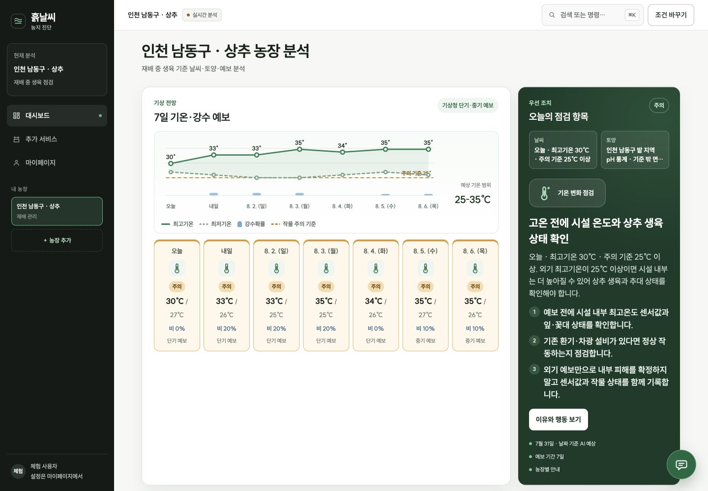
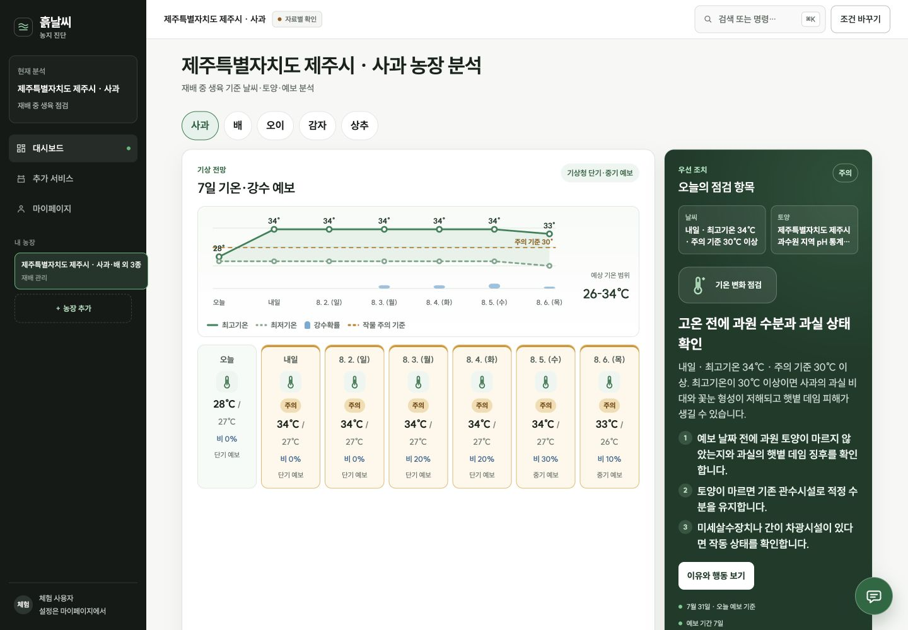
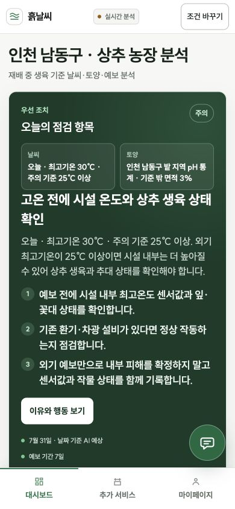
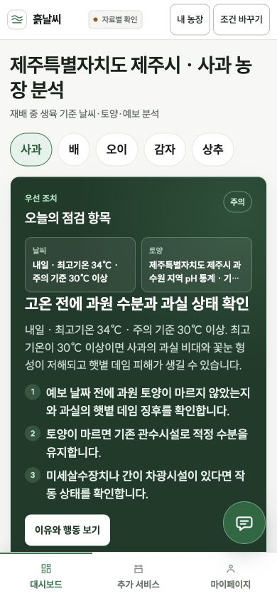

# 흙날씨 본선 제품개선 변경보고서

> 작성일: 2026-07-31
>
> 기준 브랜치: `demo1`
>
> 기준 HEAD: `127dfb3`
>
> 범위: 독립 제품 감사, 신뢰성·UX·챗봇 개선, 실제 화면·API·회귀검사, 본선 보고서 PDF

## 1. 결론

흙날씨는 기후·토양·예보를 합친 하나의 가상 점수를 말하는 프로토타입에서, **확인된 자료 축을 따로 보존하고 오늘의 행동을 제안하는 본선 시연 제품**으로 개선됐다.

- 로컬 단일 인스턴스 본선 시연: `CONDITIONAL_GO`
- Vercel/Serverless 및 농가 실사용: `NO-GO`
- 배포 차단 원인: `SHARED_STATE_NOT_CONFIGURED`
- 최종 검사: UI 56/56, 백엔드 278/278, 정적 계약 검사 88개 파일, 빌드 통과
- 실제 사전점검: 서비스 `READY`, 배포 `HOLD`, 5작물 `CONFIGURED`, 검수 지역 매핑 8곳 `CONFIGURED`

자동 검사 통과와 실사용 가능을 같은 완료로 표현하지 않는다. 공유 상태 저장소가 없는 현재 구조는 다중 인스턴스에서 세션·위치 후보·분석·멱등성·속도 제한 상태가 이어지지 않으므로 배포 P0로 남긴다.

## 2. 독립 감사 구성

구현자가 자신의 작업을 승인하지 않도록 다음 6개 축을 서로 다른 서브에이전트에게 배정했다.

| 감사 축 | 주요 검사 범위 | 초기 판정 |
|---|---|---:|
| 백엔드·보안 | 세션, CORS, 속도 제한, 다중 인스턴스, 비밀값 노출 | 6.2/10 |
| 계산·농업 근거 | 5작물 규칙, 결측, 작기, 토양 공간범위, 예보 판정 | 5.6/10 |
| UX·실사용자 | 3초 이해, 고령층, 모바일, 다중 농장, 행동 직관성 | 6.4/10 |
| 챗봇·LLM | grounding, 농약·비료·응급 제한, 작물 문맥, 비기억 | 6.0/10 |
| 기능 QA | 온보딩→분석→작물 전환→출처→챗봇, 부분 실패 | 5.4/10 |
| 해커톤 심사 | 문제 적합성, 차별성, 시연성, 실현 가능성 | 57/100 |

- 사전 지시서: [15_본선_제품감사_에이전트_지시서.md](15_본선_제품감사_에이전트_지시서.md)
- 초기 통합 감사: [16_본선_제품감사_통합보고서.md](16_본선_제품감사_통합보고서.md)
- 원본 감사·재감사: [audit/agents/2026-07-31](audit/agents/2026-07-31)

`SIMULATED_CONSUMER_REVIEW`는 실제 사람 조사가 아니라 서로 다른 사용자 상황을 가정한 모의평가로만 표기했다.

## 3. 개선 전 핵심 결함

### P0

1. 기후 60%+토양 40%로 만든 합성 생육점수가 자료의 서로 다른 공간·시점·확실성을 숨겼다.
2. 오이·감자·상추의 재배 시기를 사용자 확인 없이 현재 월로 추정했다.
3. 서버리스 다중 인스턴스에서 실행 상태가 유지되지 않는다.

### P1

1. 다작물 중 하나의 API 요청이 실패하면 성공한 나머지 결과도 잃었다.
2. `실시간 분석`이 LIVE·CACHE·UNAVAILABLE 상태를 모두 가렸다.
3. 저장 동의와 실제 localStorage 기록 조건이 일치하지 않았다.
4. 모바일에서 다중 농장 전환·추가 동선이 부족했다.
5. 챗봇이 농약 노출 응급, 처방, 사진 진단, 다른 작물, 쓰기 요청을 모델 호출 전에 충분히 제한하지 못했다.

## 4. 구현한 개선

### 4.1 계산·농업 신뢰

- 합성 점수 모듈과 테스트를 제거했다.
- 대시보드는 기후·토양·가까운 예보 상태를 별도로 보여준다.
- 오이·감자·상추는 작물별 검수 작기 선택지와 `잘 모름` 기본값을 갖는다.
- `UNKNOWN` 작기는 장기 기후를 `HOLD`로 유지하면서 작기와 무관한 토양·가까운 예보는 계속 판단한다.
- 별도 생체 상태를 확정하지 않고, 공공데이터로 확인한 위험과 현장 점검 행동을 분리했다.

### 4.2 부분 실패·저장·다중 농장

- 5작물 분석을 `Promise.allSettled` 기준으로 변경해 성공한 작물 결과를 즉시 보존한다.
- 프로필 저장은 명시적 저장 동의가 `true`일 때만 수행한다.
- 모바일 `내 농장` 다이얼로그와 `농장 추가`를 제공한다.
- 저장 농장은 `작물 1·작물 2 외 3종`처럼 다중 작물을 요약한다.

### 4.3 자료 상태 투명성

- `실시간 분석`을 `자료별 확인`으로 바꿔 과장 표현을 제거했다.
- 실제 화면에서 다음 7개 출처의 `연결됨/자료 없음`과 기준 시각을 각각 표시한다.
  - 기상청 기후평년 1991~2020
  - 기상청 ASOS 최근 관측
  - 농경지화학성 통계정보 V2
  - 토양도 기반 토양특성 상세정보 V3
  - 토양검정 화학성 상세정보 V2
  - 기상청 단기예보
  - 기상청 중기예보
- 사전점검에 `deploymentReady`, `deploymentState`, `deploymentBlockers`를 추가했다.

### 4.4 챗봇 안전·문맥·정직성

- 모델 호출 전 결정형 정책 라우터를 추가했다.
- 농약·약제 섭취/흡입/피부·눈 노출은 타 규칙보다 먼저 119·의료기관을 안내한다.
- 농약 희석·살포량, 비료·요소·퇴비량, 사진 병해 진단, 다른 농장 비교, 할 일 쓰기 요청을 모델 전에 제한한다.
- `배수`를 `배` 작물로 오인하지 않는다.
- 검수된 필지 배수 등급이 없으면 무관한 고온 근거를 대답하지 않고, 근거 부재·고인 물·배수로·과습 확인·내일 재확인을 안내한다.
- `생육점수`, `환경점수`, `적합도점수`, `종합점수`, `통합점수`, `안전점수`, `총점`은 존재하지 않는 합성 점수 전제를 먼저 정정한다.
- 사용자의 원문 질문은 Google에 보내지 않고, 로컬 의도와 검수된 근거 ID만 선택기에 제공한다.
- 초기 메시지에서 이전 질문을 기억하지 않음을 상시 고지한다.
- 모바일 전체 화면 모달에 포커스 트랩·`inert`·닫기 후 포커스 복귀를 적용했다.

## 5. 개선 전·후 실제 화면

### 데스크톱 대시보드

| 개선 전 | 개선 후 |
|---|---|
|  |  |

### 모바일 대시보드

| 개선 전 | 개선 후 |
|---|---|
|  |  |

### 작물별 작기·다중 농장·자료 상태

- [작물별 작기 확인](audit/screenshots/2026-07-31/after/season-mobile-390.png)
- [모바일 내 농장](audit/screenshots/2026-07-31/after/mobile-farm-dialog-390.png)
- [7개 출처 상태](audit/screenshots/2026-07-31/after/status-sources-mobile-390.png)

### 챗봇 정책 결과

- [응급 농약 노출 안내](audit/screenshots/2026-07-31/after/chatbot-mobile-390.png)
- [존재하지 않는 종합점수 정정](audit/screenshots/2026-07-31/after/chatbot-score-guard-mobile-390.png)
- [배수 근거 부재·현장 행동·재확인](audit/screenshots/2026-07-31/after/chatbot-drainage-mobile-390.png)

## 6. 재감사 결과

| 재감사 | 최종 판정 | 잔여 |
|---|---|---|
| 계산·농업 근거 | 로컬 본선 시연 `CONDITIONAL_APPROVAL`, 8.2/10 | P0 0, 과거 ASOS·과거 발행 예보 백테스트 미완료 |
| 챗봇·LLM | `APPROVED`, 8.7/10 | P0/P1/P2 0/0/0 |
| 기능 QA | `CONDITIONAL_APPROVAL` | P0/P1 0/0, P2 재시도·브라우저 히스토리·백테스트 |
| 해커톤 심사 | 75/100, 로컬 `CONDITIONAL_GO`, 호스팅 `NO-GO` | 전체 P0/P1/P2 1/4/1, 공유 상태 P0 유지 |

계산·농업 재감사에서 실제 안동 5작물 API 호출 5/5 성공, `UNKNOWN` 3작물의 기후 `HOLD`+토양·예보 유지, 활성 위험 51건의 원인→행동→재확인 완결성을 확인했다.

챗봇 최종 재감사에서 기존 18문항은 모두 `POLICY`, 점수 동의어 4문항은 모두 `POLICY / NEEDS_CLARIFICATION`, 선택기 스파이 22문항의 모델 호출 합계는 0회였다.

## 7. 실행한 검증

| 검증 | 결과 |
|---|---|
| `npm run verify` | 통과 |
| `npm run test:ui` | 56/56 통과 |
| `npm --prefix backend-v3 run check` | 88 files 통과 |
| `npm --prefix backend-v3 test` | 278/278 통과 |
| `npm run build` | Vercel 정적 자산 생성 통과 |
| 실제 `GET /api/health/preflight` | 서비스 READY, 배포 HOLD |
| 실제 모바일 화면 | 5작물, 7일 예보, 7출처, 농장 전환, 챗봇 정책 통과 |
| PDF 렌더링 | 12쪽 전체 PNG 렌더 후 육안 검수 |

일반 샌드박스에서 로컬 임시 테스트 서버 바인딩이 `EPERM`으로 차단되어 백엔드 23개가 한 차례 실패했다. 코드 결함으로 판정하지 않고, 로컬 바인딩이 허용된 검증 환경에서 동일 명령을 재실행해 278/278 통과를 확정했다.

## 8. 잔여 위험과 게이트

### 배포 P0

1. 공유 세션 저장소
2. 공유 위치 후보·분석 저장소
3. 공유 멱등성·속도 제한 저장소
4. 다중 인스턴스 배포 E2E

### 정확도 게이트

1. 과거 ASOS 관측값으로 규칙 재생 검증
2. 과거 발행 시각이 보존된 예보와 이후 실측 비교
3. 실제 농가 작업·피해 기록을 이용한 유용성 검증
4. 토양도 배수·토성·토심 코드의 공식 라벨 검수

### 사용성 게이트

1. 실제 귀농·초보 농업인의 온보딩→오늘 행동 실행 과업 테스트
2. 실제 기기에서 키보드·스크린리더·터치 대상 검증
3. 다작물 실패 항목만 재시도하는 조작
4. 조건 변경·농장 추가와 브라우저 뒤로가기 히스토리 일치

## 9. 신규 기능 권고 순서

### 1순위: 공유 상태 기반

사용자가 제안한 투두·사진·위성·챗봇 기록은 모두 농장·작물·날짜에 대한 영구 저장과 권한이 필요하다. 따라서 신규 기능보다 앞서 공유 상태 P0를 해결한다.

### 2순위: 오늘 할 일·당분간 주의 목록

- 데이터: `action`, `reason`, `dueAt`, `recheckAt`, `sourceAnalysisId`, `status`, `completedAt`
- 상태: 예정, 완료, 보류, 취소
- 규칙: 예보 갱신 시 새로 생성하되 이전 완료 기록은 보존
- AI: 사용자 확인 전에는 할 일을 완료 처리하거나 수정하지 않음

### 3순위: 사진 기록·비교·시즌 회고

- 원본 보존, 촬영 시각, 농장, 작물, 생육단계, 사용자 메모, 삭제·내보내기
- 비교는 `병명 확진`이 아니라 `이전 사진 대비 변화 근거`로 표현
- 시즌 종료 시 완료한 행동, 위험 경과, 사진 타임라인, 사용자 메모를 회고로 정리

### 4순위: 위성·필지 관찰

- 필지 폴리곤 선택, 촬영일, 위성/센서, 구름 비율, 해상도, 지수 계산 버전을 근거와 함께 보존
- 기상·토양·예보에 숨겨서 가중하지 않고 `SATELLITE` 별도 근거 축으로 유지
- 구름·촬영 공백·분해능 한계를 노출
- 위성 하나로 병해·수분·수확량을 확정하지 않음

### 5순위: 챗봇 도구화

- 명시적 사용자 확인 후에만 투두·사진 메모·농장 기록을 생성·변경
- 도구 호출 전 미리보기, 승인, 실행 결과, 취소, 감사 로그 필수
- 실패 시 `완료`라고 말하지 않음
- 기존 결정형 안전 라우터는 도구 호출보다 먼저 유지

## 10. 제출 산출물

- 에이전트 지시서: [15_본선_제품감사_에이전트_지시서.md](15_본선_제품감사_에이전트_지시서.md)
- 통합 감사: [16_본선_제품감사_통합보고서.md](16_본선_제품감사_통합보고서.md)
- 변경 보고서: 본 문서
- 독립 감사 원본: [audit/agents/2026-07-31](audit/agents/2026-07-31)
- 전·후 화면: [audit/screenshots/2026-07-31](audit/screenshots/2026-07-31)
- 기업형 제품개선 PDF: [output/pdf/흙날씨_본선_제품개선_보고서.pdf](output/pdf/흙날씨_본선_제품개선_보고서.pdf)
