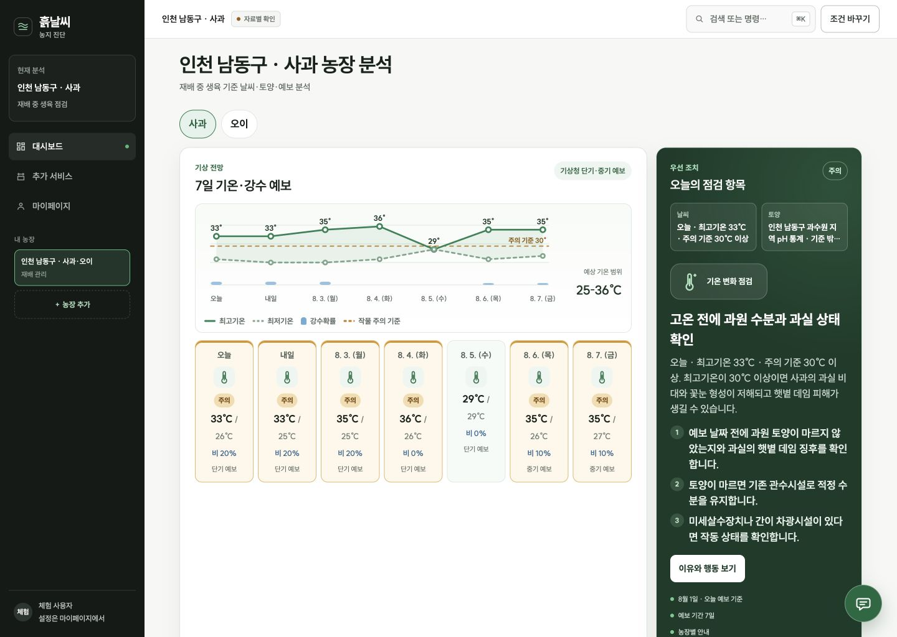

# 흙날씨 본선 제품 업그레이드 최종 보고서

작성일: 2026-08-01
검증 버전: `본선 UI Revision 3.2 작업 트리 검증본`
대상: 가톨릭대학교 해커톤 본선 제품 개선

## 1. 결론

이번 개선은 기능 수를 늘리는 작업이 아니라, 초보 농업인이 **오늘 무엇을 확인하고 왜 행동해야 하는지**를 공공데이터 근거와 함께 이해하도록 제품 구조를 바꾸는 작업이었다.

현재 로컬 단일 인스턴스 본선 시연에서는 다음 흐름을 실제 API 자료로 완주한다.

1. 저장된 농장과 복수 작물을 복원한다.
2. 기상청 단기·중기예보와 토양 통계를 작물별 검수 규칙에 연결한다.
3. 원인, 위험, 필요한 행동, 재확인 시점을 오늘·당분간 목록으로 나눈다.
4. 사용자가 완료·건너뜀 상태를 기록한다.
5. 챗봇은 현재 분석 근거를 설명하고, 명시적 확인 후에만 사용자의 할 일을 추가한다.
6. 사진 기록과 필지 위성 관찰은 진단을 과장하지 않는 보조 기능으로 분리한다.

단, 외부 호스팅과 실사용 전환은 별도 조건이 남아 있다. 현재 실행 환경에서 Supabase 공유 상태가 검증되지 않았고 Copernicus 위성 연결도 비활성 상태다. 따라서 **로컬 본선 시연 준비 완료**와 **운영 배포 준비 완료**를 같은 뜻으로 사용하지 않는다.

## 2. 최초 감사에서 확인된 근본 문제

초기 독립 감사 종합 점수는 57/100, 판정은 `CHANGES_REQUESTED`였다.

| 문제 | 사용자·심사 영향 | 개선 방향 |
| --- | --- | --- |
| 날씨와 지역 토양을 60:40 단일 점수로 합산 | 결측과 자료 공간 범위를 숨겨 잘못된 확신을 만듦 | 자료 축을 독립 상태로 유지하고 합산점수 제거 |
| 미확인 작기를 현재 월로 확정 | 실제 재배시기와 다른 기후 판단 가능 | 작기 미확인은 `UNKNOWN`으로 보존 |
| API·검증 내부 상태를 첫 화면에 노출 | 사용자가 해야 할 행동보다 기술 정보가 앞섬 | 행동 우선 화면, 상세 근거는 보조 화면으로 분리 |
| 다작물 중 한 건 실패 시 전체 결과 폐기 | 실제 농가의 복수 작물 흐름 차단 | 작물별 독립 처리와 부분 성공 보존 |
| 챗봇이 일반 질문과 쓰기 요청을 충분히 구분하지 못함 | 의도하지 않은 상태 변경과 과도한 AI 기대 | 로컬 안전 라우팅, 사용자 확인 전 쓰기 금지 |
| 서버리스 인스턴스 간 상태 비공유 | 운영 환경에서 다단계 분석이 끊길 수 있음 | 공유 상태 기반 추가, 미설정 시 배포 `HOLD` 유지 |

## 3. 병렬 개발 방식

기능별 개발자가 서로의 영역을 덮어쓰지 않도록 공통 계약을 먼저 고정했다.

- 날씨·토양·예보·위성은 하나의 종합점수로 합치지 않는다.
- 결측값은 `null`, 확인되지 않은 판단은 `HOLD`로 유지한다.
- AI는 검수된 근거와 행동만 설명하며 새로운 사실·농약·비료 처방을 만들지 않는다.
- 모든 저장은 농장·작물·계정 범위를 보존하고 사용자의 확인을 요구한다.
- 사진과 위성은 병해를 확정하지 않고 현장 재확인을 돕는 관찰 자료로만 사용한다.

독립 작업 영역은 다음과 같이 분리했다.

| 역할 | 책임 | 결과 |
| --- | --- | --- |
| 행동 계획 개발 | 오늘/당분간, 기한, 재확인, 근거, 완료 상태 | 실제 위험 규칙과 발표 시각 기반 투두 |
| 사진·시즌 개발 | 비공개 기록, 사진 품질 검사, 촬영일 비교, 시즌 회고 | 어둠·흔들림·작은 피사체 재촬영 안내 |
| 필지·위성 개발 | 필지 경계, Sentinel-2 관측 품질 게이트 | 구름·결측 화소 제외, 저품질 추세 차단 |
| 공유 상태 개발 | Supabase 기반 세션·상태 저장 토대 | 미설정 환경은 배포 `HOLD` 유지 |
| 독립 평가자 | 농업 로직, 챗봇, 해커톤 심사 | 개발에 참여하지 않고 재감사 수행 |

상세 지시와 충돌 방지 계약은 `18_본선_병렬개발_공통계약.md`, `19_본선_병렬구현_에이전트_지시서.md`에 기록했다.

## 4. 핵심 제품 개선

### 4.1 행동 중심 대시보드

대시보드의 첫 질문을 “자료가 모두 연결됐는가”에서 “오늘 농장에서 무엇을 확인해야 하는가”로 바꿨다.

- 7일 최고·최저기온과 강수확률, 작물 주의 기준을 한 그래프에 표시
- 날씨와 토양을 별도 근거로 유지
- 가장 중요한 행동을 큰 글자와 번호로 우선 표시
- 상세 기술 상태는 마이페이지·근거 상세로 이동
- 모바일에서는 그래프보다 오늘의 행동을 먼저 표시

### 4.2 실행 가능한 투두리스트

분석 결과를 정적인 안내가 아니라 지속 가능한 행동 상태로 전환했다.

- 실제 예보 위험 날짜와 검수 규칙으로 기한 생성
- `원인 → 위험 → 행동 → 재확인` 구조 보존
- 같은 규칙·날짜의 열린 행동은 최신 근거로 갱신
- 완료·건너뜀 행동은 자동 분석이 덮어쓰지 않음
- 이전 버전의 규칙 행동은 완료 기록을 보존한 채 새 중복키로 자동 정규화
- 사용자가 만든 행동은 챗봇 제안 후 명시적 확인으로만 저장

### 4.3 사진 기록과 시즌 회고

사진을 AI 진단처럼 과장하지 않고, 같은 농장·작물·시즌의 변화를 되돌아보는 기록 도구로 설계했다.

- 촬영일, 생육 단계, 현장 메모를 작물별 저장
- 노출, 선명도, 피사체 비율을 먼저 검사
- 품질이 낮으면 비교 결과 대신 구체적인 재촬영 안내
- 색 변화는 관찰 신호로만 표시하고 병해·생육 악화를 확정하지 않음
- 시즌 종료 시 저장된 사진과 행동 기록을 범위별로 회고

### 4.4 필지 단위 위성 관찰

Sentinel-2 자료는 ‘더 자세한 진단 점수’가 아니라 현장 확인 우선순위를 정하는 보조 관찰로 설계했다.

- 사용자가 확인한 필지 경계 안에서만 조회
- 동일 날짜 중 품질이 가장 높은 관측만 사용
- 유효 픽셀 비율 50% 이상, 유효 관측 2개 이상에서만 추세 표시
- 구름·결측이 많은 자료는 저장·그래프·추세에서 제외
- 위성 연결이 없으면 조작을 비활성화하고 준비 필요 상태를 표시

### 4.5 근거 제한형 챗봇

챗봇은 범용 농업 상담가가 아니라 현재 농장의 검수된 분석을 설명하고 사용자의 계획을 돕는 도우미다.

- 현재 농장·작물 분석과 다른 질문은 문맥 전환 요청
- 농약·비료·사진 진단·긴급 노출은 모델 호출 전에 안전 분기
- 일반 질문과 쓰기 요청을 구분
- 할 일은 제안 카드로 먼저 보여주고 사용자의 확인 후 저장
- 제목의 원래 어순과 ‘내일’ 같은 시간 표현을 보존

## 5. UI Revision 3.2 개선 전·후 화면

### 이번 시각개편 직전

기능은 동작했지만 첫 화면에서 예보 차트가 행동보다 크게 보였고, 여러 결과 카드가 같은 상태와 행동을 반복했다. 화면 면적과 설명량에 비해 사용자가 가장 먼저 해야 할 일이 약했다.

### 최종 데스크톱

### 최종 모바일

| 이번 시각개편에서 바뀐 부분 | 직전 화면 | Revision 3.2 |
| --- | --- | --- |
| 첫 화면 위계 | 차트·상태·행동이 경쟁 | 농장 상태 → 오늘 할 일 → 7일 변화 → 주간 주의 |
| 행동 근거 | 설명문 안에서 원인과 행동 혼합 | 날짜·실제값·기준 → 위험 → 할 일 → 기한 → 재확인 |
| 반복 정보 | 오늘 행동과 주간 위험 중복 | 최우선 행동과 같은 주간 위험 자동 제외 |
| 연속 위험 | 날짜마다 같은 카드 반복 | 같은 위험은 하나의 기간 카드로 압축 |
| 토양 표현 | 지역 통계를 필지값으로 오인할 여지 | `주변 토양 참고`, `내 밭 검사값 아님`을 같은 블록에 표시 |
| 모바일 | 그래프와 부가 설명이 먼저 노출 | 완료 기한과 최우선 행동을 첫 화면에 노출 |

## 6. 실제 API·실행 검증

2026-08-01 로컬 외부자료 모드에서 제주 제주시 농장과 5작물을 저장·복원해 자연 사용자 흐름을 검증했다.

| 항목 | 실제 확인 결과 |
| --- | --- |
| 서비스 계산 상태 | `READY` |
| 배포 상태 | `HOLD` — 공유 상태 저장소 미검증 |
| 기상청 단기·중기예보 | 실제 7일 값 수신 및 그래프 표시 |
| 기후평년 | 연결됨 |
| 토양 지역 통계 | 연결됨 |
| ASOS 최근 관측 | 테스트 시점 자료 없음으로 정직하게 표시 |
| 필지 토양검정·토양특성 | 해당 주소 결과 없음으로 정직하게 표시 |
| 5작물 규칙 | 사과·배·오이·감자·상추 모두 `CONFIGURED` |
| 검수 지역 매핑 | 8개 검증 매핑, 최소 기준 6개 충족 |
| SmartFarm | 제품 범위에서 제외 |
| Copernicus 위성 | 실행 환경 미설정, 조작 비활성화 |
| 5작물 화면 전환 | 사과·배·오이·감자·상추 모두 alert 0, 가로 overflow 0 |
| 최우선 행동 | 작물별 이유·행동·기한 분리, 재배시기 미확인은 별도 작업으로 표시 |
| 주간 위험 | 최우선 행동 중복 제거, 감자·상추의 연속 고온은 기간 카드 1개로 압축 |
| 챗봇 | 실제 Google AI 응답과 현재 분석 근거 설명 흐름 확인 |
| 브라우저 화면 | 데스크톱·모바일 주요 행동 잘림과 가로 overflow 없음 |

API가 연결됐다는 사실과 실제 판단에 충분한 값이 도착했다는 사실은 다르다. 따라서 출처가 성공했더라도 필지 실측이 없거나 발표 시각이 맞지 않으면 `자료 없음`, `일부 확인`, `HOLD`를 유지한다.

## 7. 자동 검증 결과

| 검사 | 결과 |
| --- | --- |
| UI 단위·계약 테스트 | 102/102 통과 |
| 백엔드 전체 테스트 | 332/332 통과 |
| 백엔드 프로젝트 정적 검사 | 109개 파일 통과 |
| 배포 빌드 | 통과 |
| 실제 데스크톱 흐름 | 저장 농장 복원 → 5작물 전환 → 행동·근거·주간 위험 확인 통과 |
| 실제 모바일 화면 | 기한·최우선 행동 우선 배치, 가로 overflow 0 |

자동 검사는 실제 제품 품질을 대신하지 않는다. 위 수치는 실제 API 화면, 사용자 흐름, 독립 평가자의 결과와 함께만 사용한다.

## 8. 독립 재감사

구현에 참여하지 않은 PM·QA와 농업 관점 평가자가 Revision 3.2 실제 화면과 5작물 전환 결과를 독립적으로 평가했다.

| 관점 | 판정 | 점수 | 핵심 결과 |
| --- | --- | ---: | --- |
| PM·상용 제품 | `PASS` | 8.60/10 | 모든 축 8.3 이상, P0/P1 0 |
| 소비자 모의평가 5회 | `PASS` | 평균 8.60/10 | 개인 최저 8.4, 8.0 미만 없음 |
| 농업·고령 사용자 | `PASS` | 9.0/10 | 원인→위험→행동→기한→재확인, 자료 범위 구분 통과 |

PM 세부 점수는 정보 위계 8.8, 시각 완성도 8.6, 가독성 8.3, 조작 직관성 8.6, 일관성 8.8, 상용 완성도 8.5다. 소비자 모의평가는 고령 과수 농가 8.4, 초보 귀농인 8.6, 시설재배 농가 8.5, 복합작물 농가 8.7, 농업기술센터 상담자 8.8로 평가됐다. 이는 실제 사람 평가가 아니라 명시된 사용자 관점의 시뮬레이션이다.

농업 재감사는 실제 날짜·기온·작물 기준, 구체 행동, 기한과 재확인 시점을 한 흐름으로 이해할 수 있다고 판정했다. 지역 토양 통계와 필지 실측의 구분, 자료 상태와 농장 상태의 구분도 해결됐다. 확인된 P0/P1 결함은 0건이다.

## 9. 현재 판정과 남은 위험

### 로컬 본선 시연

- 실제 API 기반 골든 플로우 완주
- 행동 계획, 챗봇 확인형 쓰기, 사진 기록, 위성 준비 상태를 한 제품 안에서 설명 가능
- 자동 테스트와 실제 화면 검증 통과

### 호스팅·실사용

다음 항목을 완료하기 전에는 운영 준비 완료라고 발표하지 않는다.

1. Supabase 공유 상태 테이블·RLS·RPC를 실제 배포 환경에 적용하고 교차 인스턴스 테스트를 통과한다.
2. Copernicus 자격 증명과 개인정보 동의를 포함한 필지 경계 저장 정책을 배포 환경에서 검증한다.
3. 5작물 규칙을 농업 전문가 또는 공식 재배 지침과 대조하고 과거 발행 예보·관측 백테스트를 확장한다.
4. 실제 농업인 사용성 평가와 농장 현장 자료를 수집한다.

## 10. 본선 시연 권장 흐름

1. 저장된 인천 남동구 사과·오이 농장을 바로 복원한다.
2. 3초 안에 “내일 33℃, 사과 기준 30℃ 이상”과 첫 행동을 보여준다.
3. 그래프에서 7일 위험 날짜와 작물별 기준 차이를 설명한다.
4. 행동 하나를 완료 처리해 계획이 상태로 남는 것을 보여준다.
5. 챗봇에 “관수시설 확인을 내일 목록에 넣어줘”라고 입력한다.
6. 바로 저장되지 않고 제안 카드가 나온 뒤 확인해야 저장되는 안전 설계를 보여준다.
7. 추가 서비스에서 사진 기록·시즌 회고와 위성 필지 기능을 설명한다.
8. 위성 미연결 상태를 숨기지 않고, 연결 시에도 병해 진단이 아니라 현장 확인 보조라는 한계를 말한다.
9. 마지막으로 로컬 시연 준비와 운영 배포 준비를 분리한 배포 상태를 보여 신뢰성을 강조한다.

---

이 제품의 핵심 경쟁력은 더 많은 숫자를 보여주는 것이 아니다. **서로 다른 공공데이터의 한계를 보존한 채, 초보 농업인이 오늘 실행할 수 있는 행동으로 바꾸는 것**이다.
