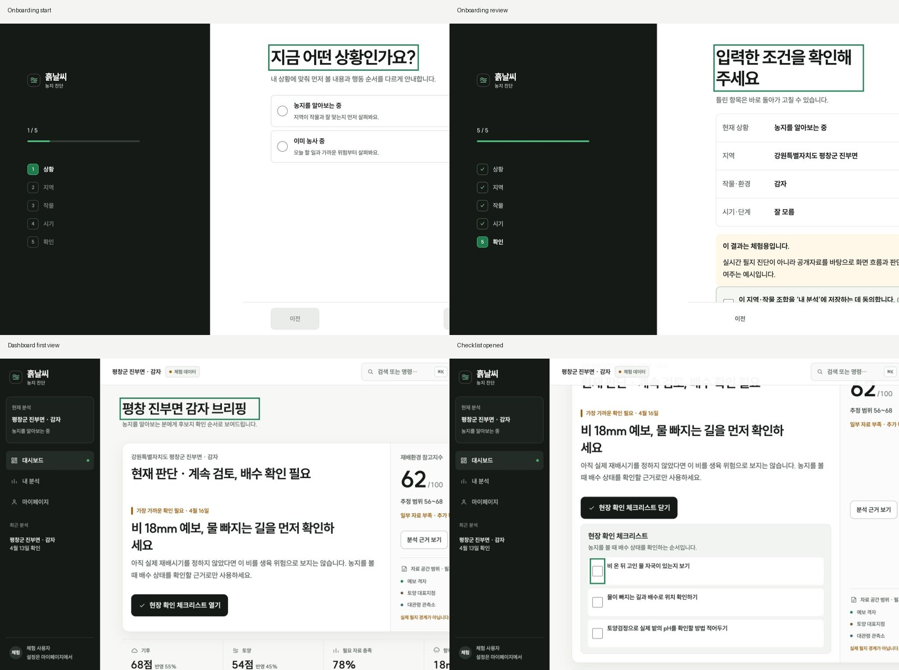
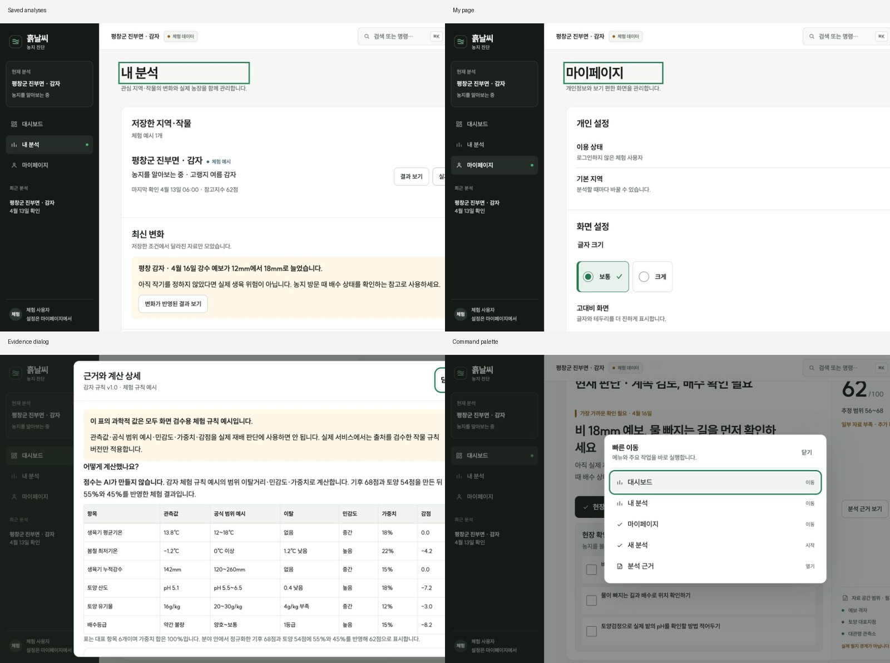
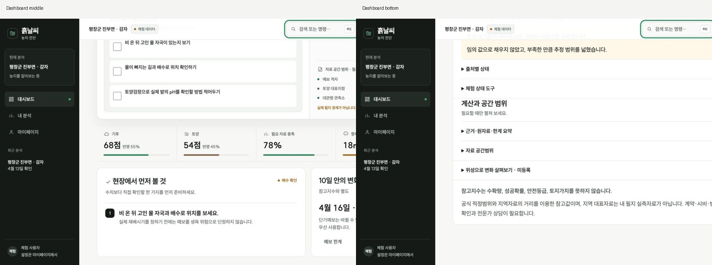
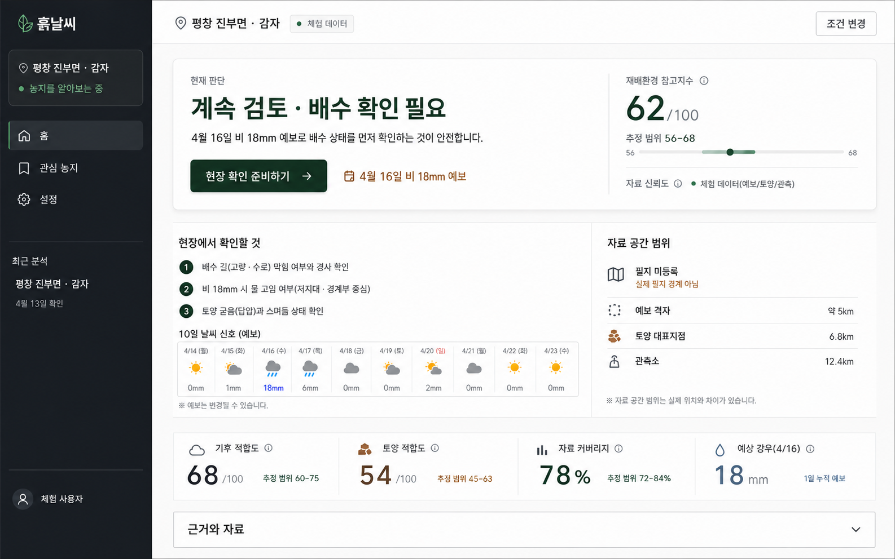

# 흙날씨 Product-first PRD

> **현재 상태 안내(2026-08-04):** 이 문서는 R1~R10의 제품 결정과 감사 이력을 함께 보존한다. 과거 리비전의 `CHANGES_REQUESTED`, `HOLD`, API 승인 대기 표기는 당시 상태이며 현재 운영 판정으로 읽지 않는다. 최신 구현·검증 상태는 [`product_upgrade_validation/CURRENT_IMPLEMENTATION_STATUS_2026-08-04.md`](./product_upgrade_validation/CURRENT_IMPLEMENTATION_STATUS_2026-08-04.md)를 기준으로 한다.

> 문서 상태: Revision R10 결정 이력 + 2026-08-04 최신 상태 문서 분리
> 기준일: 2026-07-25
> 적용 대상: 실제 실행되는 흙날씨 웹 제품 전체 흐름
> 목표: 기능 보유 여부가 아니라 사용자가 3초 안에 화면의 목적·대상·다음 행동을 이해하는 상용 제품
> 요구사항 근거: [기업 문제 정의서](https://lean-mahogany-686.notion.site/1-39b09c484bff80b6a7e3c41842def27a), [AI·OT 문제 링크](https://lean-mahogany-686.notion.site/AI-OT-39b09c484bff80d1be9de5b832cf6247), 사용자 제품 판단

## 1. 제품 한 문장 정의

**흙날씨는 현재 농장 위치와 재배 중인 작물만 확인하면, 사용자가 무엇을 물어야 할지 몰라도 공식 토양·기후·예보에서 놓치기 쉬운 위험과 아직 모르는 것을 먼저 찾아 오늘의 확인 행동을 3분 안에 제시하는 AI-native 농장 점검 서비스다.**

첫 화면의 3초 목표와 전체 흐름의 3분 목표를 구분한다. 사용자는 3초 안에 자신의 지역·작물, 가장 중요한 판단, 다음 행동을 이해하고, 3분 안에 판단 근거·아직 모르는 것·현장 검증 방법까지 확보해야 한다.

### R2 제품 결정 — 재배 중 농가를 기본 경로로 전환

사용자 피드백에 따라 첫 온보딩의 기본 가정을 `이미 재배 중`으로 고정한다. 후보지 탐색용 `LAND_SEARCH` 백엔드 계약은 삭제하지 않지만 첫 사용자 흐름에서는 상황 선택을 묻지 않는다. 대회 문제의 초보 귀농인은 “막 영농을 시작해 지역·작물별 위험을 해석하기 어려운 농가”까지 포함해 시연한다.

온보딩은 다음 5단계로 고정한다.

1. 기기 현재 위치를 행정구역 후보로 변환하고, 권한 거부·미지원·변환 실패 시 지역 직접 입력을 제공한다.
2. 사과·배·오이·감자·상추 중 현재 재배 중인 작물을 1~5개 복수 선택한다.
3. 선택 작물별로 필요한 재배 환경만 묻는다. 분석 월은 기기의 현재 날짜에서 자동 적용하고 사과·배는 서버의 검토된 연간 프로필을 사용한다.
4. 공통 생육단계를 확인하고 사진을 선택적으로 추가한다.
5. 서버가 발급한 위치 후보 토큰, 작물별 조건, 생육단계를 검토한 뒤 작물별 독립 분석을 실행한다.

#### R2에서 확인된 근본 결함

- 지역 문자열은 브라우저 폼에 남아 있지만 서버가 발급한 후보 토큰은 새로고침·재실행 뒤 사라질 수 있었다.
- 검토 화면은 문자열만 보고 지역을 확정된 것처럼 표시했지만 제출 버튼은 토큰을 검사해 비활성화했다.
- 즉, “사용자에게 보이는 완료 상태”와 “실제 제출 가능한 내부 상태”가 서로 다른 두 기준으로 관리됐다.
- 단일 작물 라디오와 공통 작기 입력은 여러 작물을 함께 키우는 실제 농가의 작업 단위를 표현하지 못했다.
- 사과·배는 선택지가 하나뿐인 연간 기준을 강제로 선택하게 해 의미 없는 클릭을 만들었다.

#### R2 구현 계약

- 검토 화면의 지역은 입력 문자열이 아니라 현재 세션의 유효한 `candidateToken`에 연결된 후보명만 표시한다.
- 후보 토큰이 없거나 만료되면 검토 화면은 `위치 확인 필요`로 표시하고 1단계로 돌려보낸다.
- 브라우저 좌표는 `POST /api/locations/current` 요청에만 사용한다. API 응답·분석 결과·로그·UI에는 위도·경도를 노출하지 않는다.
- 백엔드의 과학적 분석 계약은 `분석 1건 = 작물 1종`을 유지한다. 프런트엔드는 복수 선택을 작물별 독립 요청으로 분리하고 결과를 작물 탭으로 전환한다.
- 한 작물의 재배 환경·작기·보고서·자료 상태를 다른 작물에 복사하거나 합산하지 않는다.
- 사진은 현재 기기 안에서 미리보기만 제공하며 서버 업로드와 자동 생육 판독은 하지 않는다. 비전 모델·검수 데이터·동의·보관정책이 준비되기 전에는 분석 성공이나 진단 결과를 표시하지 않는다.

#### R2 측정 가능한 수용 조건

- 첫 화면에서 `이미 재배 중` 가정, 위치 사용 목적, `현재 위치로 농장 찾기`, 직접 입력 대체 경로를 스크롤 없이 이해할 수 있다.
- 위치 권한 거부 후 1초 이내에 직접 입력 안내가 나타나며 온보딩이 막히지 않는다.
- 지역 문자열만 입력한 상태로는 다음 단계와 최종 분석을 실행할 수 없다. 후보 토큰 확인 후에만 가능하다.
- 5개 작물 모두 체크박스로 제공하고 최소 1개, 최대 5개를 선택할 수 있다.
- 오이·상추는 작물별 재배 환경만 필수 확인한다. 감자·사과·배는 노지로 적용하며 사용자에게 작기 선택을 요구하지 않는다.
- 복수 작물 분석 후 선택 수와 같은 수의 독립 분석 결과가 생성되고, 대시보드에서 작물 탭을 바꾸면 제목·판단·근거가 함께 바뀐다.
- 사진은 이미지 파일 10MB 이하만 로컬 미리보기하며 자동 판독이 연결되지 않았다는 문구를 항상 노출한다. 사진 유무와 무관하게 생육단계 수동 확인이 필수다.
- 390×844와 1280×720에서 주요 CTA, 작물별 조건, 검토 요약이 가로로 잘리지 않고 키보드로 진행 가능해야 한다.

### R3 제품 결정 — 현재 날짜 자동 적용과 예보 시각화

현재 재배 중인 사용자의 분석 시점은 서비스 실행 날짜와 동일하므로 `봄·여름·가을 작기`를 다시 선택하게 하지 않는다. 현재 달을 기기 날짜에서 자동 적용하고, 작물별 민감도 차이는 사용자가 확인한 생육 단계와 검수 규칙으로 처리한다.

예외가 필요한 경우에도 계절 이름을 묻지 않는다.

- 파종·정식일을 알고 있고 작물별 누적 생육일이 필요한 기능을 추가할 때는 날짜를 선택적으로 받는다.
- 같은 달에 서로 다른 작기가 겹치거나 시설 내부 환경이 외부 계절과 다르면 재배 환경·생육 단계·센서값으로 보정한다.
- 날짜나 생육 단계가 불명확하면 임의 작기를 추정하지 않고 `UNKNOWN` 또는 추가 확인으로 남긴다.

대시보드 첫 화면은 상태 문장만 보여주는 구성을 금지한다. 백엔드의 `forecast.result.mergedDisplayDays`를 사용해 다음 항목을 실제 값으로 시각화한다.

1. 단기 격자와 중기 지역 예보를 날짜순으로 합친 최대 7일 타임라인.
2. 최고기온의 선 그래프와 전체 최저–최고기온 범위.
3. 날짜별 최고·최저기온, 강수확률, 단기/중기 공간 수준.
4. 결정론적 `primaryAction` 기반의 오늘 할 일 1개.
5. 실제 자료가 없을 때 빈 그래프 대신 결측 이유를 확인하도록 안내하는 명시적 빈 상태.

샘플 예보와 라이브 공공데이터는 시각적으로 같은 구조를 사용하되, 샘플은 항상 `개발 샘플 예보`, `농업 의사결정 금지`로 표시한다. 샘플 값으로 현재 위험이 없다고 확인하거나 운영 `READY`를 표시해서는 안 된다.

대시보드 문체는 사용자에게 말을 걸거나 결과를 발표하는 방식이 아니라 `명사형 제목 + 사실·상태·행동` 구조를 사용한다. `브리핑`, `모았어요`, `확인했어요`, `AI가 먼저` 같은 발표·대화식 표현을 결과 화면 제목으로 사용하지 않는다.

#### R3 측정 가능한 수용 조건

- 활성 재배 흐름에서 계절·작기 라디오 없이 현재 날짜가 자동 적용되며 검토 화면에 `오늘 날짜 자동`이 표시된다.
- 오이·상추는 노지·시설흙·시설물 선택을 요구하고 감자·사과·배는 추가 재배 환경 입력 없이 진행한다.
- 날짜 자동 적용은 1~12월 정수만 계약으로 허용하며 잘못된 기기 월은 분석 전에 차단한다.
- 예보 값이 1개 이상이면 대시보드 첫 viewport에 기온 그래프, 날짜별 카드, 오늘 할 일이 표시된다.
- 예보 카드는 최대 7일이며 각 카드가 날짜·최저/최고기온·강수확률·공간 수준을 접근 가능한 이름으로 제공한다.
- 예보 값이 없으면 빈 영역이 아니라 `표시할 예보 값이 없습니다`와 근거 확인 경로를 표시한다.
- 390×844에서 문서 전체 `scrollWidth`가 390이고 예보 타임라인은 카드 영역 안에서만 수평 스크롤된다.
- 개발 샘플과 실제 기상청 예보의 라벨을 혼동하지 않으며 샘플 자료를 농업 판단으로 승격하지 않는다.
- 결과 화면의 주요 제목은 `농장 분석`, `7일 기온·강수 예보`, `우선 조치`, `확인되지 않은 정보`처럼 짧은 명사형 문구를 사용한다.

### R4 제품 결정 — SmartFarm 공개자료는 비교 전용 독립 축

SmartFarm의 데이터가 많다는 이유로 핵심 적합도나 위험 판단에 가중하지 않는다. 기상청·토양·검수 규칙은 사용자 지역과 작물의 조건·위험을 판단하고, SmartFarm은 동일 작물·동일 재배형태의 공개 코호트가 얼마나 존재하며 어떤 종류의 자료를 비교할 수 있는지만 별도 표시한다.

대회 대상 5종과 공식 SmartFarm API가 직접 겹치는 조합은 다음과 같이 고정한다.

| 대상 조합 | 공식 데이터 계열 | 현재 제공 | 금지 |
|---|---|---|---|
| 오이 + 시설토경/시설수경 | 품목별 시설원예 데이터 | 같은 작물·재배형태의 농가/작기 수, 자료기간, 지역·시설·재배형태 분포, 환경·제어·생육·사진·컨설팅·생산/비용 자료 제공 여부 | 다른 시설형태 혼합, 개별 농가 선택, 공개 환경값을 적정 기준으로 사용 |
| 사과 + 노지 | 노지 빅데이터 | 같은 품목코드 농가 수, 지역 일치 수준, 자료기간, 작기·환경·사과 생육 자료 제공 여부 | 생육값을 사용자 농장 상태로 표현 |
| 감자 + 노지 | 노지 빅데이터 | 같은 품목코드 농가 수, 지역 일치 수준, 자료기간, 작기·환경 자료 제공 여부 | 확인되지 않은 감자 생육 API를 있다고 표현 |
| 배·상추·노지 오이 | 확인된 직접 대응 없음 | `NOT_APPLICABLE` | 유사 작물 대체 |

SmartFarm 패널의 제목은 `동종 작물 공개자료 비교`로 고정한다. `비슷한 농가가 안전하다`, `우수 농가 기준`, `추천 환경`, `적합도 상승` 같은 표현을 금지한다. 화면에는 `적합도·위험 판단·점수에 반영하지 않음`과 `다른 농가의 환경값은 내 농장의 센서값이나 공식 적정 기준이 아님`을 항상 표시한다.

#### R4 측정 가능한 수용 조건

- SmartFarm 호출은 시설 오이, 노지 사과, 노지 감자에서만 발생하며 나머지 조합은 외부 호출 없이 `NOT_APPLICABLE`이다.
- 시설 데이터는 작물명과 토경/수경을 동시에 일치시키고, 노지 데이터는 검증된 품목코드 사과 `060100`, 감자 `050100`을 사용한다.
- 개인 농가 ID와 사용자 ID는 서버 결과·UI·출처·로그·캐시 키에 포함하지 않는다.
- 동일 입력에서 SmartFarm 활성/비활성, 성공/실패와 관계없이 `decision`, `actions`, `state`, `conditionState`, `riskState`가 동일하다.
- 패널은 같은 시·군/시·도 표본 수, 전체 농가 또는 작기 수, 자료기간, 데이터 종류, 갱신 특성을 표시한다.
- SmartFarm 서비스 키·계약·응답이 없으면 비교 패널만 `UNAVAILABLE`이며 기후·토양·예보 분석은 계속 동작한다.
- 데스크톱과 모바일에서 비교 패널이 가로로 잘리지 않고, 상태·표본·자료 종류·한계를 읽는 순서가 유지된다.

이 제품의 성공 기준은 더 많은 점수·표·설명을 배치하거나 채팅창을 제공하는 것이 아니다. 사용자가 검색어와 질문을 직접 만들지 않아도 서비스가 먼저 확인할 문제를 발견하고, 검증된 근거 안에서 가장 중요한 행동을 제시하는 것이 우선이다.

### 1.1 왜 이 서비스가 필요한가

초보 귀농인에게 부족한 것은 정보 자체보다 **무엇을 찾아야 하는지 아는 능력과 정보를 행동으로 번역하는 과정**이다.

- 표준 재배 매뉴얼은 일반적인 생육 조건을 설명하지만 특정 지역의 토양·평년·다가오는 예보를 한 판단으로 연결하지 않는다.
- 일반 날씨 서비스는 날씨를 빠르게 보여주지만 작물·작기·토양 맥락에서 무엇을 확인해야 하는지 알려주지 않는다.
- 토양 공공서비스는 공식 원자료를 제공하지만 pH·EC·유효인산·지역 통계의 의미와 필지값의 차이를 초보자가 해석하기 어렵다.
- 농업기술센터와 토양검정은 최종 판단에 필수지만, 여러 후보지를 알아보는 초기 단계마다 무엇을 질문하고 어디부터 검증할지 준비하기 어렵다.
- 범용 검색과 대화형 AI는 쉬운 설명에는 유리하지만 공간·시점·단위가 다른 자료를 섞거나 근거 없는 확신을 만들 수 있다.

흙날씨가 줄여야 할 것은 농업의 불확실성 자체가 아니라 다음 세 가지 비용이다.

1. 필요한 질문을 몰라 중요한 위험을 놓치는 비용.
2. 지역 통계를 필지 진단이나 성공확률로 오해하는 비용.
3. 중요도가 낮은 정보부터 찾느라 현장 방문·상담·검정의 순서를 잘못 정하는 비용.

따라서 서비스는 농업기술센터·현장 조사·토양검정을 대체하지 않는다. 사용자가 **어느 후보에서 무엇을 먼저 검증하고 어떤 질문을 준비할지** 정하는 전 단계가 된다.

### 1.2 핵심 사용자와 비사용자

연령이 아니라 사용자의 상황과 결정으로 타깃을 정의한다.

| 우선순위 | 사용자 | 가장 절박한 순간 | 필요한 결과 |
|---|---|---|---|
| P0 핵심 | 후보 지역·주소 1~3곳과 지원 작물 중 하나는 정했지만 토양·기후자료를 해석하기 어려운 귀농 준비자 | 현장 방문·임대·계약·재배 준비에 돈과 시간을 쓰기 직전 | 계속 검토 여부, 가장 먼저 확인할 위험, 현장 확인 1~3개 |
| P1 확장 | 같은 사용자가 실제 재배를 시작한 뒤 1~2년차가 된 초보 재배자 | 폭우·저온·고온 등 1~3일 위험에 대응하기 전 | 오늘의 첫 행동, 확인 시점, 현장과 다른 경우의 재검토 |
| 접근성 조건 | 스마트폰 조작·작은 글씨·전문용어가 어려운 고령 사용자 | 위 두 흐름을 스스로 수행할 때 | 한 화면 한 질문, `잘 모르겠어요`, 큰 조작 영역, 음성·전화 도움 없이도 가능한 복구 |

P0 골든 패스는 **노지 감자 후보지를 보러 가기 전의 귀농 초보자**로 고정한다. 기술적으로 5개 작물을 지원하더라도 제품의 첫인상과 시연은 한 사람·한 결정·한 행동에 집중한다.

초기 비사용자는 다음과 같다.

- 정밀 생육제어·자동화가 필요한 대규모 농가와 스마트팜 운영자.
- 필지 정밀진단, 시비량, 농약, 병충해 확진을 원하는 사용자.
- 수확량·수익·재배 성공확률·토지가치 예측을 원하는 사용자.
- 농지 매입이나 작물 선택의 최종 결론을 서비스에 맡기려는 사용자.
- 후보 지역과 관심 작물이 아직 전혀 없는 일반 탐색 사용자.
- 지원 5종 밖의 모든 작물을 같은 품질로 분석받으려는 사용자.

### 1.3 AI-native 제품 계약

AI-native는 채팅창에 질문을 입력하는 제품이 아니라 **사용자 상황을 바탕으로 필요한 질문·미확인 위험·다음 행동을 서비스가 먼저 구성하는 제품**을 뜻한다.

#### 사용자가 하지 않아도 되는 일

- 농업 전문용어를 알아서 검색어로 바꾸기.
- 어떤 API와 공공데이터가 필요한지 고르기.
- 기후·토양·예보 결과의 중요도를 직접 비교하기.
- ChatGPT에 넣을 프롬프트나 정확한 질문을 작성하기.
- 여러 근거를 읽고 오늘의 우선 행동을 직접 조합하기.

#### 서비스가 먼저 해야 하는 일

1. 지역·작물·재배 상황처럼 사용자가 아는 최소 사실을 받는다.
2. 사용자가 `잘 모르겠어요`를 선택한 항목은 임의 추정하지 않고 `UNKNOWN`으로 보존한다.
3. 공식자료와 검수된 규칙에서 현재 확인 가능한 사실을 수집한다.
4. 사용자가 질문하지 않은 작물·작기별 위험, 핵심 결측, 자료 거리·시점 차이를 찾는다.
5. 예상 피해 크기, 시급성, 사용자가 행동할 수 있는 정도, 근거 품질 순으로 우선순위를 정한다.
6. 첫 화면에는 primary action 1개와 보조 확인 항목 최대 3개만 제시한다.
7. 각 안내를 `확인된 사실 / 아직 모르는 것 / 확인 방법`으로 분리한다.
8. 근거가 부족하면 안심·위험을 단정하지 않고 추가 질문이나 `HOLD`를 제시한다.

#### AI와 결정론적 로직의 책임 분리

| 계층 | 책임 | 금지 |
|---|---|---|
| 공식 데이터·규칙 엔진 | 자료 수집, 단위·시점·공간 검증, 상태·위험·행동 후보 계산 | 결측 추정, 서로 다른 축의 임의 합산 |
| 선제 안내 오케스트레이터 | 어떤 미확인 항목과 행동을 먼저 보여줄지 결정 | 검증되지 않은 행동 생성 |
| 설명 AI | 검증된 팩트와 행동을 초보자 언어로 설명하고 질문을 한 번에 하나씩 제시 | 새로운 숫자·원인·진단·농약·비료·매입 결론 생성 |
| 지속 모니터링(P1) | 저장된 농장과 변경된 자료를 비교해 의미 있는 변화만 알림 | 동의 없는 저장·알림, 변화 없는 반복 알림 |

AI-native 경험은 두 단계로 나눈다.

- **P0 세션 내 선제 안내:** 분석이 끝나면 사용자가 별도 보고서 버튼이나 질문을 누르지 않아도 핵심 판단·미확인 항목·다음 행동이 자동으로 나타난다.
- **P1 시간 기반 선제 안내:** DB, 사용자 동의, 저장 농장, 스케줄러, 중복 제거, 알림 채널이 준비된 뒤에만 날씨·자료 변화에 따른 알림을 제공한다.

현재 구현은 백엔드의 `primaryAction`과 결정론적 보고서로 P0의 일부만 지원한다. 실제 DB·주기적 감시·알림 전달·자유형 LLM은 없으므로 P1을 구현된 기능처럼 표현하지 않는다.

### 1.4 사용자가 서비스를 찾는 순간

| 이용 계기 | 사용자가 실제로 궁금한 것 | 서비스가 먼저 확인할 정보 | 제공해야 할 결과 | 우선순위 |
|---|---|---|---|---|
| 중개인·지인에게 후보 농지 주소를 받음 | 이곳을 계속 알아볼 가치가 있는가 | 위치 확인, 작물, 재배형태, 작기, 장기 기후·지역 토양 | `계속 검토 / 먼저 확인 / 자료 필요`와 이유 | P0 |
| 이번 주말 현장 방문 예정 | 현장에서 무엇부터 봐야 하는가 | 가까운 예보, 배수·물 고임·경사·토양검정 필요성 | 현장 체크리스트 1~3개와 질문 목록 | P0 |
| 임대·계약·파종 준비 직전 | 공개자료만으로 놓친 위험은 없는가 | 장기 조건, 자료 충족도, 필지 미확인 항목 | 현재 알 수 없는 것과 검증 장소·방법 | P0 |
| 토양검정·현장 관찰 결과를 받음 | 새 정보가 판단을 바꾸는가 | 이전 분석, 새 실측, 시점과 필지 일치 | 변경 전후 판단과 다음 행동 | P1 |
| 폭우·저온·고온 예보가 바뀜 | 지금 준비해야 하는가 | 저장 농장, 생육단계, 최신 발표시각·유효기간 | 의미 있는 변화가 있을 때만 알림과 첫 행동 | P1 |
| 무엇을 물어봐야 할지조차 모름 | 내가 놓치고 있는 것은 무엇인가 | 최소 입력과 지원 규칙의 핵심 결측 | 가장 중요한 질문 1개 또는 부분 분석 | P0 |

사용자가 서비스를 다시 찾는 이유는 `대시보드를 보기 위해서`가 아니라 **새 후보가 생기거나, 현장·토양 정보가 추가되거나, 가까운 위험이 의미 있게 바뀌었기 때문**이어야 한다.

### 1.5 핵심 사용자 시나리오

#### 시나리오 A — 아무것도 모르는 귀농 준비자의 후보지 사전 점검

1. 사용자는 중개인에게 후보 농지 주소를 받았지만 pH·EC·배수·작기 기준을 모른다.
2. 서비스는 “무엇을 질문하시겠어요?”라고 묻지 않고 `지역과 키우려는 작물부터 알려주세요`라고 시작한다.
3. 사용자는 주소와 감자만 입력하고, 모르는 작기·세부 조건은 `잘 모르겠어요`를 선택한다.
4. 서비스는 분석을 막지 않는다. 계산 가능한 토양·일반 예보는 보여주고, 작기가 없어서 판단할 수 없는 기후 항목은 명확히 보류한다.
5. 검수된 근거 안에서 사용자가 묻지 않은 핵심 결측과 현장 위험을 찾는다.
6. 첫 화면은 `이 후보지는 계속 검토하되, 현장에서는 배수 상태를 먼저 확인하세요`처럼 판단 1개를 보여준다. 실제 문장과 수치는 실행 시점의 검증된 데이터에서만 생성한다.
7. 바로 아래에 `왜`, `아직 모르는 것`, `현장에서 확인하는 방법`을 분리해 보여준다.
8. 사용자는 체크리스트를 들고 현장을 방문하고, 결과를 토양검정 또는 농업기술센터 상담 질문으로 연결한다.

#### 시나리오 B — 새 정보로 다시 판단하기(P1)

1. 사용자는 현장 방문 뒤 물 고임 여부와 토양검정 결과를 받는다.
2. 서비스는 이전 지역 통계와 새 필지 실측을 섞지 않고 별도 근거로 저장한다.
3. 바뀐 정보 때문에 달라진 판단과 그대로인 판단을 나눠 보여준다.
4. 사용자는 후보 비교·추가 검정·전문가 상담 중 다음 단계를 선택한다.

#### 시나리오 C — 사용자가 묻기 전에 알려주기(P1)

1. 사용자가 분석을 실제 재배 농장으로 전환하고 알림에 명시적으로 동의한다.
2. 서비스는 저장된 작물·생육단계·위치와 새 예보를 비교한다.
3. 근거가 달라지고 행동 가능한 위험이 임계치를 넘은 경우에만 알림을 보낸다.
4. 알림은 `무슨 변화 / 왜 나에게 중요한지 / 언제까지 무엇을 확인할지 / 모르는 것`을 포함한다.
5. 사용자가 `현장과 다름`을 기록하면 원래 판단을 숨기지 않고 피드백과 근거를 함께 보존한다.

### 1.6 문제정의서 적합성 검토

2026-07-25 사용자가 제공한 문제정의서 원문을 평가 기준으로 확정했다. 아래 표는 문제 상황, 대회 과제, 5종 범위, 핵심 요구사항 ①~④와 핵심 요구사항 Tip을 각각 현재 구현에 추적한다. 방향이 맞는 것과 실제 심사 시연·운영 준비가 끝난 것을 같은 의미로 사용하지 않는다.

판정 의미는 다음과 같다.

- `ALIGNED`: 요구 계약과 방어 로직이 현재 코드·문서에 존재하고 확인됐다.
- `PARTIAL`: 구조나 로직은 있으나 실제 공공데이터, 검수 규칙, UI 노출 또는 사용자 검증이 부족하다.
- `NOT_IMPLEMENTED`: 사용자에게 약속할 실행 기능이 아직 없다.

#### 문제정의서 평가 기준 추적

| 원문 평가 기준 | 현재 서비스·코드 근거 | 판정 | 심사 전 남은 차이 |
|---|---|---|---|
| 지역 표준이 아닌 `내 땅과 날씨에 맞는 맞춤형 예방 가이드` | 위치 후보·작물·재배형태·작기 문맥을 분석 요청에 보존하고, 기후·토양·예보를 분리 평가 | `PARTIAL` | 지역 통계는 필지 진단이 아님을 UI에서 더 명확히 하고 실제 필지 실측 연계 필요 |
| 초보 귀농인이 희망 지역과 작물을 입력 | 질문형 온보딩, 주소 후보 확인, 작물 선택, `잘 모르겠어요` 흐름 존재 | `ALIGNED` | 실제 초보 귀농인·고령 사용자 과업 테스트 필요 |
| 대상 작물은 사과·배·오이·감자·상추 5종 고정 | 5종 입력 계약과 작물별 preflight 존재 | `PARTIAL` | 5종 각각에 대해 검수 완료된 기후·토양·예보 규칙 묶음과 출처 동결 필요 |
| 토양 공공데이터에서 토성·pH·EC 등 추출 | 흙토람/토양 화학성 공급자 어댑터, 필드 매핑, 단위·경계 검증 계약 존재 | `PARTIAL` | 실제 승인 키·응답으로 토성/pH/EC 필드를 검증하고 누락 필드를 `HOLD` 처리하는 시연 필요 |
| 기상청 데이터에서 최근 기후 추이와 단·중기 예보 추출 | 관측값·평년 비교 로직, 단기 격자·중기 지역 예보 병합 및 출처 보존 로직 존재 | `PARTIAL` | 실제 기상청 승인 응답, 발표시각·유효기간·격자/지역 매핑 운영 검증 필요 |
| 표준 생육 지침과 실제 환경 변수를 비교 | 검수 규칙 registry의 작물·작기·재배형태 범위와 실제 관측·토양 구간·예보를 비교 | `PARTIAL` | 농사로·농촌진흥청 등 1차 출처로 5종 기준값과 적용 조건을 전문가 검수해야 함 |
| 변수별 영향력 가중치 | `CRITICAL/IMPORTANT/SUPPORTING` 민감도 등급을 3/2/1 원시 가중치로 적용하고 planned/available weight를 보존 | `ALIGNED` | 작물별 가중치의 농학적 근거와 버전을 심사 자료에 공개해야 함 |
| 범위를 벗어난 정도에 따른 차등 | 기후는 물리적 이탈 방향·양과 `이탈량 ÷ 적정범위 폭`의 정규화 이탈값을 함께 계산 | `ALIGNED` | 공식 적정범위가 검수되지 않은 작물·변수에는 값을 노출하지 않고 `HOLD` 유지 |
| 5개 작물의 서로 다른 민감도 | 규칙이 작물·작기·생육단계·재배형태별로 활성화되고 민감도 등급·critical 여부를 별도 보존 | `PARTIAL` | 5종 전체의 실제 규칙 데이터와 농학 검수 완료 필요 |
| 최근 추이와 단·중기 예보를 위험 신호에 반영 | 날짜별 예보, 지속일 조건, 결측 창, 단기 우선·중기 원본 보존, stale/sample 차단 로직 존재 | `PARTIAL` | 실제 데이터로 `야간 저온 3일` 등 작물별 시연 시나리오와 UI 설명을 검증해야 함 |
| API 결측·이상치 방어 | 엄격한 숫자 파싱, 불가능 날짜·단위·스키마·출처 불일치 차단, `HOLD/PARTIAL/UNAVAILABLE/UNSUPPORTED` 상태 존재 | `ALIGNED` | 실제 공급자 스키마 변경을 탐지하는 운영 모니터링 필요 |
| 생육 적합도 점수 또는 대시보드 시각화 | 서로 다른 의미의 기후·토양·예보를 임의 합산하지 않고 축별 상태·이탈·면적비·위험·근거 품질을 대시보드로 제시하는 방식을 선택 | `PARTIAL` | 실제 API 데이터와 검수 규칙을 연결한 대시보드, 전문용어 번역, 불확실성 노출 완성 필요 |
| 위험 요소를 선제적으로 안내 | 예보 위험 후보를 계산하고 `primaryAction` 1개와 최대 3개 행동을 우선순위화 | `PARTIAL` | 분석 완료 후 별도 보고서 요청 없이 자동 노출하고, P1 지속 알림은 별도 구현해야 함 |
| LLM 기반 초보자 리포트 | 근거 ID와 허용 행동만 사용하는 결정론적 초보자용 템플릿 보고서가 안전한 fallback으로 존재 | `PARTIAL` | 자유형 LLM 경로가 기본 비활성·미지원이며, 도입 시 근거 밖 수치·원인·행동 생성 차단 검증 필요 |
| EC·유효인산 등 전문용어를 직관적으로 전달 | 쉬운 표현과 근거 상세를 분리하는 UI 방향 및 용어 번역 수용 조건 존재 | `PARTIAL` | 실제 화면의 모든 전문용어에 쉬운 이름·한 줄 의미·행동 영향·원문 단위를 함께 제공해야 함 |
| 추가 데이터 활용 가능 | 위성 관측을 선택 옵션으로 격리하는 요청 계약은 존재 | `PARTIAL` | 핵심 요구사항 충족 전에는 위성·민간 데이터를 필수 의존성이나 과장 근거로 사용하지 않음 |
| 질문을 몰라도 AI가 먼저 알려주는 사용자 보강 요구 | 최소 입력, `UNKNOWN`, 핵심 결측, `primaryAction` 기반 존재 | `PARTIAL` | 보고서 버튼·화면 탐색 의존을 제거하고 “몰랐지만 필요한 정보”를 첫 결과에 자동 노출해야 함 |
| 시간 기반 선제 알림이라는 제품 확장 | UI에 알림 모양의 시연 상태만 존재 | `NOT_IMPLEMENTED` | DB·동의·저장 농장·스케줄러·알림 채널·중복 제거 필요 |

#### 적합도 표현 결정: 근거 없는 종합점수 대신 축별 대시보드

원문은 **생육 적합도 점수 또는 대시보드 시각화**를 요구하므로, 0~100 종합점수는 필수가 아니다. 흙날씨는 현재 **대시보드 방식**을 선택한다.

- 같은 단위를 가진 기후 변수 안에서는 검수된 민감도와 정규화 이탈값으로 가중 집계할 수 있다.
- 토양은 공개자료가 필지 실측값이 아닐 수 있으므로 적합·불확실·범위 밖 면적비와 자료 범위를 그대로 보여준다.
- 예보는 장기 적합성과 합산하지 않고 날짜·지속일·발표시각이 있는 별도 위험 신호로 보여준다.
- 각 축에 자료 충족도, 결측, 출처, 시점, 공간 수준을 함께 표시한다.
- 공식 실패 경계와 현장 결과로 보정되기 전에는 서로 다른 축을 하나의 “성공확률”이나 0~100 점수로 합치지 않는다.

이 결정은 점수 요구를 회피하는 것이 아니라, 초보자에게 거짓 정밀도를 주지 않으면서 원문이 허용한 직관적 대시보드로 가중치·이탈 정도·작물 민감도·예보 위험을 설명하기 위한 것이다. 향후 종합점수를 도입하려면 5종별 실패 정의, 기준 데이터셋, 전문가 검수, 교정 오차, 결측 시 동작과 현장 검증을 먼저 문서화해야 한다.

**종합 판정은 `CHANGES_REQUESTED`다.** 평가 팁의 핵심 알고리즘 구조와 안전한 실패 경계는 확인됐지만, 현재 실행물은 샘플 또는 운영 `HOLD` 상태다. 실제 공공데이터 승인 응답, 5종 검수 규칙, 완성된 대시보드, 자동 초보자 설명이 준비되지 않았으므로 대회 핵심 요구사항을 완성했다고 주장할 수 없다.

문제정의서 원문은 2026-07-25 사용자가 대화에 직접 제공했다. 따라서 링크 접근 여부와 무관하게 이번 revision에서 문장 단위 요구사항 추적을 완료했으며, 링크 원문 접근은 더 이상 제품 판정의 보류 사유가 아니다.

## 2. R0 범위와 판정

- 이번 R0는 구현 전 기준선 수립 단계다.
- 실제 제품을 `http://127.0.0.1:4173`에서 실행한 자연스러운 흐름을 기준으로 캡처하고 평가했다.
- HTML/CSS/JavaScript 소스는 R0 평가 과정에서 수정하지 않았다.
- Root 자체 평가와 독립 PM & QA 평가 모두 목표 점수를 충족하지 못했다.
- R0 판정은 **`CHANGES_REQUESTED`**다.
- 자동 테스트·validator·빌드 성공은 이후에도 보조 증거일 뿐, 실제 화면 품질 승인 조건을 대체하지 않는다.

## 3. 현재 제품의 실제 화면

아래 이미지는 테스트용 갤러리나 별도 목업이 아니라 `http://127.0.0.1:4173`에서 실제 앱의 자연스러운 사용자 흐름을 실행해 캡처한 R0 기준선이다.

### 3.1 핵심 화면 전체 보기

[핵심 화면 모음 A](product_first_baseline/00_current_core_screens_a.jpg)  
[핵심 화면 모음 B](product_first_baseline/00_current_core_screens_b.jpg)  
[핵심 화면 모음 C](product_first_baseline/00_current_core_screens_c.jpg)

### 3.2 자연스러운 사용자 흐름별 원본 캡처

1. [온보딩 시작](product_first_baseline/01_onboarding_start.jpg)
2. [온보딩 입력 검토](product_first_baseline/02_onboarding_review.jpg)
3. [대시보드 첫 화면](product_first_baseline/03_dashboard_top.jpg)
4. [현장 체크리스트](product_first_baseline/04_dashboard_checklist.jpg)
5. [나의 분석](product_first_baseline/05_my_analyses.jpg)
6. [마이페이지](product_first_baseline/06_mypage.jpg)
7. [근거 상세](product_first_baseline/07_evidence_dialog.jpg)
8. [명령 팔레트](product_first_baseline/08_command_palette.jpg)
9. [대시보드 중단](product_first_baseline/09_dashboard_middle.jpg)
10. [대시보드 하단](product_first_baseline/10_dashboard_bottom.jpg)

> 모바일 실제 화면 캡처는 아직 없다. 데스크톱 화면만으로 모바일 품질을 승인하지 않는다.

## 4. 구현 전 Root 자체 평가

이 평가는 독립 PM & QA 결과를 보기 전에 확정한 R0 자체 평가다.

| 평가 항목 | 점수 / 10 | 냉정한 판단 |
|---|---:|---|
| 정보 위계 | 6.3 | 정보는 많지만 하나의 최우선 결론과 다음 행동이 다른 점수·카드·설명에 묻힌다. |
| 시각적 완성도 | 5.7 | 개별 컴포넌트는 정돈됐지만 전체는 누적 패치의 흔적과 포털형 밀도를 벗어나지 못했다. |
| 가독성 | 6.2 | 핵심 문장 자체는 읽히지만 작은 메타 텍스트, 긴 설명, 7열 표가 빠른 판단을 방해한다. |
| 조작 직관성 | 5.5 | 핵심 CTA와 보조 기능의 우선순위가 불분명하고 일부 화면에서는 CTA 가시성과 진행성이 깨진다. |
| 일관성 | 6.0 | 화면마다 카드·간격·헤더·브레이크포인트의 동작이 달라 하나의 제품처럼 느껴지지 않는다. |
| 상용 완성도 | 4.9 | 실제 농지 객체와 의사결정 맥락보다 데이터 시연 구조가 강하며 주요 화면 결함이 남아 있다. |
| **평균** | **5.8** | **CHANGES_REQUESTED** |

## 5. 독립 PM & QA 기준선

독립 PM & QA는 구현자가 아닌 별도 역할로 실제 실행 화면을 평가했다. 아래 평가는 실제 사용자나 실제 농업 종사자의 평가가 아니다.

| 평가 항목 | 점수 / 10 |
|---|---:|
| 정보 위계 | 6.3 |
| 시각적 완성도 | 5.6 |
| 가독성 | 6.1 |
| 조작 직관성 | 5.2 |
| 일관성 | 6.0 |
| 상용 완성도 | 4.8 |
| **평균** | **5.7** |

확인된 결함:

- **P0 1건:** 온보딩 핵심 CTA가 캡처 표면에서 완전히 보이지 않거나 진행을 차단하는 문제.
- **P1 4건:** 가로 잘림, 포커스 대상과 고정 헤더의 충돌, 제목에 노출되는 포커스 사각형, 근거 모달의 과밀한 7열 표.

## 6. 핵심 결함의 근본 원인

### 6.1 데이터 산출물 중심 정보 구조

화면이 “사용자가 오늘 무엇을 해야 하는가”보다 점수·데이터·설명 모듈을 얼마나 많이 보여줄 수 있는가에 맞춰져 있다. 따라서 사용자는 첫 화면에서 목적과 다음 행동을 읽는 대신 여러 카드의 의미를 종합해야 한다.

### 6.2 하나의 최우선 결론 부재

기후 점수, 토양 점수, 커버리지, 강우량, AI 설명, 체크리스트가 비슷한 시각적 무게를 가진다. 제품이 책임지고 제시하는 오늘의 단일 판단과 단일 CTA가 화면을 지배하지 못한다.

### 6.3 실제 농지 객체의 약한 존재감

사용자가 어떤 농지·작물·기간을 보고 있는지보다 “분석 결과”라는 추상적 개념이 앞선다. 반대로 필지가 등록되지 않은 상태에서도 화면이 실제 필지를 정확히 아는 것처럼 느껴질 위험이 있다.

### 6.4 누적 override에 의존한 시각 구조

기존 CSS base 위에 `v5`, `v5.1` override가 누적되고 서로 다른 breakpoint가 공존한다. 컴포넌트가 하나의 규칙으로 동작하지 않고 화면 크기마다 우연히 맞는 구조가 된다. 같은 본질적 결함을 작은 CSS 패치로 반복 수정하면 다시 깨질 가능성이 높다.

### 6.5 실제 가용 폭을 계산하지 않는 앱 셸

고정 사이드바를 배치한 뒤 남은 콘텐츠 가용 폭을 기준으로 그리드와 최소 폭을 재설계하지 않았다. 브라우저가 보고한 내부 레이아웃과 캡처 표면 사이 차이에서 오른쪽 콘텐츠와 CTA 잘림이 드러났다.

### 6.6 포커스 이동과 고정 헤더의 분리

프로그래밍 방식의 제목 포커스 이동, 제목 outline, sticky header의 높이가 하나의 내비게이션 규칙으로 설계되지 않았다. 키보드 접근을 추가했지만 실제 보이는 포커스 위치와 화면 맥락이 어긋난다.

### 6.7 근거를 설명하는 방식의 과밀화

7열 표와 설명 모듈을 쌓아 근거를 제공하려 했다. 정보는 존재하지만 사용자가 “왜 이 판단인지, 자료가 얼마나 떨어져 있는지, 어느 기간인지”를 10초 안에 찾기 어렵다.

## 7. 반드시 보존할 현재 장점

구조를 교체하더라도 아래 신뢰 요소는 유지한다.

- “배수 길 막힘, 물 고임, 토양 굳음 확인”처럼 사용자가 현장에서 바로 수행할 수 있는 행동 문장.
- 필지 미등록 상태에서 시각 자료가 **실제 필지 경계가 아님**을 명시하는 정직한 표현.
- 예보 격자 약 **5km**, 토양 대표지점 **6.8km**, 관측소 **12.4km**처럼 자료와 대상의 공간 거리를 숨기지 않는 표현.

## 8. 목표 화면 시안

[목표 대시보드 시안 v2](product_first_baseline/12_target_dashboard_v2.png)

이 이미지는 **구성·크기·위계에 대한 계약**이다. production asset으로 복사하거나 이미지 자체를 UI에 삽입하지 않는다. 실제 앱의 HTML·CSS·JavaScript와 접근 가능한 컴포넌트로 재구현한다.

### 8.1 목표 첫 화면의 3초 메시지

첫 화면은 아래 네 문장을 순서대로 답해야 한다.

1. **무엇을 보고 있는가:** 평창 진부면의 감자 재배 조건.
2. **오늘의 판단은 무엇인가:** 계속 검토하되 배수 확인이 필요하다.
3. **왜 그런가:** 4월 16일 18mm 강우 예보와 배수 위험 때문이다.
4. **무엇을 하면 되는가:** 현장 확인을 준비한다.

### 8.2 목표 화면 구조

1. **제품 셸:** 최소한의 브랜드·현재 농지 문맥·핵심 내비게이션만 유지한다.
2. **판단 브리핑:** 왼쪽에는 단일 결론·한 줄 이유·단일 CTA, 오른쪽에는 보조 참고지수와 추정 범위를 둔다.
3. **실행과 신뢰:** 현장 확인 항목과 자료 공간 범위를 한 행에서 비교 가능하게 둔다.
4. **보조 지표:** 기후·토양·커버리지·예상 강우는 판단 이후에 읽히는 보조 계층으로 둔다.
5. **근거 시트:** 기본 화면에는 접힌 상태로 두고, 사용자 요청 시 이유·거리·기간·한계를 순차적으로 공개한다.
6. **부차 화면:** 관심 농지, 설정, 최근 분석은 같은 셸·같은 행 규칙·같은 밀도를 공유한다.

## 9. 화면 크기별 레이아웃 계약

| 구간 | 셸과 그리드 계약 |
|---|---|
| 1440px 이상 | sidebar 216px, topbar 64px, page gutter 32px, content max-width 1160px. 12-column grid와 24px gap을 사용하고 hero는 판단 7열 + 지수 5열로 구성한다. 첫 viewport에 문맥·판단·이유·CTA·신뢰도를 노출한다. |
| 1280px | sidebar 204px, page gutter 28px. 12-column grid와 hero 7:5 비율을 유지하되 콘텐츠 최소 폭을 강제하지 않는다. 오른쪽 잘림은 0이어야 한다. |
| 1040–1199px | sidebar 184px와 내비게이션 text label을 유지한다. hero는 1열로 전환하고 metrics는 2×2로 배치한다. 아이콘 전용 셸로 축약하지 않는다. |
| 919px 이하 | sidebar를 제거하고 topbar 56px, bottom navigation 68px로 전환한다. 모든 핵심 영역은 1열이며 데스크톱 고정 폭과 표 레이아웃을 상속하지 않는다. |
| 모바일 390/360px | 919px 이하의 1열 계약을 따른다. 판단→이유→CTA→신뢰→실행 순서를 유지하고 페이지 가로 스크롤을 허용하지 않는다. |

## 10. 타이포그래피와 조작 수치 기준

| 용도 | 목표 수치 |
|---|---|
| 핵심 결론 | 36px / 46px, 과도한 800·900 굵기 금지 |
| 섹션 제목 | 22px / 32px |
| 본문 | 최소 17px / 28px |
| 메타·보조 정보 | 최소 14px |
| 데스크톱 primary CTA | 최소 높이 48px |
| 모바일 primary CTA | 최소 높이 52px, 전체 폭 허용 |
| 주요 선택 컨트롤 | 최소 높이 48px |
| 보조 컨트롤 | 최소 높이 44px |
| 본문 행 길이 | 가능하면 45–75자 범위, 긴 설명은 요약 후 펼침 |

타입 스케일은 한 글꼴 가족과 제한된 weight 집합으로 운용한다. 제목·본문·수치의 역할을 크기와 행간으로 먼저 구분하며 색상이나 굵기만으로 위계를 만들지 않는다.

## 11. 금지 요소

- 정부 포털처럼 보이는 대형 내비게이션, 반복 카드, 행정 문구 중심 화면.
- 범용 AI 템플릿처럼 보이는 카드 적층, 별빛·스파클 장식, 추상적 “AI 정리” 레이블.
- 명령 팔레트를 핵심 제품 표면이나 첫 사용 흐름에 노출하는 구조.
- gradients, glass, neon 효과.
- 지나치게 큰 radius, 큰 그림자, 의미 없는 hero 장식.
- 실제 데이터가 없는 가짜 지도·위성 이미지·필지 경계·정밀 농지 시각화.
- 모바일에서 축소만 되는 7열 모달 표.
- 14px 미만의 메타 텍스트와 17px 미만의 핵심 본문.
- 포인터 클릭이나 프로그램 포커스 이동 후 제목에 남는 사각 focus box.
- 동일한 근거 화면을 여는 CTA의 반복.
- 기존 base + `v5` + `v5.1` 위에 쌓는 **네 번째 override CSS 패치**.

## 12. 측정 가능한 수용 조건

### 12.1 3초 이해 조건

첫 viewport만 본 평가자가 3초 안에 다음 네 가지를 말할 수 있어야 한다.

- 화면의 목적: 농지 재배 의사결정 브리핑.
- 주요 대상: 지역·작물, 그리고 필지 등록 여부.
- 오늘의 판단: 한 문장으로 표현된 단일 결론.
- 다음 행동: 화면에서 가장 강한 단 하나의 CTA.

이 조건은 독립 PM & QA와 5회의 `SIMULATED_CONSUMER_REVIEW` 모두에서 확인한다.

### 12.2 실제 화면 기준

- 검증 viewport: **1440×900, 1280×800, 1040×768, 390×844, 360×800**.
- 모든 viewport에서 페이지 수준 수평 overflow 0.
- 모든 핵심 CTA가 스크롤·잘림·고정 UI에 가려지지 않고 보이며 작동한다.
- 첫 viewport에 현재 문맥, 단일 판단, 판단 이유, 단일 CTA, 데이터 신뢰 정보가 함께 나타난다.
- 첫 판단 영역의 primary CTA는 1개다.
- 주요 컨트롤 높이는 48px 이상, 보조 컨트롤은 44px 이상이다.
- 메타 텍스트는 14px 이상, 핵심 본문은 17px 이상이다.
- 브라우저 텍스트 112.5% 확대에서도 잘림·겹침·조작 불가가 없다.
- 키보드 포커스가 sticky header나 fixed navigation에 가려지지 않는다.
- 포인터 또는 프로그램 내비게이션 후 제목에 의미 없는 outline이 남지 않는다. 키보드 사용자의 유효한 포커스 표시는 유지한다.
- 사용자가 근거 시트에서 판단 이유, 자료 거리, 적용 기간을 10초 안에 찾을 수 있다.
- 필지 미등록 상태에서는 지도·경계·위성 이미지 등 실제 농지를 정확히 식별한 듯한 시각 표현을 사용하지 않는다.

### 12.3 AI-native 선제 안내 수용 조건

#### 첫 세션

- 첫 사용자는 프롬프트·검색어·자유형 질문을 작성하지 않고도 분석을 시작할 수 있다.
- 최소 입력은 위치 후보 확인과 작물이며, 추가 정보가 없을 때 `잘 모르겠어요` 또는 동등한 선택을 제공한다.
- 모르는 입력을 임의 기본값으로 바꾸지 않는다. 계산 불가 항목은 `UNKNOWN` 또는 `HOLD`와 이유를 표시한다.
- 분석 완료 뒤 별도 보고서 요청 없이 판단 1개, primary action 1개, 아직 모르는 것, 확인 방법이 자동으로 나타난다.
- 화면에 보이는 행동은 모두 결정론적 결과의 `actionId`와 근거 ID를 추적할 수 있어야 한다.
- 설명 AI를 끄거나 실패시켜도 동일한 판단·행동·한계가 템플릿으로 남는다.
- AI는 근거에 없는 숫자·원인·진단·농약·비료·매입 결론을 만들지 않는다.
- 보조 확인 항목은 최대 3개이며 사용자가 스스로 우선순위를 다시 계산하게 만들지 않는다.

#### 사용성 검증

- 실제 귀농 준비자 또는 초보 재배자 5명 중 4명 이상이 자유형 질문 없이 첫 분석을 완료한다.
- 5명 중 4명 이상이 결과를 본 뒤 `가장 먼저 할 일`, `그 이유`, `아직 모르는 것`을 각각 말할 수 있다.
- `잘 모르겠어요`를 한 번 이상 선택한 사용자도 막다른 화면 없이 부분 결과 또는 다음 질문 1개에 도달한다.
- 시스템이 먼저 제시한 항목 중 사용자가 “이미 알고 있었고 불필요하다”고 판단한 비율과 “몰랐지만 유용하다”고 판단한 비율을 기록한다.
- 내부 모의평가가 아니라 실제 사용자 검증 전에는 “아무것도 몰라도 사용할 수 있다”를 검증 완료 문구로 사용하지 않는다.

#### 시간 기반 선제 알림(P1)

- 영구저장, 삭제·보관정책, 알림 동의, 저장 농장, 스케줄러, 알림 채널이 모두 준비되기 전에는 활성화하지 않는다.
- 이전 분석과 비교해 자료 또는 판단이 의미 있게 바뀐 경우에만 알림을 보낸다.
- 동일 위험·동일 근거의 중복 알림을 제한하고, 사용자가 빈도·시간·채널을 끄거나 변경할 수 있다.
- 모든 알림은 작물·위치 범위, 발표시각, 유효기간, 근거, 첫 행동, 불확실성을 포함한다.
- `stale`·`sample`·부분 실패 자료는 현재 위험 부재나 안심성 알림을 만들 수 없다.

#### 종합 대시보드 주의사항·위험 알림 표시 원칙

- `주의사항`은 설명용 고정 콘텐츠가 아니라 **새 기상 발표·토양 자료·작물 상태를 다시 분석했을 때 행동 가능한 위험이 확인된 경우에만 생성되는 조건부 기능**이다.
- 여기서 `실시간`은 초 단위 센서 스트리밍을 뜻하지 않는다. 공공 API의 새 발표자료를 가져오거나 사용자가 새로고침한 분석 시점을 기준으로 최신 위험을 재평가한다.
- 현재 품목에 적용되는 위험이 없으면 종합 대시보드의 `주의사항` 영역과 알림을 모두 표시하지 않는다. `주의사항 없음`, `안전함` 같은 채우기 문구도 만들지 않는다.
- 위험이 새로 발생하거나 기존 위험의 날짜·심각도·필요 행동이 의미 있게 바뀐 경우에만 표시·알림 후보를 만든다. 동일 작물·동일 위험·동일 유효기간은 중복 발송하지 않는다.
- 주의사항에는 `대상 농장·품목 / 위험 시점 / 원인 / 예상 위험 / 필요한 행동 / 재확인 시점`을 포함한다. 원자료나 검증되지 않은 진단 문구를 그대로 사용자에게 노출하지 않는다.
- 자료가 오래됐거나 결측·부분 실패라면 새로운 위험을 확정하거나 안심 알림을 만들지 않는다. 이 경우 자료 상태는 근거 상세에서만 구분한다.
- 위험이 해제되면 해당 주의사항은 다음 최신 분석에서 제거한다. 해제 알림은 사용자가 별도로 동의한 경우에만 보낸다.

### 12.4 품질 승인 게이트

다음 조건을 **모두** 만족해야 `APPROVED`다.

- 독립 PM 종합 평균 8.5/10 이상.
- PM 평가 항목 모두 8.0/10 이상.
- 5회 `SIMULATED_CONSUMER_REVIEW` 평균 8.5/10 이상.
- 소비자 모의평가별 종합점수 8.0/10 미만 0회.
- P0/P1 버그, 진행 차단, 확인된 주요 결함 0건.
- 전체 자동 테스트 통과.
- 실제 실행 화면과 자연스러운 사용자 흐름 검증 통과.

하나라도 실패하면 판정은 `CHANGES_REQUESTED`다. 실패 원인과 화면 증거를 남기고 새 revision으로 재구현한다.

## 13. 역할과 승인 독립성

### Developer

- 실제 HTML/CSS/JavaScript 구현과 자동 테스트를 담당한다.
- 목표 시안을 이미지로 복사하지 않고 접근 가능한 제품 UI로 재구현한다.
- 화면별 상태, 반응형, 키보드 흐름, 데이터 표시를 검증한다.
- 자신이 구현한 revision을 스스로 최종 승인할 수 없다.

### PM & QA

- Developer와 독립된 역할·에이전트가 담당한다.
- 테스트용 갤러리나 목업이 아니라 실제 실행 앱의 자연스러운 사용자 흐름과 실제 화면을 평가한다.
- 정보 위계, 시각적 완성도, 가독성, 조작 직관성, 일관성, 상용 완성도를 각각 채점한다.
- 결함의 심각도, 재현 경로, 화면 증거, 승인 또는 변경 요청을 기록한다.

### SIMULATED_CONSUMER_REVIEW

다음 서로 다른 소비자 관점으로 매 revision마다 5회 수행한다. 이것은 실제 사람 인터뷰나 사용자 테스트가 아닌 **모의평가**다.

1. **60–70대 농업 종사자:** 큰 글자, 용어 이해, 다음 행동, 실수 회복을 중점 평가.
2. **귀농 초보자:** 농업 지식이 적어도 판단과 근거를 이해할 수 있는지 평가.
3. **경험 많은 농가 운영자:** 정보 밀도, 현장 효용, 자료 신뢰와 한계의 정직성을 평가.
4. **모바일 중심 사용자:** 360–390px에서 한 손 조작, CTA 가시성, 내비게이션을 평가.
5. **상용 SaaS 기대 사용자:** 브랜드 신뢰, 시각적 완성도, 일관성, 유료 제품 수준을 평가.

각 리뷰는 3초 이해 여부, 항목별 점수, 종합점수, 주요 불만, 구매·재사용 신뢰를 기록한다. 어떤 경우에도 실제 사람의 평가라고 표현하지 않는다.

## 14. Revision 운영 규칙

1. 모든 승인 게이트 통과 시에만 `APPROVED`로 종료한다.
2. 하나라도 실패하면 `CHANGES_REQUESTED`와 원인·증거를 기록하고 새 revision으로 진행한다.
3. 같은 본질적 결함이 2회 반복되면 국소 패치를 중단한다.
4. 반복 결함 발생 시 목표 화면과 셸·그리드·컴포넌트 구조를 다시 설계한다.
5. 매 revision마다 변경 전후 **실제 실행 화면**, 정확한 commit SHA, 수행한 검사, 남은 위험을 보고한다.
6. full-page 캡처의 fixed overlay 중복처럼 캡처 도구가 만든 artifact는 승인 증거로 사용하지 않는다.

## 15. 구현 순서

### R0 — Baseline과 PRD 확정

- 실제 앱 실행과 자연 흐름 캡처.
- Root 자체 평가와 독립 PM & QA 평가.
- 근본 원인, 목표 시안, 금지 요소, 수용 조건 고정.
- 판정: `CHANGES_REQUESTED`.

### R1.0 — 타깃과 AI-native 핵심 흐름 고정

- 첫 제품을 `LAND_SEARCH` 후보지 사전 점검에 고정하고 `ACTIVE_GROWING`은 후속 흐름으로 분리.
- 노지 감자 후보지를 보러 가기 전의 귀농 초보자를 골든 패스로 지정.
- 자유형 질문 없이 시작하는 최소 입력, `잘 모르겠어요`, 핵심 결측 발견, primary action 자동 노출을 제품 계약으로 고정.
- `현재 작동 / 샘플 / 준비 중 / P1`을 기능마다 구분하고 저장·알림·AI를 구현된 것처럼 보이는 시연 상태를 제거.

### R1.1 — 단일 디자인 시스템과 셸 교체

- base/v5/v5.1 누적 override를 정리하고 단일 토큰·타입·간격·breakpoint 체계로 교체.
- 1440/1280/1040/919/mobile에서 앱 셸의 실제 가용 폭을 먼저 보장.
- 이 단계부터 새로운 네 번째 override 패치를 금지.

### R1.2 — 온보딩 교체

- 사용자가 프롬프트를 작성하지 않고 지역·작물부터 답하도록 흐름 재구성.
- 중요 입력마다 `잘 모르겠어요`를 제공하고 임의 기본값 대신 부분 분석·다음 질문으로 연결.
- 한 화면 한 질문을 유지하되 결과에 영향이 큰 질문부터 한 번에 하나씩 제시.
- 모든 viewport에서 CTA 가시성과 진행 가능성을 먼저 검증.
- 프로그램 포커스, sticky header, 오류·수정 흐름을 함께 설계.

### R1.3 — 선제 브리핑·단일 CTA·근거 시트 교체

- 첫 viewport에 문맥→판단→이유→행동→신뢰 순서를 구현.
- 백엔드 `primaryAction`을 핵심 CTA 1개로 사용하고 별도 보고서 요청 없이 자동 노출.
- 사용자가 질문하지 않은 핵심 결측과 위험을 `확인된 사실 / 아직 모르는 것 / 확인 방법`으로 분리.
- 보조 확인 항목을 최대 3개로 제한.
- 7열 모달 표를 이유·거리·기간 중심 evidence sheet로 교체.
- 필지 미등록 상태의 정직한 시각 표현 유지.

### R1.4 — 부차 화면 통합

- 영구저장 전에는 `내 분석`, 농장 전환, 실제 알림을 핵심 내비게이션이나 작동 기능처럼 노출하지 않는다.
- 영구저장이 준비된 뒤에만 나의 분석, 마이페이지, 관심 농지를 동일한 셸·행·상태 체계로 통합.
- 제품 핵심 흐름을 방해하는 명령 팔레트와 데모 도구는 기본 표면에서 제거하거나 보조 계층으로 이동.

### R1.5 — 반응형·모바일 완성

- 919px 이하 셸 전환과 390/360px 단일 열 흐름 구현.
- 112.5% 텍스트 확대, 키보드, focus visibility, overflow 검증.
- 모바일 실제 캡처 생성.

### R1.6 — Developer 검증

- 프로젝트가 제공하는 전체 자동 테스트, 정적 검사, 런타임 오류 검사를 수행.
- 실제 앱의 온보딩→대시보드→행동→근거→부차 화면 자연 흐름을 실행.
- 각 viewport의 실제 변경 후 캡처와 정확한 commit SHA 기록.

### R1.7 — 독립 평가와 게이트

- Developer가 아닌 PM & QA가 실제 화면을 재평가.
- 5회 `SIMULATED_CONSUMER_REVIEW` 수행.
- 실제 귀농 준비자·초보 재배자 5명의 무프롬프트 분석 완료와 행동 이해를 별도 검증.
- 모든 게이트 통과 시 `APPROVED`, 하나라도 실패 시 `CHANGES_REQUESTED`.

### R2 — 시간 기반 선제 서비스

- 사용자 동의·삭제·보관정책을 포함한 영구저장과 농장 프로필 구현.
- 새 토양검정·현장 관찰을 기존 지역 통계와 분리해 재분석.
- 최신 예보·관측 변화 감시, 판단 변화 감지, 중복 제거, 조용한 시간, 알림 해제를 포함한 알림 시스템 구현.
- `LAND_SEARCH → ACTIVE_GROWING` 전환 뒤에만 재배 중 위험과 오늘 할 일을 활성화.
- 실제 운영자료·알림 정확성·현장 피드백을 검증하기 전에는 R2를 상용 기능으로 승인하지 않는다.

## 16. Revision 보고 필수 항목

매 revision은 다음 표를 빠짐없이 채운다.

| 필수 증거 | 기록 내용 |
|---|---|
| 판정 | `APPROVED` 또는 `CHANGES_REQUESTED` |
| 변경 전 화면 | 실제 앱 캡처 경로와 viewport |
| 변경 후 화면 | 실제 앱 캡처 경로와 viewport |
| Commit SHA | 정확한 SHA. 없으면 `NONE`과 사유 |
| Developer 검사 | 명령, 결과, 실패·미실행 항목 |
| PM & QA | 6개 항목 점수, 평균, P0/P1/주요 결함 |
| 소비자 모의평가 | 5명 관점별 종합점수와 평균 |
| 3초 이해 | 목적·대상·판단·다음 행동 확인 결과 |
| 남은 위험 | 미검증 환경, 실제 사용자 검증, 데이터·네트워크 위험 |

## 17. Git 기준선

### R0 역사 기록

- R0 평가 당시 저장소는 **unborn repository**였으며 `HEAD`가 없었다.
- 당시 관련 HTML, 문서, `product_first_baseline/` 산출물은 untracked 상태였다.
- 따라서 R0 화면 baseline의 정확한 commit SHA는 **`NONE`**이다.

### 현재 구현 기준선

- 초기 구현과 문서는 `13a1555ecea158b09b9dbc0dbef05745b5c97aed`에 기록돼 있다.
- 이 R0.1 제품정의 보강은 문서 변경이며 사용자 검토 전에는 별도 commit이나 push를 자동 수행하지 않는다.
- 이후 revision은 변경 전후 실제 화면과 정확한 commit SHA를 함께 기록한다.

## 18. 확인된 사실과 미검증 항목

### R0에서 확인된 사실

- `http://127.0.0.1:4173`에서 실제 앱의 온보딩·대시보드·나의 분석·마이페이지·근거 상세·명령 팔레트 흐름을 실행하고 R0 캡처를 생성했다.
- Root 자체 평가 평균은 5.8/10, 독립 PM & QA 평균은 5.7/10이다.
- 독립 PM & QA가 P0 1건과 P1 4건을 확인했다.
- 현재 화면은 제품 승인 게이트를 충족하지 못해 `CHANGES_REQUESTED`다.
- R0 평가 중 제품 HTML/CSS/JavaScript는 수정하지 않았다.
- R0 당시 저장소에 `HEAD`가 없어 화면 baseline commit SHA는 `NONE`이다.

### R0.1 제품정의 보강 시 확인된 사실

- UI와 backend-v3의 세션·CSRF·위치 후보·분석·결정론적 보고서 흐름이 연결돼 있다.
- 마지막 검증에서 UI 통합 테스트 11/11, 백엔드 테스트 191/191, 정적 프로젝트 검사 61개 파일이 통과했다.
- 백엔드는 `primaryAction`, `UNKNOWN`, `HOLD`, `UNAVAILABLE`, 근거 ID 추적을 지원한다.
- 2026-07-25 사용자가 제공한 문제정의서 원문을 기준으로 대회 과제, 5종 범위, 핵심 요구사항 ①~④와 적합도 로직 Tip의 문장 단위 추적을 완료했다.
- 원문은 생육 적합도 **점수 또는 대시보드**를 허용하므로, 서로 다른 의미의 축을 근거 없이 합산하지 않는 대시보드 방식을 채택했다.
- 현재 기본 실행은 샘플 또는 운영 `HOLD`이며 실제 농업 의사결정에 사용할 수 없다.
- 실제 DB, 영구 분석 저장, 주기적 데이터 감시, 푸시 알림은 구현되지 않았다.
- P0 보고서는 자유형 LLM이 아니라 근거가 제한된 결정론적 템플릿이다.
- 현재 UI의 알림 설정과 `나중에 알림`은 실제 서버 알림 기능이 아니라 시연 상태다.

### R1 UI 실행 계약 — 2026-07-25

문제 정의를 문서에만 남기지 않고 실제 사용자 흐름의 정보 구조로 옮긴다.

#### 온보딩 첫 화면

- 대상: 귀농 준비자와 초보 재배자.
- 사용 순간: 후보 농지 현장 방문·임대·계약·파종 전 또는 재배 중 가까운 위험을 확인할 때.
- 제품 약속: 사용자가 농업 질문을 만들지 않아도 지역·작물·시기에서 놓친 위험, 핵심 결측, 첫 행동을 먼저 제시한다.
- 입력 원칙: 전문용어부터 묻지 않고 `현재 상황 → 지역 → 작물 → 시기` 순서로 질문한다. 모르는 값은 `UNKNOWN`으로 보존하고 가능한 부분 분석을 계속한다.

#### 결과 첫 화면

정보 순서는 아래 네 항목으로 고정한다.

1. `현재 판단`: 계속 검토·추가 확인·판단 보류 중 하나를 쉬운 문장으로 표시한다.
2. `AI가 먼저 찾은 것`: 사용자가 검색하거나 질문하지 않은 가장 가까운 위험 또는 가장 큰 결측을 1개 표시한다.
3. `아직 모르는 것`: 필지 실측과 지역 대표자료를 구분하고, 판단을 제한하는 핵심 정보만 표시한다.
4. `가장 먼저 할 일`: `primaryAction` 1개만 주 행동으로 표시하고 나머지는 후속 확인으로 내린다.

#### 금지 요소

- 검증되지 않은 기후·토양 합산 0~100 종합점수.
- `55% + 45%`처럼 서로 다른 의미의 축을 숨은 가중치로 합치는 표현.
- 미구현 DB·주기 실행·푸시 채널을 실제 알림처럼 보이게 하는 제어.
- AI가 공식 범위·수치·원인·행동을 근거 밖에서 새로 만드는 표현.
- 사용자가 별도 보고서 생성 버튼을 찾아야만 핵심 설명을 볼 수 있는 흐름.

#### 실제 사용자 관점의 수용 조건

- 3초 안에 “초보 귀농인이 농지를 결정하거나 심기 전에 쓰는 서비스”라고 설명할 수 있다.
- 3초 안에 현재 판단과 다음 행동을 각각 한 문장으로 말할 수 있다.
- pH·EC를 모르는 사용자가 전문용어 검색 없이 다음 현장 행동을 선택할 수 있다.
- 60–70대 사용자를 고려해 본문 16px 이상, 주요 CTA 48px 이상, 명시적 라벨, 키보드 focus를 유지한다.
- 390px와 360px 폭에서 핵심 문장·CTA·선택 카드가 잘리거나 가로 스크롤을 만들지 않는다.
- 샘플·`HOLD`·지역 대표자료·필지 미등록 상태를 정상 데이터나 필지 실측처럼 오인할 수 없다.

### R0.1 검증 실행 결과 — 2026-07-24

| 검증 항목 | 결과 | 증거 |
|---|---|---|
| PRD 구조·링크 | `PASS` | diff whitespace 오류 0, 로컬 링크 18개 중 누락 0, 필수 신규 섹션 6개 확인 |
| UI 통합 테스트 | `PASS` | 11/11 통과 |
| 백엔드 정적 검사 | `PASS` | 61개 파일 검사 통과 |
| 백엔드 전체 테스트 | `PASS` | 191/191 통과 |
| 실제 브라우저 골든 패스 | `PASS` | `LAND_SEARCH → 주소 후보 → 감자 → 시기 잘 모름 → 분석 → 결정형 보고서` 완료 |
| 실제 HTTP 흐름 | `PASS` | session 200, preflight 200, location 200, analysis 201/200, report 202/200 |
| 반응형 기본 안전성 | `PASS` | 기본 1280px, 390px, 360px에서 페이지 수준 가로 overflow 0 |
| 브라우저 런타임 | `PASS` | 검증 흐름의 console error 0 |
| AI-native 첫 세션 계약 | `FAIL` | 보고서를 별도 버튼으로 요청해야 하며, primary action 1개보다 행동 목록 2개가 먼저 노출됨 |
| 시간 기반 선제 안내 | `NOT_IMPLEMENTED` | 실제 DB·저장 농장·스케줄러·알림 채널 없음 |
| 운영 데이터 판단 | `HOLD` | 현재는 개발 샘플이며 검수 규칙·지역 매핑·실제 공급자 계약이 준비되지 않음 |
| 실제 사용자 검증 | `NOT_RUN` | 귀농 준비자·초보 재배자·고령 사용자 대상 테스트 미실시 |

자동·통합·브라우저 회귀 검사는 통과했지만 새 제품 수용 조건 전체는 충족하지 못했다. 따라서 R0.1의 최종 제품 판정은 **`CHANGES_REQUESTED`**다.

### 문제정의서 원문 반영 재검증 — 2026-07-25

| 검증 항목 | 결과 | 증거 |
|---|---|---|
| 원문 요구사항 추적 | `PASS` | 문제 상황·대회 과제·5종 범위·핵심 요구사항 ①~④·적합도 로직 Tip을 18개 판정 행에 연결 |
| 적합도 표현 계약 | `PASS` | 원문의 `점수 또는 대시보드` 중 축별 대시보드를 명시적으로 선택하고 종합점수 도입 선행조건 기록 |
| 문서 형식·로컬 링크 | `PASS` | `git diff --check` 오류 0, 로컬 링크 18개 중 누락 0 |
| UI 계약 회귀 테스트 | `PASS` | 11/11 통과 |
| 백엔드 정적 검사 | `PASS` | 61개 파일 검사 통과 |
| 백엔드 전체 회귀 테스트 | `PASS` | localhost 포트 사용이 허용된 실행 환경에서 191/191 통과 |
| 소스 변경 여부 | `PASS` | 이번 문제정의서 반영은 PRD만 변경했으며 제품 코드 변경 없음 |

이 검증은 문서가 현재 구현을 정확히 추적하는지와 기존 로직의 회귀 여부를 확인한 것이다. 실제 API 승인 응답, 5종 농학 규칙 검수, 완성된 대시보드, LLM 보고서와 실제 사용자 검증의 미완료 상태를 승인으로 바꾸지 않는다.

### 공공데이터 env 연결 검증 — 2026-07-25

| 공급자·경로 | 결과 | 판정 |
|---|---|---|
| 공공데이터포털 키 로드 | 저장소 밖 env 파일에서 값 비노출 상태로 설정 여부 확인 | `PASS` |
| 기상청 단기예보 실제 호출 | 현재 v3 어댑터로 5일 자료 수신, 비정량 강수 표현은 품질 플래그로 보존 | `PASS` |
| 기상청 중기예보 실제 호출 | 현재 v3 어댑터로 6일 자료 수신 | `PASS` |
| `--external` UI→backend 환경 전달 | 키가 있을 때 동결된 KMA 계약과 live flag를 활성화하고 명시적 비활성 설정은 보존 | `PASS` |
| API 응답의 비밀키 노출 검사 | preflight 응답에 공공데이터·Kakao 키 원문 미포함 | `PASS` |
| 연결 코드 회귀 검사 | UI 계약 14/14, backend 191/191, 정적 검사 62개 파일 통과 | `PASS` |
| Kakao 주소 검색 실제 호출 | env의 현재 Kakao 키가 공급자 인증 오류 반환 | `FAIL` |
| 토양 공공데이터 | 실제 endpoint·필드·단위·경계·면적·연도 계약 미동결로 자동 활성화하지 않음 | `HOLD` |
| 전체 서비스 preflight | KMA 단기·중기는 `READY`, 규칙·위치 매핑·기후·관측·토양 미완료 | `HOLD` |

공공데이터 키 연결은 코드와 실제 네트워크에서 확인됐지만, Kakao 주소 후보가 인증에 실패하므로 현재 자연스러운 UI 분석 흐름은 시작할 수 없다. 유효한 Kakao REST 키로 교체하거나 별도의 검수된 위치 후보 공급자를 구현해야 한다. 그 뒤에도 5종 규칙과 토양 계약이 준비되기 전에는 서비스 전체를 `READY`로 승인하지 않는다.

### 아직 검증되지 않은 항목

- 390×844와 360×800에서의 실제 모바일 화면.
- 실제 60–70대 농업 종사자의 이해도와 현장 사용성.
- 실제 귀농 준비자·초보 재배자가 질문이나 검색 없이 분석을 끝내고 다음 행동을 이해하는지.
- 시스템이 먼저 제시한 `몰랐지만 필요한 정보`의 정확성·유용성·과잉 안내 비율.
- 실제 공공데이터 승인 응답, 5개 작물 규칙, 지역 매핑을 연결한 운영 판단.
- DB·사용자 동의·저장 농장·스케줄러·알림 채널을 포함한 시간 기반 선제 안내.
- 자유형 LLM을 사용하더라도 근거 밖 사실과 행동을 만들지 않는지.
- 브라우저가 보고한 viewport와 저장된 캡처 픽셀 크기의 명시적 parity.
- 서로 다른 네트워크·브라우저 환경에서 웹폰트가 항상 정상 로드되는지 여부.
- R1 구현 이후의 자동 테스트, 실제 화면 검증, 독립 PM 승인, 5회 소비자 모의평가.

### R9 토양·날씨 행동 가이드 계약 — 2026-07-26

AI-native의 의미를 “주의 표시”가 아니라 **확인된 조건을 사용자의 다음
행동으로 번역하는 것**으로 고정한다. 결과 화면은 날씨와 토양을 같은
가중치 점수로 합치지 않고, 두 근거축을 한 안내 안에서 다음 순서로
표시한다.

1. `확인된 조건`: 날짜·예보값·작물 기준과 지역 토양 pH 분포.
2. `왜 주의해야 하나요`: 해당 조건이 현재 작물·생육상태에 미치는 영향.
3. `필요한 행동`: 예보 전에 할 현장 점검, 이미 보유한 설비로 할 조치,
   필지 토양검정값을 확보하는 방법.
4. `자료 한계`: 시·군 대표 예보와 지역 pH 통계가 실제 필지 실측값은
   아니라는 점.

#### 수용 조건

- 주의 항목은 원인 설명과 한 개 이상의 실행 가능한 행동 없이 노출하지 않는다.
- 날씨 행동과 토양 행동은 중복을 제거해 최대 5개로 우선 표시한다.
- 지역 pH 통계는 작물 기준 안·경계·밖 면적비로 설명하며 평균 pH나 필지
  pH로 변환하지 않는다.
- 필지 pH·EC가 없으면 값을 추정하지 않고 기존 검정결과 등록 또는
  농업기술센터 토양검정 신청을 안내한다.
- 기상·토양 출처와 전달 상태는 기본 화면에서 숨기고 사용자가 상세보기를
  열었을 때 확인할 수 있다.
- 자유형 LLM은 확인되지 않은 원인, 진단, 수치, 비료·농약 처방 또는 행동을
  새로 만들 수 없다. 현재 P0는 검수 규칙 기반 결정론적 안내를 사용한다.

#### 실제 API 검증

경북 안동시·사과·노지·날짜 기준 생육상태로 실제 호출했다.

| 근거축 | 실제 결과 | 사용자 안내 |
|---|---|---|
| 기상청 단기예보 | 오늘 최고기온 32℃, 검수 주의 기준 30℃ 이상 | 과원 수분·햇볕 데임 확인, 관수·미세살수·차광 설비 점검 |
| 농경지화학성 통계정보 V2 | 작물 기준 안 0%, 경계 33%, 기준 밖 67%의 지역 pH 면적분포 | 필지 pH·EC 검정결과 확인, 없으면 농업기술센터 토양검정 신청 |

실행 화면은
[`product_first_validation/soil-weather-ai-guide-live-soil-dialog-full.png`](product_first_validation/soil-weather-ai-guide-live-soil-dialog-full.png)에
보존했다. 실제 필지 pH·EC와 최근 관측·기후평년·중기예보가 모두 준비된
것은 아니므로 서비스 전체 운영 판정은 여전히 `PARTIAL`이다.

### R10 제공 범위 — 준비부터 수확 종료까지

제품은 `재배 준비 진단(LAND_SEARCH)`과 `재배 관리(ACTIVE_GROWING)`를
동일한 기능으로 위장하지 않고 목적에 따라 분리한다. 준비 진단은 아직
심지 않은 사용자가 농지·작물·재배환경의 적합성과 준비 행동을 확인하는
흐름이다. 재배 관리는 파종·정식·개화 등 작물별 기준일부터 수확 종료까지
현재 진행, 다음 단계, 예상 수확 기간과 당장 할 일을 함께 관리하는 흐름이다.

진행률은 식물 건강점수나 수확 성공확률이 아니다. 사용자 입력 기준일과
농사로 농작업일정의 품목·작형 범위 사이에서 계산한 **일정 예상치**다.
품종이나 실제 단계가 확인되지 않으면 단일 날짜 대신 범위를 넓히고
`저장 입력 기준 예상`과 신뢰도를 표시한다.

#### R10 측정 가능한 수용 조건

- 새 농장 설정에서 `재배 준비 진단`과 `재배 관리`를 모두 선택할 수 있다.
- 준비 진단은 현재 생육단계를 묻지 않고 예정 시작일·작물·재배환경·위치를
  받아 분석을 완료한다.
- 재배 관리는 선택한 작물마다 기준일과 현재 상태를 독립적으로 저장한다.
- 5개 작물 모두 현재 단계, 다음 단계, 수확 예상 기간, 준비 시작일을
  반환하며 품종 미상은 확정일로 축약하지 않는다.
- 진행률·환경점수·식물상태 점수는 이름, 산식, UI 위치가 서로 구분된다.
- 완료한 시즌은 사진·할 일·분석 기록을 보존한 채 `COMPLETED`가 되고 새
  시즌을 시작하기 전까지 진행률이 다시 활성화되지 않는다.

### R11 상세 필지 분석

주소 정밀도와 실제 연결 근거에 따라 분석 범위를 네 단계로 고정한다.

1. `FIELD_MEASUREMENT`: 같은 필지의 최근 토양검정 또는 사용자가 확인한 실측.
2. `FIELD_SOIL_MAP`: 필지 식별자에 연결된 토양도 배수·토심·토성.
3. `ADDRESS_POINT`: 상세 주소 지점과 가까운 기상 격자·관측지점.
4. `ADMIN_AREA_REFERENCE`: 시·군·구 대표자료를 사용한 지역 참고 분석.

#### R11 측정 가능한 수용 조건

- 상세 주소 후보는 사용자가 선택한 경우에만 필지 분석으로 승격한다.
- 토양검정 이력 없음, 토양도 빈 자료, API 인증·시간초과를 서로 다른
  원인 코드와 사용자 행동으로 표시한다.
- 필지 식별자(PNU), 공급자 내부 키와 비밀키는 API 응답·로그·브라우저
  저장소에 노출하지 않는다.
- 지역 참고 분석도 값과 행동은 제공하되 상단에 분석 범위를 한 번만
  설명하고 각 카드에 `확인 필요`를 반복하지 않는다.
- 기상 관측지점은 거리와 공간 범위를 근거 상세에 남기며 필지 센서값으로
  표현하지 않는다.
- 위성·필지 경계가 등록되지 않았으면 가짜 경계나 정밀 영상을 만들지 않는다.
